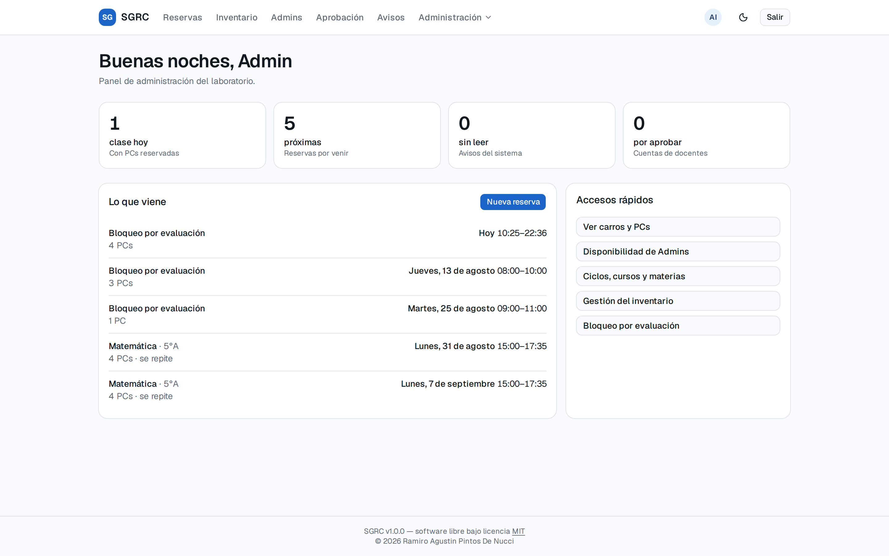
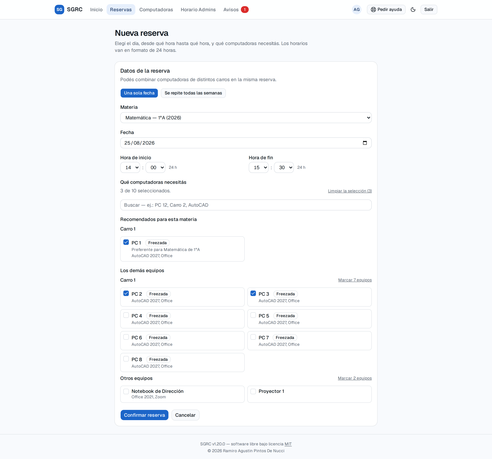
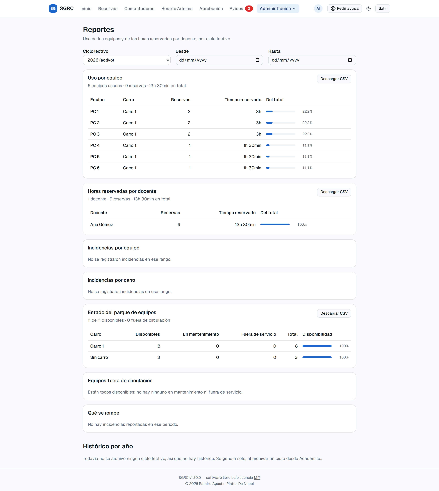
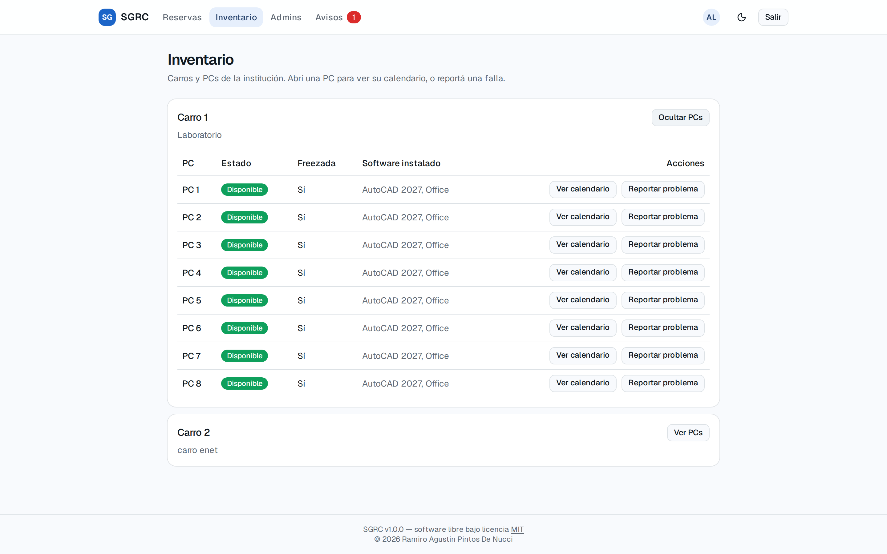
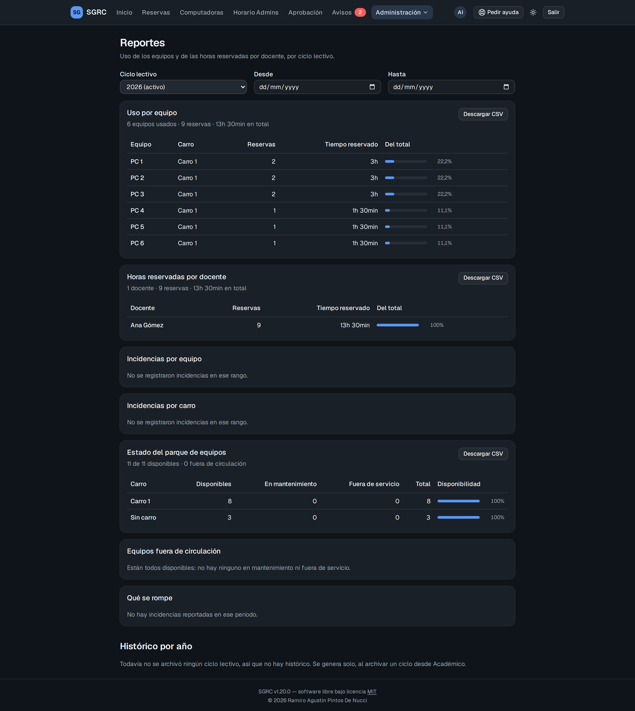
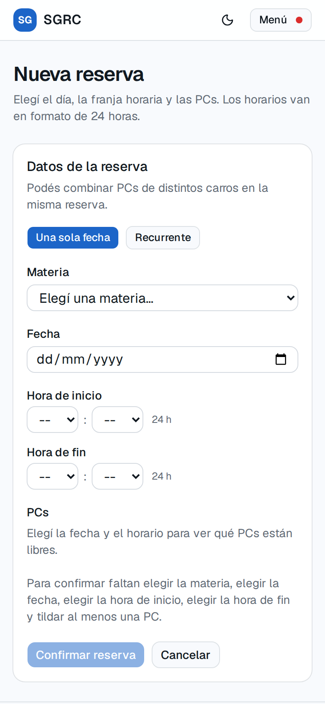
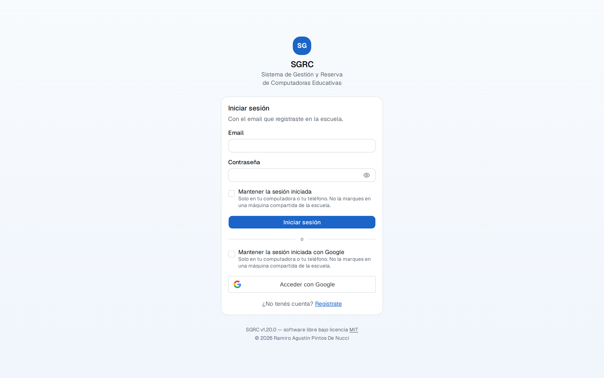

# SGRC — Sistema de Gestión y Reserva de Computadoras Educativas

**Una escuela tiene carros con notebooks que se prestan a las aulas. Este sistema lleva la cuenta de qué máquina hay, en qué estado está y quién la usa cada hora.**

Plataforma web para inventario de equipos informáticos y reserva de PCs vinculadas a cursos y materias, pensada para una única institución educativa. Los docentes reservan las máquinas que necesitan para su clase; el equipo de administración carga el inventario, aprueba las cuentas y mira los reportes de uso.



---

## El problema que resuelve

En muchas escuelas el préstamo de los carros de notebooks se coordina por mensajes, en un cuaderno o en una planilla compartida. Eso trae tres problemas concretos:

1. **Dos docentes reservan la misma máquina para la misma hora** y se enteran cuando ya están los dos en el aula.
2. **Nadie sabe qué PC está rota.** Se reserva un carro de 8 máquinas y aparecen 5 que arrancan.
3. **No hay números para pedir presupuesto.** Cuando hay que justificar la compra de más equipos, o el arreglo de los que fallan, no existe un registro de cuánto se usaron ni cuántas veces se rompieron.

SGRC resuelve los tres: **impide el solapamiento a nivel de base de datos** (no por una validación que se pueda saltear), lleva el **estado de cada equipo** con su historial de incidencias, y produce **reportes de uso** exportables a planilla.

---

## Qué hace

### Para un docente

| | |
|---|---|
| **Reservar PCs para una clase** | Elige la materia, el día y la franja horaria, y el sistema muestra únicamente las máquinas libres en ese momento. Puede combinar PCs de distintos carros en la misma reserva. |
| **Reservas que se repiten** | "Todos los martes de 15 a 17, hasta fin de año." El sistema crea la serie completa y avisa si alguna fecha está ocupada, sin crear ninguna a medias. |
| **Ver qué tiene por delante** | La pantalla de inicio responde "¿qué tengo hoy?" y "¿hay algo esperándome?" apenas se entra. |
| **Reportar una máquina con problemas** | Desde el inventario, indicando la gravedad. El aviso le llega al equipo de administración. |
| **Cancelar** | Una fecha suelta o toda la serie de aquí en adelante. |

### Para el equipo de administración

| | |
|---|---|
| **Inventario** | Carros, PCs, número de serie, procesador, memoria, software instalado y estado (disponible, en mantenimiento, fuera de servicio). |
| **Ciclo lectivo** | Años, cursos, materias y qué docente dicta cada una. Al cerrar el año, el sistema guarda un resumen histórico permanente. |
| **Aprobación de cuentas** | Un docente se registra solo —con email y contraseña, o con su cuenta de Google— pero no entra hasta que alguien lo aprueba. Un docente aprobado también puede recibir permisos de Admin. |
| **Bloqueo por evaluación** | Reserva las máquinas para una prueba estatal y cancela automáticamente lo que se pisa, notificando a cada docente afectado. |
| **Reportes** | Uso por PC y por docente, incidencias por equipo y por carro, con porcentajes y descarga a CSV. |
| **Auditoría** | Toda acción sensible queda registrada con quién, cuándo y desde qué dirección. |

---

## Cómo se ve

<table>
<tr>
<td width="50%">

**Reservar una clase**

Solo aparecen las PCs libres en esa franja, agrupadas por carro y con el software que tiene cada una.

</td>
<td width="50%">

**Reportes de uso**

Ordenados de mayor a menor, con el porcentaje que representa cada fila y descarga a planilla.

</td>
</tr>
<tr>
<td></td>
<td></td>
</tr>
<tr>
<td width="50%">

**Inventario de equipos**

Cada carro con sus máquinas, el estado de cada una y su ficha técnica.

</td>
<td width="50%">

**Tema oscuro**

Todo el sistema acompaña la preferencia del sistema operativo, y se puede forzar desde la barra.

</td>
</tr>
<tr>
<td></td>
<td></td>
</tr>
</table>

<table>
<tr>
<td width="34%">

**Funciona en el teléfono**

Un docente reserva desde el celular, camino al aula. Todas las pantallas se adaptan.

</td>
<td width="33%"></td>
<td width="33%"></td>
</tr>
</table>

> Las capturas salen del sistema real corriendo con datos de prueba. Están todas en [`docs/capturas/`](docs/capturas).

---

## Cómo se usa

**Si vas a operar el servidor de la escuela** —prenderlo, apagarlo, reiniciarlo, sacar una copia de seguridad— el único documento que necesitás es **[`docs/11-operacion.md`](docs/11-operacion.md)**. Está escrito paso a paso y no hace falta saber programar: todo se hace con dos o tres comandos.

**Si sos docente o administrativo y vas a usar el sistema**, el recorrido completo de cada tarea —registrarse, reservar, cancelar, reportar una máquina rota, cerrar el año— está descrito en **[`docs/02-casos-de-uso.md`](docs/02-casos-de-uso.md)**, con diagramas de quién hace qué.

**Si querés entender qué reglas sigue el sistema** (por qué no deja reservar un sábado, cuánto puede durar una reserva, qué pasa con las reservas de un año que se cierra), están enumeradas una por una en **[`docs/01-requisitos.md`](docs/01-requisitos.md)**.

---

## Documentación

Toda la documentación funcional y técnica vive en [`docs/`](docs).

| Documento | De qué trata | Para quién |
|---|---|---|
| [`01-requisitos.md`](docs/01-requisitos.md) | Todo lo que el sistema tiene que hacer, regla por regla | Cualquiera |
| [`02-casos-de-uso.md`](docs/02-casos-de-uso.md) | Cada tarea contada como un recorrido, con diagramas | Cualquiera |
| [`11-operacion.md`](docs/11-operacion.md) | **Puesta en marcha, arranque, parada, logs, migraciones y copias de seguridad** | Quien opera el servidor |
| [`03-diagrama-clases.md`](docs/03-diagrama-clases.md) | Modelo de dominio | Técnico |
| [`04-diagramas-secuencia.md`](docs/04-diagramas-secuencia.md) | Los flujos críticos, paso a paso entre módulos | Técnico |
| [`05-diagramas-estado.md`](docs/05-diagramas-estado.md) | Máquinas de estado de PC, Reserva, Usuario y Ciclo | Técnico |
| [`06-arquitectura.md`](docs/06-arquitectura.md) | Arquitectura del monolito modular, bus de eventos, decisiones de diseño | Técnico |
| [`07-modelo-datos.md`](docs/07-modelo-datos.md) | Esquema completo de la base de datos | Técnico |
| [`08-api-spec.yaml`](docs/08-api-spec.yaml) | Contrato OpenAPI de la API | Técnico |
| [`09-seguridad-rbac.md`](docs/09-seguridad-rbac.md) | Autenticación, matriz de permisos, auditoría | Técnico |
| [`10-testing.md`](docs/10-testing.md) | Qué se prueba, con qué, y qué queda deliberadamente afuera | Técnico |
| [`adr/`](docs/adr) | El porqué de las decisiones estructurales, con las alternativas descartadas | Técnico |

Si es tu primera vez en el repositorio y venís del lado técnico, leé `01` y `06` primero: dan el contexto para todo lo demás. [`adr/001-monolito-modular.md`](docs/adr/001-monolito-modular.md) explica por qué el sistema es un monolito modular y no microservicios, y bajo qué condiciones convendría revisar esa decisión.

---

## Decisiones técnicas que vale la pena mirar

**El solapamiento lo impide la base de datos, no el código.** Una restricción `EXCLUDE USING gist` de PostgreSQL hace imposible que dos reservas confirmadas se pisen sobre la misma máquina. Aunque dos personas aprieten "Confirmar" en el mismo milisegundo, o alguien escriba directo en la base, la segunda operación falla. Una validación en la aplicación se puede ganar por carrera; esta no.

**Monolito modular, no microservicios.** Un solo binario Go y un solo Postgres, divididos en módulos que se comunican únicamente a través de interfaces: ningún módulo importa el dominio de otro. Para una escuela con decenas de usuarios, la complejidad operativa de los microservicios no se justifica — pero los límites están puestos como si lo fueran, así que el día que haga falta dividir, no hay que reescribir la lógica. Hay un test automático que falla si alguien cruza un límite.

**El histórico sobrevive al borrado.** Al cerrar un año lectivo se eliminan sus reservas, pero antes el sistema guarda un resumen permanente con los nombres "congelados" tal como estaban. Una PC que después se muda de carro, o un docente cuya cuenta se elimina, siguen apareciendo correctamente en el reporte del año que ya pasó.

**Same-origin, sin CORS.** El navegador pide todo al mismo host: nginx sirve la interfaz y redirige `/api` al backend. Un hostname, un certificado, ninguna configuración de CORS que se rompa.

**Entrar con Google es opcional y no cambia nada del resto.** Si se configura `GOOGLE_CLIENT_ID`, la pantalla de login suma el botón de Google; si no, ni siquiera se dibuja y el sistema funciona como siempre. En los dos casos el token que circula por la API es el nuestro: Google solo dice quién sos una vez, al entrar. Y una cuenta creada así queda igual de pendiente que cualquier otra — tener un Gmail prueba tu identidad, no que la escuela te conozca. Ver `GOOGLE_CLIENT_ID` en [`.env.example`](.env.example) para el paso a paso de la consola de Google.

---

## Stack

- **Backend:** Go 1.23 con [Fiber](https://gofiber.io/) v2
- **Base de datos:** PostgreSQL 16 (extensiones `pgcrypto` y `btree_gist`)
- **Autenticación:** JWT HS256, contraseñas con `argon2id`, e ingreso opcional con cuenta de Google
- **Frontend:** React 19 + TypeScript + Vite, Tailwind CSS, TanStack Query
- **Infraestructura:** Docker Compose y Cloudflare Tunnel

---

## Cómo levantarlo

```bash
cp .env.example .env   # completar los valores reales
make run-prod          # docker compose up --build
```

Todo corre en contenedores: `sgrc-app` (el binario Go), `postgres` (con las migraciones aplicadas automáticamente la primera vez que el volumen está vacío), `frontend` (nginx sirviendo la interfaz compilada) y `cloudflared`.

El contenedor de la API se autochequea contra su propio `/health`, que a su vez consulta la base: `docker compose ps` muestra `healthy` solo si la API puede llegar a Postgres.

En **producción la base arranca vacía a propósito**: las migraciones crean las tablas, la aplicación siembra el primer administrador y ahí termina. Ni carros, ni PCs, ni ciclo lectivo — eso lo carga el administrador desde la interfaz.

En **desarrollo**, `make run` levanta además un servicio que siembra datos de prueba (un ciclo, una materia, un docente y un carro con PCs) apenas la API queda sana, así que `docker compose down -v && make run` deja el sistema usable sin pasos extra.

> **[`docs/11-operacion.md`](docs/11-operacion.md) es el manual completo**: qué completar en el `.env`, cómo parar y reiniciar, cómo leer los registros cuando algo falla, cómo aplicar una migración sobre una base que ya existe (no corren solas) y cómo sacar una copia de seguridad.

El compose base **no publica ningún puerto al host**: en producción el único camino de entrada es el túnel. Para desarrollo, `docker-compose.dev.yml` expone la API (`8080`), Postgres (`5432`) y la interfaz compilada (`8081`), y se aplica explícitamente:

```bash
make run        # con puertos expuestos, para desarrollar
make run-prod   # exactamente lo que corre en el servidor
```

### Cómo entra el tráfico

```
Internet → cloudflared → frontend (nginx :80) ─┬─ /api/* → sgrc-app:8080
                                               └─ resto  → interfaz web
```

Por eso `VITE_API_URL` va vacío. **El ingress del túnel en el panel de Cloudflare tiene que apuntar a `http://frontend:80`**, no a `sgrc-app:8080`.

Con un dominio propio se toca **una sola línea**: `FRONTEND_ORIGIN` en el `.env`. No hay ningún `localhost` que reemplazar — los del repositorio son de desarrollo, y lo que aparece en `nginx.conf` son nombres de contenedor de la red interna de Docker ([`11-operacion.md` §9.3 y §9.4](docs/11-operacion.md)).

¿Vas a desplegarlo de otra manera? **[§10](docs/11-operacion.md)** explica cómo cambiar los puertos del backend y del frontend, y **[§11](docs/11-operacion.md)** cómo salir a internet sin Cloudflare Tunnel —abriendo un puerto en el router o detrás de otro proxy inverso— con los tres puntos que hay que resolver: publicar el puerto, el certificado y la coherencia de `FRONTEND_ORIGIN`.

---

## Estructura del repositorio

```
sgrc/
├── cmd/main.go           ← arranque: conecta la base, siembra el primer Admin, levanta el servidor
├── internal/
│   ├── auth/             ← usuarios, JWT, aprobación de cuentas
│   ├── academic/         ← ciclos lectivos, cursos, materias, asignación de docentes
│   ├── inventory/        ← carros, PCs, incidencias
│   ├── reservation/      ← reservas, solapamiento, recurrencia, bloqueos
│   ├── notification/     ← avisos internos
│   ├── reporting/        ← reportes y estadísticas históricas
│   ├── availability/     ← disponibilidad de los administradores
│   └── shared/           ← bus de eventos, middleware, seguridad, auditoría, paginación
├── migrations/           ← SQL versionado, se aplica al crear el volumen de Postgres
├── frontend/             ← interfaz web (ver frontend/README.md)
├── docs/                 ← documentación y capturas
├── docker-compose.yml
├── Dockerfile
└── Makefile
```

Cada módulo de `internal/` tiene la misma forma: `domain/` (reglas puras, sin dependencias), `application/` (casos de uso), `infrastructure/` (acceso a Postgres) e `interfaces/http/` (rutas). El porqué está en [`docs/06-arquitectura.md`](docs/06-arquitectura.md) §3.

**Sobre el primer administrador:** no hay script aparte. `cmd/main.go` lo siembra al arrancar, de forma idempotente, con `SEED_ADMIN_EMAIL` y `SEED_ADMIN_PASSWORD` del `.env`. La condición es que no haya ningún administrador en estado aprobado — mira el estado y no solo el rol, así que una base cuyo único administrador quedó dado de baja se recupera reiniciando, en vez de quedar sin acceso y sin forma de arreglarlo desde la aplicación.

---

## Testing

```bash
make test                          # pruebas rápidas, sin Docker, con cobertura
make lint                          # golangci-lint
go test -tags integration ./...    # + PostgreSQL real en contenedores (lento)
cd frontend && npx vitest run      # pruebas de la interfaz
cd frontend && npx playwright test # recorrido completo contra el sistema real
```

La lógica de negocio —máquinas de estado, cálculo de solapamiento, generación de series recurrentes— está cubierta entre el **94 % y el 100 %** en cada módulo. La interfaz tiene **253 pruebas** que ejercitan las pantallas como lo haría una persona.

Las pruebas de integración van detrás de una etiqueta de compilación porque necesitan Docker: en una máquina sin Docker ni se compilan, y `make test` sigue funcionando. El detalle de qué se prueba en cada capa está en [`docs/10-testing.md`](docs/10-testing.md).

---

## Licencia

Publicado bajo la **[Licencia MIT](LICENSE)**.

Copyright © 2026 Ramiro Agustin Pintos De Nucci.

En castellano llano: podés usar este sistema, modificarlo, desplegarlo en tu institución y hasta cobrar por hacerlo, sin pedir permiso. La única condición es conservar el aviso de copyright y el texto de la licencia. Se entrega sin garantía: si algo falla, la responsabilidad no es del autor.

Si lo adaptás para tu escuela, no hace falta que me avises — pero si el sistema te sirvió, o si mejoraste algo que le pueda servir a otra institución, un aviso o un *pull request* se agradecen.

### Licencias de terceros

Todas las dependencias del proyecto son permisivas y compatibles con MIT: la mayoría MIT, más Apache-2.0 (`class-variance-authority`, TypeScript, Playwright), ISC (`lucide-react`) y BSD-3-Clause (`golang.org/x/crypto`, `google/uuid`). No hay ninguna dependencia con copyleft.

La tipografía **Geist** se distribuye bajo la [SIL Open Font License 1.1](https://openfontlicense.org/) y viaja dentro de los archivos compilados de la interfaz. Su licencia es independiente de la de este software y se mantiene con la obra.
