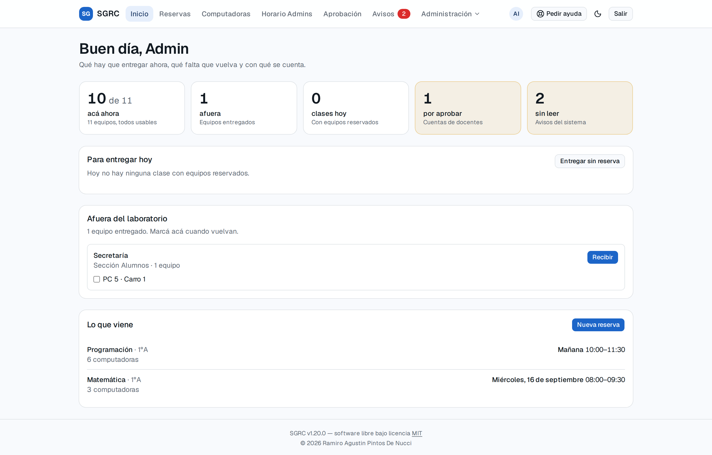
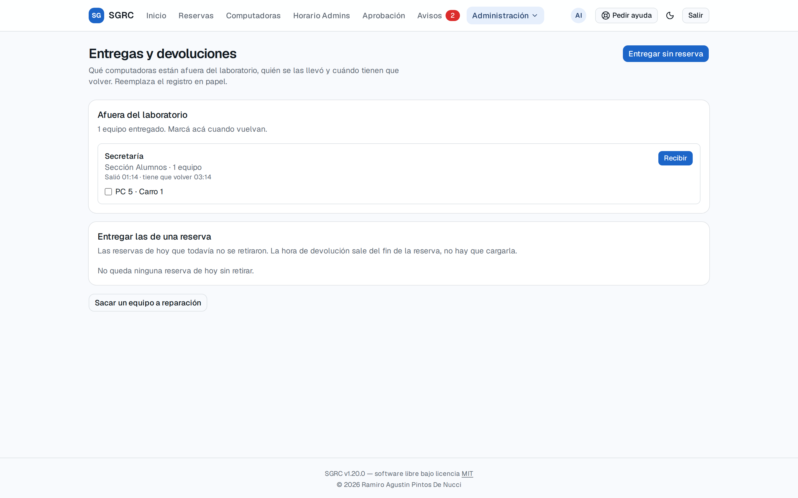
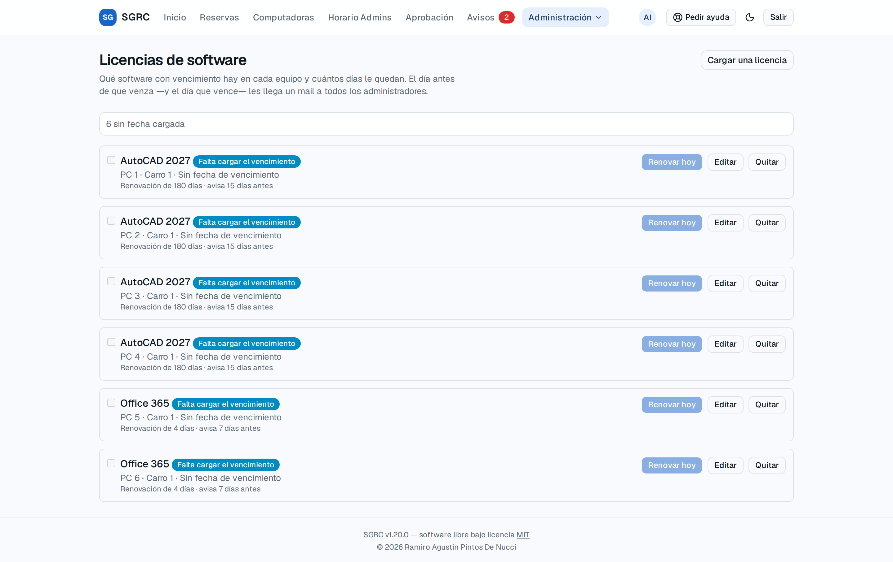
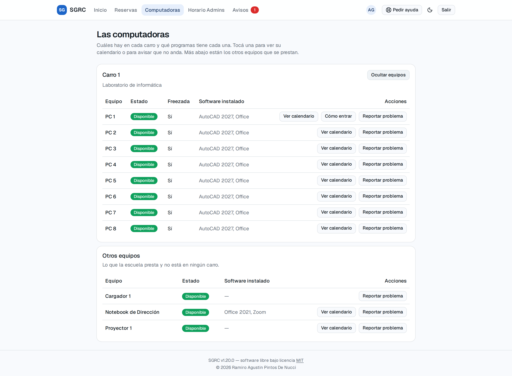
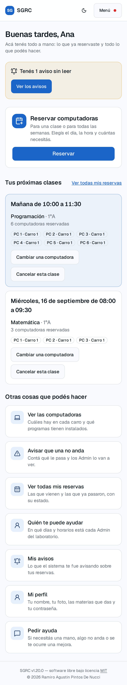

# SGRC — Sistema de Gestión y Reserva de Computadoras Educativas

**Una institución educativa tiene carros con notebooks que se prestan a las aulas. Este sistema lleva la cuenta de qué equipo hay, en qué estado está, quién lo usa cada hora y quién lo tiene ahora mismo.**

Plataforma web para inventario de equipos informáticos y reserva vinculada a cursos y materias, pensada para una única institución. Los docentes reservan las máquinas que necesitan para su clase; el equipo de administración carga el inventario, entrega y recibe los equipos, aprueba las cuentas y mira los reportes de uso.



<p align="center">
  <a href="#el-problema-que-resuelve">El problema</a> ·
  <a href="#qué-hace">Qué hace</a> ·
  <a href="#cómo-se-ve">Cómo se ve</a> ·
  <a href="#decisiones-técnicas-que-vale-la-pena-mirar">Decisiones técnicas</a> ·
  <a href="#cómo-levantarlo">Levantarlo</a> ·
  <a href="#documentación">Documentación</a>
</p>

---

## El problema que resuelve

En muchas instituciones el préstamo de los carros de notebooks se coordina por mensajes, en un cuaderno o en una planilla compartida. Eso trae cuatro problemas concretos:

1. **Dos docentes reservan la misma máquina para la misma hora** y se enteran cuando ya están los dos en el aula.
2. **Nadie sabe qué equipo está roto.** Se reserva un carro de ocho máquinas y aparecen cinco que arrancan.
3. **Nadie sabe dónde está el equipo.** El renglón del cuaderno dice que salió, pero no dice si volvió, porque quien lo devolvió no lo tachó.
4. **No hay números para pedir presupuesto.** Cuando hay que justificar la compra de más equipos, o el arreglo de los que fallan, no existe un registro de cuánto se usaron ni cuántas veces se rompieron.

SGRC resuelve los cuatro: **impide el solapamiento a nivel de base de datos** (no con una validación que se pueda ganar por carrera), lleva el **estado de cada equipo** con su historial de incidencias, **deriva la custodia** en vez de guardarla en una columna que se desincroniza, y produce **reportes de uso** exportables a planilla.

---

## Qué hace

### Para un docente

| | |
|---|---|
| **Reservar equipos para una clase** | Elige la materia, el día y la franja, y recién ahí el sistema arma la lista: qué hay para elegir depende de cuándo. Puede combinar equipos de distintos carros en la misma reserva. |
| **Ver quién tiene lo que falta** | Los equipos ya tomados en esa franja aparecen con el nombre de quien los reservó. "No hay nada libre" y "los tiene alguien con quien puedo hablar" son situaciones distintas, y solo la segunda tiene salida. |
| **Pedirle equipos a otro docente** | Un botón le manda al que los tiene un aviso y un correo: quién los necesita, para qué materia y a qué hora. No le saca nada ni espera respuesta del sistema — el acuerdo lo cierran ellos. Lo que el sistema garantiza es que el pedido llegue aunque no se crucen. |
| **Reservas que se repiten** | "Todos los martes de 15 a 17, hasta fin de año." El sistema valida la serie completa antes de crear nada: si alguna fecha choca, dice cuáles y no crea ninguna. |
| **Ver qué tiene por delante** | La pantalla de inicio responde "¿qué tengo hoy?" y "¿hay algo esperándome?" apenas se entra. Muestra sus próximas clases con el día en palabras, y sobre cada una puede cambiar de máquina o cancelar sin ir a ninguna otra pantalla. |
| **Llegar a todo sin conocer el sistema** | Debajo, un atajo por cada cosa que puede hacer, nombrado por la tarea y no por la sección —"Ver las computadoras", no "Inventario"— con una línea que dice para qué sirve. Está pensado para quien no usa una computadora todos los días. |
| **Saber con qué cuenta se entra a una máquina** | Una notebook no se abre sola. Cada equipo puede llevar anotadas sus cuentas: con qué usuario se entra, cuál es de administrador, si pide contraseña y —si le corresponde verla— cuál es. Se consulta desde el teléfono, parado frente a la máquina. |
| **Reportar un equipo con problemas** | Desde el inventario o desde la pantalla de inicio, indicando la gravedad y qué falla. El aviso le llega al equipo de administración. |
| **Cancelar** | Una fecha suelta o toda la serie de aquí en adelante. |
| **Cambiar de máquina** | Si una de las que reservó no está, la cambia por otra libre en la misma franja sin partir la clase en dos reservas. Si la reserva se repite todas las semanas, elige si el cambio es solo por esa fecha o de ahí hasta el final de la serie. |
| **Su perfil** | Su foto —opcional; si no pone ninguna se ven sus iniciales—, las materias que da, y la contraseña. Todo detrás del redondel con la cara, donde se lo busca en cualquier aplicación. |
| **Pedir otra materia** | Le asignaron una materia a mitad de año y necesita reservar para ella. La elige de la lista, o la escribe si todavía no está cargada. Lo resuelve una persona, no el sistema. |
| **Pedir ayuda** | Un botón en la barra de arriba, en todas las pantallas: escribe un asunto y qué le pasa, y elige si necesita una mano ahora, si algo no anda o si se le ocurre una mejora. El sistema agrega solo desde qué pantalla escribió. La conversación sigue **dentro del sistema** —le contestan, puede volver a preguntar— sin abrir el correo. |
| **Elegir qué le llega por correo** | Cuáles de los avisos que ya ve en el sistema quiere además por mail. Se apagan y se prenden cuando quiera; lo que se elige es el canal, no el aviso. Los de su cuenta y los de un pedido de ayuda salen siempre. |

### Para el equipo de administración

| | |
|---|---|
| **El mostrador** | La pantalla de inicio muestra sin buscar a quién hay que entregarle ahora, qué clase sigue, qué hay afuera del laboratorio con el botón para marcar que volvió, y con cuántos equipos se cuenta en este momento. Se refresca sola cada minuto, porque el mostrador lo atienden varias personas a la vez. |
| **Entregas y devoluciones** | Qué equipos están afuera, quién se los llevó y cuándo tienen que volver. Reemplaza el registro en papel, y a diferencia de él no deja que la misma máquina figure entregada dos veces. También sirve para prestar en el momento a alguien que ni siquiera tiene cuenta en el sistema. |
| **La reserva que nadie retiró** | Una hora antes de la clase le llega un recordatorio al docente, y a los quince minutos de empezada —si todavía no fue a buscarlas— el aviso de que a los cuarenta quedan libres: llega cuando todavía puede ir, cambiar de máquina o cancelar. Pasado ese plazo se liberan para otro, aunque si el docente aparece más tarde y siguen ahí se le entregan igual. Si vino y se llevó solo una parte, lo que dejó se libera enseguida: ya lo decidió él. Y si un equipo no vuelve a horario, el sistema lo reclama y le avisa a quien lo tenía reservado después. |
| **Inventario** | Carros, equipos, número de serie, procesador, memoria, software instalado y estado (disponible, en mantenimiento, fuera de servicio). |
| **Otros equipos** | Lo que se presta y no está en ningún carro: un proyector, cargadores, notebooks sueltas. Se entregan y se reciben en la misma pantalla que las computadoras, y cada uno decide si además se puede reservar con anticipación —un proyector sí, un cargador se pide en el momento—. Lo que es una **computadora** se administra igual que una de carro: ficha técnica, licencias y cuentas de acceso. |
| **Cuentas de cada equipo** | Con qué usuario se entra a cada máquina, si es local o de un directorio remoto, si tiene privilegios de administrador y cuál es la contraseña. Cada cuenta se marca por separado como visible para cualquier docente o solo para administración, y esa marca **no** se deduce del privilegio: hay cuentas de administrador que usa todo el mundo y cuentas comunes que no. Las contraseñas se guardan cifradas —el volcado de la copia de seguridad no es la lista de contraseñas de la institución—, no viajan en ningún listado, se piden de a una y cada consulta queda auditada. |
| **Licencias de software** | Qué programas con vencimiento hay en cada equipo y cuántos días le quedan a cada uno. El día antes de que venza —y el día que vence— llega un correo a todos los administradores. Si la licencia se renovó otro día, o hay que corregir la fecha, se edita en cualquier momento. |
| **Ciclo lectivo** | Años, cursos, materias y qué docente dicta cada una. Al cerrar el año, el sistema guarda un resumen histórico permanente y clona la estructura al año siguiente. |
| **Aprobación de cuentas** | Un docente se registra solo —con email y contraseña, o con su cuenta de Google— pero no entra hasta que alguien lo aprueba. Un docente aprobado también puede recibir permisos de Admin, y perderlos sin que se le cierre la cuenta. |
| **Pedidos para dictar una materia** | Un docente pide sumarse a una materia y explica por qué. Al equipo de administración le llega el pedido con ese texto y con quiénes la dictan hoy, para saber con quién hablar; a esos docentes también les llega el aviso, para que no se enteren tarde. **Lo decide una persona**: aprobar habilita a reservar los mismos equipos que usa quien ya la da. Rechazar exige explicar por qué, y quién resolvió qué queda auditado. |
| **Pedidos de ayuda y mensajes** | Lo que escribe la gente —un pedido de ayuda, algo que no anda, una idea— con la pantalla desde la que lo escribió. Se lee y se contesta **desde el sistema**, sin abrir Gmail, en la misma pantalla donde están los avisos. La conversación admite ida y vuelta: contestar no la cierra, y cerrarla es un acto aparte. Un pedido de ayuda avisa por correo sí o sí. |
| **Bloquear equipos** | Toma las máquinas para otra cosa —una evaluación, una jornada docente, una obra en el aula— escribiendo por qué, y cancela automáticamente lo que se pisa notificando a cada docente afectado con ese mismo texto. |
| **Reportes** | Uso por equipo y por docente, incidencias por equipo y por carro, con porcentajes y descarga a CSV. Y para el parque de máquinas: cuántas andan y cuántas no, la lista de las que están fuera de circulación con qué le pasa a cada una, y qué se rompe más seguido. |
| **Auditoría** | Toda acción sensible queda registrada con quién, cuándo y desde qué dirección. |

---

## Cómo se ve

<table>
<tr>
<td width="50%" valign="top">

### Reservar una clase

Primero el día y la franja; recién entonces la lista. Arriba, los equipos libres para tildar, agrupados por carro y con el software que tiene cada uno; abajo, los que ya tiene alguien, con su nombre y el botón para pedírselos. Lo que no está en ningún carro va aparte, y solo si es reservable.

</td>
<td width="50%" valign="top">

### El mostrador

Qué hay que entregar ahora, qué está afuera y cuántos equipos quedan. Cada máquina de una clase se marca *entregada*, *sin retirar* o *liberada*.

</td>
</tr>
<tr>
<td></td>
<td></td>
</tr>
<tr>
<td width="50%" valign="top">

### Reportes

Uso por equipo y por docente, estado del parque, equipos fuera de circulación y qué se rompe más seguido. Todo con su descarga a CSV.

</td>
<td width="50%" valign="top">

### Licencias de software

Ordenadas por urgencia: primero las que todavía no se verificaron contra la máquina, después de la más vencida a la que más le falta.

</td>
</tr>
<tr>
<td></td>
<td></td>
</tr>
<tr>
<td width="50%" valign="top">

### Inventario

Cada carro con sus máquinas, el estado de cada una y su ficha técnica. Lo ve cualquier usuario autenticado: un docente necesita saber qué tiene instalado cada equipo antes de elegir.

</td>
<td width="50%" valign="top">

### Tema oscuro

Todo el sistema acompaña la preferencia del sistema operativo, y se puede forzar desde la barra.

</td>
</tr>
<tr>
<td></td>
<td></td>
</tr>
</table>

<table>
<tr>
<td width="34%" valign="top">

### Funciona en el teléfono

Un docente reserva desde el celular, camino al aula. Las doce pantallas se miden automáticamente a seis anchos distintos, de 320 a 1440px.

</td>
<td width="33%"></td>
<td width="33%"></td>
</tr>
</table>

> Las capturas salen del sistema real corriendo con datos de prueba. Están todas en [`docs/capturas/`](docs/capturas).

---

## Decisiones técnicas que vale la pena mirar

**El solapamiento lo impide la base de datos, no el código.** Una restricción `EXCLUDE USING gist` de PostgreSQL hace imposible que dos reservas confirmadas se pisen sobre el mismo equipo. Aunque dos personas aprieten "Confirmar" en el mismo milisegundo, o alguien escriba directo en la base, la segunda operación falla. Una validación en la aplicación se puede ganar por carrera; esta no.

**La reserva y la custodia son cosas distintas.** Una reserva es el derecho a usar un equipo en una franja; un préstamo es quién tiene la máquina *ahora*. Modelarlas por separado es lo que permite representar los tres casos que el papel confunde: reservas que nadie vino a buscar, préstamos sin reserva detrás y préstamos que sobreviven a su reserva. Y "¿dónde está la PC 3?" **se deriva** de si existe un préstamo abierto, en vez de guardarse en una columna: lo que se duplica se desincroniza.

**Una sola entidad para todo lo prestable.** El proyector, los cargadores y las notebooks sueltas comparten tabla con las computadoras de los carros. No es un atajo: "qué hay afuera del laboratorio" tiene que ser **una** lista. Con dos clases de cosa, el préstamo necesitaría dos referencias, el mostrador dos consultas y el barrido dos recorridos; compartiendo entidad, el proyector queda prestable, reclamable, liberable y —si es reservable— reservable, sin una línea nueva en ninguno de esos flujos.

**Monolito modular, no microservicios.** Un solo binario Go y un solo Postgres, divididos en módulos que se comunican únicamente a través de interfaces: ningún módulo importa el dominio de otro. Para una institución con decenas de usuarios, la complejidad operativa de los microservicios no se justifica — pero los límites están puestos como si lo fueran, así que el día que haga falta dividir, no hay que reescribir la lógica. Hay un test automático que falla si alguien cruza un límite. El porqué completo está en [`docs/adr/001-monolito-modular.md`](docs/adr/001-monolito-modular.md).

**SQL escrito a mano, sin ORM.** La regla más importante del sistema —dos personas no pueden reservar el mismo equipo en la misma franja— es una constraint de exclusión de PostgreSQL, y el repositorio traduce el error que devuelve a un error de dominio. Ese tipo de cosa, junto con las consultas que sostienen los reportes y la paginación, es lo que un ORM no expresa y terminaría igual en SQL crudo. El costo aceptado es escribir el escaneo de cada fila. El porqué completo, con las alternativas descartadas, está en [`docs/adr/002-sin-orm.md`](docs/adr/002-sin-orm.md).

**El histórico sobrevive al borrado.** Al cerrar un año lectivo se eliminan sus reservas, pero antes el sistema guarda un resumen permanente con los nombres "congelados" tal como estaban. Un equipo que después se muda de carro, o un docente cuya cuenta se elimina, siguen apareciendo correctamente en el reporte del año que ya pasó.

**Lo que la institución escribe es texto libre; lo que el sistema interpreta es un enum.** El tipo de un equipo, la categoría de una falla y el motivo de un bloqueo son texto libre, porque cada institución rompe, presta y se organiza distinto y una lista cerrada haría que el primer caso no previsto pidiera un cambio de esquema. Los estados —de una reserva, de un equipo, de una cuenta— son enums con `CHECK`, porque sobre ellos decide el sistema. El costo del texto libre se paga afuera de la base: el formulario sugiere los valores ya usados y los reportes agrupan sin distinguir mayúsculas.

**Los avisos automáticos son idempotentes por estado, no por horario.** Los tres barridos periódicos (finalizar reservas vencidas, vigilar entregas, avisar licencias por vencer) dejan su marca en la fila. Correr el barrido cada cinco minutos, reiniciar el proceso o estar caído dos horas cambia *cuándo* sale un aviso, nunca *cuántas veces*.

**Same-origin, sin CORS.** El navegador pide todo al mismo host: nginx sirve la interfaz y redirige `/api` al backend. Un hostname, un certificado, ninguna configuración de CORS que se rompa.

**Entrar con Google es opcional y no cambia nada del resto.** Si se configura `GOOGLE_CLIENT_ID`, la pantalla de login suma el botón de Google; si no, ni siquiera se dibuja. En los dos casos el token que circula por la API es el nuestro: Google solo dice quién sos una vez, al entrar. Y una cuenta creada así queda igual de pendiente que cualquier otra — tener un Gmail prueba tu identidad, no que la institución te conozca.

---

## Stack

| Capa | Tecnología |
|---|---|
| **Backend** | Go 1.25 con [Fiber](https://gofiber.io/) v2 |
| **Base de datos** | PostgreSQL 16 (extensiones `pgcrypto` y `btree_gist`) |
| **Autenticación** | JWT HS256, contraseñas con `argon2id`, ingreso opcional con cuenta de Google |
| **Frontend** | React 19 + TypeScript + Vite, Tailwind CSS v4, shadcn/ui, TanStack Query |
| **Correo** | SMTP con `net/smtp` de la biblioteca estándar — opcional |
| **Infraestructura** | Docker Compose, imagen `scratch` para el binario, nginx para la SPA, Cloudflare Tunnel |

---

## Cómo levantarlo

```bash
cp .env.example .env   # completar los valores reales
make run-prod          # docker compose up --build
```

Todo corre en contenedores: `sgrc-app` (el binario Go), `postgres` (con el esquema aplicado automáticamente la primera vez que el volumen está vacío), `frontend` (nginx sirviendo la interfaz compilada) y `cloudflared`.

El contenedor de la API se autochequea contra su propio `/health`, que a su vez consulta la base: `docker compose ps` muestra `healthy` solo si la API puede llegar a Postgres.

En **producción la base arranca vacía a propósito**: el esquema crea las tablas, la aplicación siembra el primer administrador y ahí termina. Ni carros, ni equipos, ni ciclo lectivo — eso lo carga el administrador desde la interfaz.

En **desarrollo**, `make run` levanta además un servicio que siembra datos de prueba (un ciclo, una materia, un docente y un carro con equipos) apenas la API queda sana, así que `docker compose down -v && make run` deja el sistema usable sin pasos extra.

> **[`docs/11-operacion.md`](docs/11-operacion.md) es el manual completo**: qué completar en el `.env`, cómo parar y reiniciar, cómo leer los registros cuando algo falla, cómo aplicar el esquema sobre una base que ya existe y cómo sacar una copia de seguridad.

El compose base **no publica ningún puerto al host**: en producción el único camino de entrada es el túnel. Para desarrollo, `docker-compose.dev.yml` expone la API (`8080`), Postgres (`5432`) y la interfaz compilada (`8081`), y se aplica explícitamente:

```bash
make run        # con puertos expuestos, para desarrollar
make run-prod   # exactamente lo que corre en el servidor
```

### Cómo entra el tráfico

```
Internet → cloudflared → frontend (nginx :80) ─┬─ /api/* → sgrc-app:8080
                                               └─ resto  → interfaz web
```

Por eso `VITE_API_URL` va vacío. **El ingress del túnel en el panel de Cloudflare tiene que apuntar a `http://frontend:80`**, no a `sgrc-app:8080`.

Con un dominio propio se toca **una sola línea**: `FRONTEND_ORIGIN` en el `.env`. No hay ningún `localhost` que reemplazar — los del repositorio son de desarrollo, y lo que aparece en `nginx.conf` son nombres de contenedor de la red interna de Docker ([`11-operacion.md` §9.3 y §9.4](docs/11-operacion.md)).

¿Vas a desplegarlo de otra manera? **[§10](docs/11-operacion.md)** explica cómo cambiar los puertos del backend y del frontend, y **[§11](docs/11-operacion.md)** cómo salir a internet sin Cloudflare Tunnel —abriendo un puerto en el router o detrás de otro proxy inverso— con los tres puntos que hay que resolver: publicar el puerto, el certificado y la coherencia de `FRONTEND_ORIGIN`.

---

## Estructura del repositorio

```
sgrc/
├── cmd/main.go           ← arranque: conecta la base, siembra el primer Admin,
│                            registra los suscriptores y los barridos, levanta el servidor
├── internal/
│   ├── auth/             ← usuarios, JWT, aprobación de cuentas, recuperación de contraseña
│   ├── academic/         ← ciclos lectivos, cursos, materias, asignación de docentes
│   ├── inventory/        ← carros, equipos, cuentas de cada equipo, incidencias, licencias
│   ├── reservation/      ← reservas, solapamiento, recurrencia, bloqueos, préstamos
│   ├── notification/     ← avisos internos y sus copias por correo
│   ├── reporting/        ← reportes y estadísticas históricas
│   ├── availability/     ← disponibilidad de los administradores
│   └── shared/           ← bus de eventos, middleware, seguridad, correo, auditoría, paginación
├── migrations/           ← el esquema de la base, se aplica al crear el volumen de Postgres
├── frontend/             ← interfaz web (ver frontend/README.md)
├── docs/                 ← documentación y capturas
├── docker-compose.yml
├── Dockerfile
└── Makefile
```

Cada módulo de `internal/` tiene la misma forma: `domain/` (reglas puras, sin dependencias), `application/` (casos de uso), `infrastructure/` (acceso a Postgres) e `interfaces/http/` (rutas). El porqué está en [`docs/06-arquitectura.md`](docs/06-arquitectura.md) §3.

**Sobre el primer administrador:** no hay script aparte. `cmd/main.go` lo siembra al arrancar, de forma idempotente, con `SEED_ADMIN_EMAIL` y `SEED_ADMIN_PASSWORD` del `.env`. La condición es que no haya ningún administrador en estado aprobado — mira el estado y no solo el rol, así que una base cuyo único administrador quedó dado de baja se recupera reiniciando, en vez de quedar sin acceso y sin forma de arreglarlo desde la aplicación.

---

## Testing

```bash
make test                          # pruebas rápidas, sin Docker, con cobertura
make lint                          # golangci-lint
go test -tags integration ./...    # + PostgreSQL real en contenedores (lento)
cd frontend && npx vitest run      # pruebas de la interfaz
cd frontend && npx playwright test # recorrido completo contra el sistema real
```

La lógica de negocio —máquinas de estado, cálculo de solapamiento, generación de series recurrentes— está cubierta entre el **89 % y el 100 %** en el `domain/` de cada módulo, y entre el **62 % y el 90 %** en la capa de casos de uso. La interfaz tiene **418 pruebas** en 40 archivos, que ejercitan las pantallas como lo haría una persona.

Las pruebas de integración van detrás de una etiqueta de compilación porque necesitan Docker: en una máquina sin Docker ni se compilan, y `make test` sigue funcionando. El detalle de qué se prueba en cada capa —y de qué queda deliberadamente afuera— está en [`docs/10-testing.md`](docs/10-testing.md).

---

## Documentación

Toda la documentación funcional y técnica vive en [`docs/`](docs).

| Documento | De qué trata | Para quién |
|---|---|---|
| [`01-requisitos.md`](docs/01-requisitos.md) | Todo lo que el sistema tiene que hacer, regla por regla | Cualquiera |
| [`02-casos-de-uso.md`](docs/02-casos-de-uso.md) | Cada tarea contada como un recorrido, con diagramas | Cualquiera |
| [`11-operacion.md`](docs/11-operacion.md) | **Puesta en marcha, arranque, parada, logs, esquema y copias de seguridad** | Quien opera el servidor |
| [`12-observabilidad.md`](docs/12-observabilidad.md) | Tableros de Prometheus y Grafana, opcionales: qué se mide y qué contesta cada número | Quien opera el servidor |
| [`03-diagrama-clases.md`](docs/03-diagrama-clases.md) | Modelo de dominio | Técnico |
| [`04-diagramas-secuencia.md`](docs/04-diagramas-secuencia.md) | Los flujos críticos, paso a paso entre módulos | Técnico |
| [`05-diagramas-estado.md`](docs/05-diagramas-estado.md) | Máquinas de estado de Equipo, Reserva, Usuario y Ciclo | Técnico |
| [`06-arquitectura.md`](docs/06-arquitectura.md) | Monolito modular, bus de eventos, decisiones de diseño | Técnico |
| [`07-modelo-datos.md`](docs/07-modelo-datos.md) | Esquema completo de la base y el porqué de cada constraint | Técnico |
| [`08-api-spec.yaml`](docs/08-api-spec.yaml) | Contrato OpenAPI de la API | Técnico |
| [`09-seguridad-rbac.md`](docs/09-seguridad-rbac.md) | Autenticación, matriz de permisos, auditoría | Técnico |
| [`10-testing.md`](docs/10-testing.md) | Qué se prueba, con qué, y qué queda deliberadamente afuera | Técnico |
| [`adr/`](docs/adr) | El porqué de las decisiones estructurales, con las alternativas descartadas | Técnico |

Si es tu primera vez en el repositorio y venís del lado técnico, leé `01` y `06` primero: dan el contexto para todo lo demás. El esquema de la base, `migrations/001_esquema_inicial.sql`, está comentado para leerse de corrido y es la mejor puerta de entrada al dominio.

**Si vas a operar el servidor** —prenderlo, apagarlo, reiniciarlo, sacar una copia de seguridad— el único documento que necesitás es [`docs/11-operacion.md`](docs/11-operacion.md). Está escrito paso a paso y no hace falta saber programar: todo se hace con dos o tres comandos.

---

## Licencia

Publicado bajo la **[Licencia MIT](LICENSE)**.

Copyright © 2026 Ramiro Agustin Pintos De Nucci.

En castellano llano: podés usar este sistema, modificarlo, desplegarlo en tu institución y hasta cobrar por hacerlo, sin pedir permiso. La única condición es conservar el aviso de copyright y el texto de la licencia. Se entrega sin garantía: si algo falla, la responsabilidad no es del autor.

Si lo adaptás para tu institución, no hace falta que me avises — pero si el sistema te sirvió, o si mejoraste algo que le pueda servir a otra, un aviso o un *pull request* se agradecen.

### Licencias de terceros

Todas las dependencias del proyecto son permisivas y compatibles con MIT: la mayoría MIT, más Apache-2.0 (`class-variance-authority`, TypeScript, Playwright), ISC (`lucide-react`) y BSD-3-Clause (`golang.org/x/crypto`, `google/uuid`). No hay ninguna dependencia con copyleft.

La tipografía **Geist** se distribuye bajo la [SIL Open Font License 1.1](https://openfontlicense.org/) y viaja dentro de los archivos compilados de la interfaz. Su licencia es independiente de la de este software y se mantiene con la obra.
</content>
