# Casos de Uso (UML) — SGRC

## Diagrama general

```mermaid
flowchart LR
    ADM((Admin))
    DOC((Docente))
    SYS((Sistema/Job))

    subgraph Institución
        UC_Ciclo[Gestionar ciclo lectivo]
        UC_CursoMat[Gestionar cursos y materias]
        UC_Clonar[Clonar ciclo lectivo]
        UC_AsigDoc[Asignar docentes a materias]
        UC_AprobarDoc[Aprobar cuentas docentes]
        UC_BajaDoc[Dar de baja a un docente]
        UC_Inventario[Gestionar carros y equipos - crear, editar, dar de baja]
        UC_OtrosEquipos[Registrar equipos sueltos - proyector, cargadores]
        UC_Licencias[Llevar el vencimiento de las licencias]
        UC_Mostrador[Atender el mostrador]
        UC_Entregar[Entregar y recibir equipos]
        UC_Incidencia[Registrar incidencia]
        UC_CambioEstadoEquipo[Cambiar estado de un equipo]
        UC_Calendario[Ver calendario de un equipo]
        UC_Reservar[Reservar equipos - uno o varios]
        UC_Pedir[Pedirle equipos a quien los tiene reservados]
        UC_ReservarRec[Reservar equipos en serie]
        UC_Cancelar[Cancelar reserva]
        UC_Bloquear[Bloquear equipos con un motivo]
        UC_Notif[Ver notificaciones]
        UC_Reportes[Ver reportes]
        UC_Horario[Configurar horario de disponibilidad]
        UC_VerDisp[Ver disponibilidad de Admins]
    end

    ADM --> UC_Ciclo & UC_CursoMat & UC_Clonar & UC_AsigDoc & UC_AprobarDoc & UC_BajaDoc
    ADM --> UC_Inventario & UC_CambioEstadoEquipo & UC_Reservar & UC_ReservarRec & UC_Cancelar & UC_Bloquear & UC_Reportes
    ADM --> UC_Horario & UC_VerDisp
    ADM --> UC_OtrosEquipos & UC_Licencias & UC_Mostrador & UC_Entregar

    DOC --> UC_Incidencia & UC_Calendario & UC_Reservar & UC_ReservarRec & UC_Cancelar & UC_Notif & UC_VerDisp
    DOC --> UC_Pedir
    ADM --> UC_Pedir

    SYS --> UC_Vencer[Finalizar reservas vencidas]
    SYS --> UC_Recordar[Recordar la reserva una hora antes]
    SYS --> UC_Liberar[Liberar la reserva que nadie retiró]
    SYS --> UC_Reclamar[Reclamar un equipo que no volvió]
    SYS --> UC_AvisarLic[Avisar el vencimiento de una licencia]

    UC_Reservar -.include.-> UC_ValidSolap[Validar solapamiento por equipo]
    UC_ReservarRec -.include.-> UC_ValidSolap
    UC_ReservarRec -.include.-> UC_MaterializarOcurrencias[Materializar ocurrencias x equipos]
    UC_Bloquear -.include.-> UC_CancelPuntual[Cancelar reservas en conflicto + notificar]
    UC_CambioEstadoEquipo -.include.-> UC_CancelPuntual
    UC_BajaDoc -.include.-> UC_RevisarReservas[Revisar reservas huérfanas]
    UC_Cancelar -.extend.-> UC_OpcionRecur[¿Esta fecha / Esta y siguientes?]
    UC_Reservar -.extend.-> UC_Pedir
    UC_Mostrador -.include.-> UC_Entregar
    UC_Liberar -.include.-> UC_AvisarDocente[Avisar al docente que la perdió]
    UC_Reclamar -.include.-> UC_AvisarDocente

    %% Un equipo suelto no es un caso aparte una vez cargado: se entrega, se
    %% reclama y —si es reservable— se reserva por los mismos caminos que una
    %% computadora de carro. Por eso UC_OtrosEquipos no cuelga de nada más.
```

## Especificación de casos de uso críticos

### UC: Reservar equipos (uno o varios)
- **Actores:** Docente (asignado a la materia), Admin
- **Precondición:** Usuario autenticado con JWT, cuenta en estado `APROBADA`.
- **Flujo:**
  1. Usuario selecciona materia, fecha, hora de inicio y de fin. **Hasta acá no se le ofrece ningún equipo**: cuáles hay para elegir depende de la franja, así que antes no hay lista que mostrar.
  2. Sistema muestra la franja completa: los equipos **libres** para tildar —solo los `DISPONIBLE`, no dados de baja y reservables— y, aparte, los que están **tomados**, con quién los tiene, para qué materia y en qué horario. Los tomados no se tildan.
  3. El usuario tilda los que necesita. Si le falta alguno de los tomados, puede pedírselo a quien lo tiene (UC siguiente) y seguir con otra franja o con menos equipos mientras tanto.
  4. Sistema verifica que el usuario tiene permiso para reservar en esa materia.
  5. Sistema valida la disponibilidad **de todo el lote en una sola consulta** y deja que la constraint `EXCLUDE` resuelva el solapamiento por equipo.
  6. Crea un `ReservaGrupo` `CONFIRMADA` con snapshot del nombre del docente, y una `Reserva` por cada equipo elegido.
- **Error de solapamiento:** HTTP 409 nombrando qué equipo choca, en qué fecha y franja, y con quién. No se crea ninguna fila. La pantalla muestra ese texto y vuelve a pedir la franja, donde el equipo que chocó ya aparece del lado de los tomados.
- **Por qué se muestran los tomados:** sin ellos, "no hay equipos libres" y "los tiene alguien con quien puedo hablar" se ven igual, y la segunda tiene salida. El dato ya era público —está en el calendario de cada equipo—, pero ahí no es donde se decide.

### UC: Reservar equipos en serie (recurrente)
- **Flujo:**
  1. Usuario indica materia, conjunto de equipos, día de semana, horario y rango de fechas.
  2. Sistema calcula todas las ocurrencias (cada fecha × cada equipo elegido) para el día de semana elegido, que puede ser cualquiera de los siete.
  3. Valida **todas** contra solapamientos. Si alguna falla → devuelve la lista de conflictos (fecha + equipo) y no crea ninguna.
  4. Si todas pasan → crea la `ReglaRecurrencia` y N `ReservaGrupo` materializados (uno por fecha), cada uno con sus `Reserva`.

### UC: Pedirle equipos a quien los tiene reservados
- **Actores:** Docente, Admin
- **Motivo:** dos docentes que necesitan las mismas máquinas a la misma hora es un problema que se arregla hablando, y el sistema no tiene por qué decidirlo. Lo único que el pasillo no garantiza es que el pedido llegue: pueden no cruzarse, no tener el teléfono del otro, o descubrirlo la noche anterior.
- **Precondición:** el equipo está tomado por una `Reserva` `CONFIRMADA` de otra persona, cuya franja **todavía no empezó**.
- **Flujo:**
  1. En la lista de la franja, el usuario elige uno o más equipos tomados por el mismo docente y aprieta pedir.
  2. Opcionalmente escribe un texto ("es para una evaluación, tengo el aula tomada a esa hora").
  3. Sistema le manda al dueño una notificación interna y una copia por correo: quién pide, para qué materia, qué equipos, qué franja y ese texto.
  4. Los dos lo arreglan por fuera del sistema. Si el dueño accede, libera esos equipos con lo que ya existe: los cambia por otros libres (RF-08.14) o cancela esas `Reserva`.
  5. Al liberarse, el equipo vuelve a aparecer entre los libres de esa franja y quien lo pidió lo reserva como cualquier otro.
- **Reglas que no son obvias:**
  - **El pedido no toca ninguna reserva.** Es un mensaje. Nada queda "reservado a la espera de respuesta", y quien pidió no tiene prioridad sobre el equipo cuando se libera.
  - **No hay aceptar ni rechazar en el sistema.** Un pedido con estado obliga a resolver qué pasa si el dueño acepta y otro ya tomó el equipo, cuándo caduca sin respuesta, y qué se ve mientras tanto: tres problemas nuevos para intermediar un acuerdo de treinta segundos.
  - **Un pedido por reserva, por solicitante y por día.** El segundo correo idéntico es presión, no aviso: se rechaza avisando que ya se pidió.
  - **A un bloqueo administrativo no se le pide nada**: no tiene docente detrás. Se muestra con su motivo y sin la acción.
  - **Nadie ve el correo de nadie.** El envío lo hace el sistema; en pantalla figura el nombre, que es el mismo dato que ya publica el calendario.

### UC: Cancelar una reserva
- **Un equipo puntual dentro de un grupo:** marca esa `Reserva` como `CANCELADA` y libera su franja. El `ReservaGrupo` pasa a `PARCIALMENTE_CANCELADA` si conserva otros equipos confirmados, o a `CANCELADA` si ese era el último.
- **El grupo completo, a pedido del usuario:** cancela todas sus `Reserva` de una vez → grupo `CANCELADA`.
- **Una ocurrencia de una serie:** el sistema pregunta "¿solo esta fecha o esta y las siguientes?" y aplica sobre los `ReservaGrupo` de la misma regla con `fecha >= hoy`.
- **Un Admin cancela algo ajeno:** motivo obligatorio → marca la `Reserva` `CANCELADA`, notifica al docente con ese texto y recalcula el estado del grupo.

### UC: Cambiar la máquina de una reserva (RF-08.14)
- **Actores:** Docente (sobre las suyas), Admin (sobre cualquiera)
- **Motivo:** la alternativa —cancelar esa reserva y hacer otra— arma un `ReservaGrupo` nuevo, así que la misma clase termina mostrada como dos tarjetas separadas.
- **Flujo:**
  1. El usuario elige cuál de sus máquinas cambia.
  2. **Si la reserva es parte de una serie**, el sistema pregunta el alcance, igual que al cancelar: "solo esta fecha" o "esta y todas las siguientes".
  3. Sistema ofrece los equipos libres **para el alcance elegido**: en esa franja si es una sola fecha, o libres en **todas** las fechas que faltan si es la serie.
  4. El usuario elige el reemplazo y confirma.
  5. Sistema valida **todas** las ocurrencias del alcance antes de tocar ninguna. Si el equipo nuevo choca en alguna fecha, no cambia nada y dice en cuál.
- **Reglas que no son obvias:**
  - **La serie llega hasta su final, no hasta una fecha elegida.** Es el mismo alcance que la cancelación; dos pantallas parecidas con opciones distintas confunden más de lo que agregan.
  - **No toca las ocurrencias pasadas**, aunque el alcance diga "y las siguientes": lo que ya se dio no se reescribe.
  - Solo se cambia una reserva `CONFIRMADA`. Una cancelada, finalizada o liberada por no retiro ya no reserva nada.

### UC: Bloquear equipos
- **Actor:** Admin
- **Motivo:** a veces el laboratorio se usa para otra cosa y las clases que había encima no pueden darse. Puede ser una evaluación, una jornada docente, una capacitación o una obra en el aula — **el sistema no sabe cuál y no tiene por qué**, así que pregunta.
- **Precondición:** rango de fecha/hora **definido** de antemano.
- **Flujo:**
  1. Admin elige los equipos (de cualquier carro, sin restricción), el rango fecha/hora y escribe **por qué**.
  2. Sistema identifica las `Reserva` `CONFIRMADA` en conflicto sobre esos equipos, dentro de ese rango exacto.
  3. Cancela cada `Reserva` puntual afectada y recalcula el estado de cada `ReservaGrupo` al que pertenecía.
  4. Genera notificación interna para cada docente afectado, detallando qué equipos puntuales se cancelaron y con el motivo tal como lo escribió el Admin.
  5. Crea filas `Reserva` tipo `BLOQUEO` (sin `materia_id` ni `reserva_grupo_id`, con `motivo_bloqueo`) sobre los equipos elegidos para ese rango.
- **Reglas que no son obvias:**
  - **El motivo es obligatorio**, a diferencia de los otros textos libres del sistema. Un bloqueo le cancela la clase a otra persona: quien tiene la autoridad para hacerlo puede escribir para qué.
  - **Se guarda en el bloqueo, no solo en el aviso.** Lo más común es bloquear con anticipación, cuando todavía no hay ninguna reserva que cancelar — y ahí el motivo es lo único que explica el rato ocupado que después alguien encuentra en el calendario.
  - La pantalla muestra **qué se va a llevar puesto antes de confirmar**. Es la operación más destructiva que un Admin puede hacer sin darse cuenta: las reservas canceladas no se restauran solas.

### UC: Cambiar estado de un equipo (con cancelación en cascada)
- **Actor:** Admin
- **Precondición:** El equipo tiene `Reserva` `CONFIRMADA` futuras.
- **Flujo:**
  1. Admin cambia el estado del equipo a `EN_MANTENIMIENTO` o `FUERA_DE_SERVICIO`, opcionalmente con un motivo. Esta condición es indefinida — no hay fecha de fin conocida.
  2. Sistema busca las `Reserva` `CONFIRMADA` de ese equipo puntual con fecha/hora aún no transcurrida.
  3. Cancela cada una (`CANCELADA`, `motivo_cancelacion` = el ingresado o uno generado por defecto) y recalcula el estado de cada `ReservaGrupo` afectado.
  4. Genera notificación interna para cada docente afectado, detallando que fue ese equipo puntual (no necesariamente toda su reserva).
- **Diferencia con el bloqueo administrativo (RF-04.7):** acá el alcance es un solo equipo, la duración es indefinida (no un rango horario acotado), y el motivo es opcional.
- **Al volver el equipo a `DISPONIBLE`:** las reservas canceladas no se restauran automáticamente — quien las necesite debe volver a reservar.
- **Al terminar, la pantalla dice cuántas reservas se cancelaron y a cuántos docentes se avisó** (RF-03.19). Antes de confirmar solo se puede advertir que va a pasar; el número real recién se sabe después, y sin él quien apretó el botón no distingue entre haber cancelado una clase o veinte. Con cero no se muestra nada.

### UC: Archivar y clonar ciclo lectivo
- **Actor:** Admin
- **Flujo:**
  1. Admin archiva ciclo actual: `curso` y `materia` de ese ciclo pasan a `archivado=true` (se preservan, para no recrearlos).
  2. Antes de tocar las reservas, el sistema calcula un snapshot agregado (uso por equipo, uso por docente de ese año) y lo guarda en `historico_uso_equipo` / `historico_uso_docente` (permanentes).
  3. El sistema **elimina físicamente** todos los `ReservaGrupo`, `Reserva` y `ReglaRecurrencia` de las materias de ese ciclo, más los bloqueos administrativos de ese año. `Incidencia` y `Prestamo` no se tocan: no dependen del ciclo lectivo.
  4. Sistema ofrece clonar estructura al nuevo ciclo (año+1): crea `curso` + `materia` nuevos (sin `archivado`). No clona: `DocenteMateria`.
  5. Admin puede ajustar la estructura clonada antes de activar el nuevo ciclo.
- **Por qué se conserva la estructura académica pero no las reservas:** recrear "1°A" + "Matemáticas" + "el titular es Fulano" cada año es el trabajo tedioso que la clonación evita. Las reservas puntuales de un año que ya terminó no tienen valor operativo — solo estadístico, y ese valor queda cubierto por el snapshot histórico.
- **El clonado se valida antes de empezar**: si el año destino ya existe o no es un año válido, la operación rebota sin archivar ni borrar nada. El archivado es irreversible y el clonado es el único paso que puede fallar por algo que el Admin tipeó, así que se comprueba primero. Si igual queda a medias, reintentar el archivado completa el clonado.

### UC: Aprobar una cuenta pendiente
- **Actor:** Admin
- **Precondición:** Alguien se autorregistró y su cuenta está en estado `PENDIENTE`.
- **Flujo:**
  1. La persona se autorregistra declarando su cargo (Docente o Administrador de Sistema) y si es titular o suplente, y —si da clase y ya lo sabe— qué curso y qué materia va a dictar → sistema notifica a todos los Admin (RF-05.6), sin necesidad de que revisen la lista manualmente.
  2. Admin ve la lista de cuentas pendientes, o llega directo desde el botón de la notificación.
  3. La tarjeta de cada pendiente muestra lo que esa persona declaró. Si es docente, a qué materia y curso corresponde asignarla —y si todavía no existen, que los tiene que crear primero (RF-02.6)—. Si se registró como Administrador de Sistema, la tarjeta lo dice y aclara que eso no le da permisos.
  4. Admin aprueba o rechaza. **Aprobar significa lo mismo para todas las cuentas**, sin importar el cargo declarado.
  5. Si aprueba, la persona puede iniciar sesión. Para poder reservar, además hay que asignarla a la materia desde Académico; para que administre el sistema, hay que promoverla desde Usuarios (RF-01.4). Un Administrador de Sistema que además dicte materias las pide desde su perfil una vez aprobado (RF-09/pedidos de materia).

### UC: Dar de baja a un docente
- **Actor:** Admin
- **Precondición:** El docente tiene estado `APROBADA`.
- **Flujo:**
  1. Admin da de baja al docente → `Usuario.estado = BAJA`.
  2. Sistema identifica todas las `Materia` donde el docente tenía `DocenteMateria`.
  3. Para cada una, verifica si queda al menos otro docente en estado `APROBADA` asignado:
     - **Sí queda otro docente** → no se toca ninguna reserva. Se genera una notificación informativa a todos los `ADMIN` listando los `ReservaGrupo` futuros creados por el docente dado de baja en esa materia, para revisión manual.
     - **No queda ningún docente** → se cancelan automáticamente todos los `ReservaGrupo` futuros de esa materia (con sus `Reserva`), y se notifica a todos los `ADMIN` (no hay un docente al cual avisar).
  4. **Recién después** de resolver el destino de las reservas de todas sus materias, el sistema elimina los vínculos `DocenteMateria` del docente dado de baja — el orden importa: si se borraran antes, el paso 3 no podría distinguir "quedan otros docentes" de "este era el único".
  5. El docente pierde acceso al login (estado `BAJA` no puede autenticarse).
- **La baja es permanente:** no existe "reactivar cuenta" — la API lo rechaza explícitamente. Si la persona vuelve, se autorregistra de nuevo como cuenta nueva.

### UC: Eliminar definitivamente una cuenta en BAJA
- **Actor:** Admin
- **Precondición:** La cuenta está en estado `BAJA` (no se puede hacer directamente sobre `PENDIENTE`/`APROBADA`/`RECHAZADA`).
- **Motivación típica:** el docente quiere volver y reusar el mismo email, que quedó ocupado por la cuenta anterior.
- **Flujo:**
  1. Admin confirma la eliminación definitiva de la cuenta.
  2. Sistema borra la fila `Usuario`. Sus `DocenteMateria` (ya deberían estar vacíos desde la baja) y sus notificaciones propias se eliminan en cascada; sus reservas, incidencias y aprobaciones que hizo a otros usuarios **no se eliminan** — solo pierden la referencia al usuario (`creado_por`, `reportado_por`, `aprobado_por` quedan en `NULL`), preservando `nombre_docente_snapshot` u otro texto ya guardado.
  3. El email queda libre para un registro nuevo.

### UC: Remover a un docente de una materia puntual (sin baja completa)
- **Actor:** Admin
- **Precondición:** El docente sigue con cuenta `APROBADA`, pero se lo desvincula de una materia específica (conserva sus demás materias y su cuenta).
- **Flujo:**
  1. Admin remueve el vínculo `DocenteMateria` de esa materia puntual.
  2. Sistema verifica si queda al menos otro docente `APROBADA` asignado a esa materia:
     - **Sí queda otro docente** → no se toca ninguna reserva. Aviso informativo al `ADMIN`.
     - **No queda ningún docente** → se cancelan los `ReservaGrupo` futuros de esa materia y se notifica al `ADMIN`.
- **Diferencia con la baja completa:** misma política de cascada (RF-02.10), pero acá el docente conserva su cuenta y el resto de sus materias — solo se ve afectado el vínculo puntual que se removió.

### UC: Gestionar el inventario de carros
- **Actor:** Admin
- **Flujo:**
  1. Admin crea un carro (nombre, descripción) y lo edita cuando lo necesite.
  2. Admin registra equipos dentro de un carro: identificador de zócalo, número de serie, `freezado`, CPU, RAM, sistema operativo y software instalado.
  3. Admin edita los datos de un equipo en cualquier momento, y puede moverlo a otro carro.
  4. Admin cambia el estado de circulación (`DISPONIBLE`/`EN_MANTENIMIENTO`/`FUERA_DE_SERVICIO` — ver la cascada de cancelación más arriba).
  5. Admin puede dar de baja un equipo (soft delete: deja de listarse y de poder reservarse, pero su historial de incidencias, préstamos y reservas se conserva).
  6. Lo que se presta y **no está en ningún carro** se carga aparte; ver el UC siguiente.
- **Visibilidad:** el listado de carros y equipos —incluidos `software_instalado` y `freezado`— lo ve **cualquier usuario autenticado**, no solo Admin: un docente lo necesita para elegir qué reservar, por ejemplo cuáles tienen instalada la versión del programa que su clase requiere.

### UC: Registrar equipos que no son computadoras de un carro
- **Actor:** Admin
- **Motivo:** una institución no presta solo las computadoras de sus carros: también proyectores, cargadores, notebooks de otro modelo. Parte de eso se planifica con anticipación y parte se pide en el momento, y qué hay en esa lista cambia de una institución a otra.
- **Flujo:**
  1. Admin abre **Otros equipos**, una sección aparte dentro del inventario —no cuelga de ningún carro porque no pertenece a ninguno—.
  2. Carga el equipo con **qué es** (tipo, texto libre con sugerencias de los ya cargados) y **cómo lo llaman** (nombre, obligatorio).
  3. Decide si **se puede reservar con anticipación**. Por defecto no.
  4. Desde ese momento el equipo se entrega, se recibe y se reclama en las mismas pantallas que las computadoras.
  5. Puede **editarlo** después —corregir el nombre, cambiar si se reserva— o **darlo de baja** si se rompió o se perdió.
- **Reglas que no son obvias:**
  - No tienen identificador ni número de serie: "PC 3" no significa nada para un cargador, y un cargador puede no traer serie de fábrica. El **nombre** es lo único que los distingue, y es **único** entre ellos sin distinguir mayúsculas — dos filas llamadas "Cargador" serían indistinguibles justo donde hay que elegir cuál se está prestando.
  - El tipo es **texto libre y no una lista cerrada**: otra institución tiene proyector pero quizá no cargadores, y agregar "impresora 3D" no puede pedir tocar el sistema. El formulario sugiere los tipos ya usados para no terminar con "PROYECTOR" y "Proyector" como dos cosas distintas.
  - Lo **no reservable no aparece** en la lista de equipos libres al reservar. Sin esa marca, todo lo que se presta en el momento —cargadores, adaptadores— sería ruido cada vez que un docente arma una reserva, y la primera vez que alguien reserve uno sin querer habría que explicarlo.
  - **Quitar la marca de reservable no cancela nada**: el equipo deja de ofrecerse al armar una reserva, pero las que ya existen siguen en pie. Alguien contaba con el proyector esa hora, y cancelárselo sin avisar por un cambio de configuración sería peor que dejarlo.
  - **Dar de baja algo que está prestado deja el préstamo abierto**: el equipo sale del inventario pero sigue en la lista de lo que falta volver. La pantalla lo advierte antes de confirmar, que es cuando todavía se puede marcar la devolución primero.
  - Puertas adentro **son la misma entidad `equipo` que las computadoras**, y eso no es un detalle de implementación: es lo que hace que el proyector quede prestable, reclamable, liberable y —si es reservable— reservable, sin una línea nueva en ninguno de esos flujos.

### UC: Ver qué me toca y resolverlo (pantalla de inicio del docente)
- **Actor:** Docente
- **Motivo:** un docente entra de a ratos y a hacer una cosa, y no tiene por qué saber cómo está dividido el sistema. Enfrentado a una pantalla que nombra secciones —"Inventario", "Disponibilidad"— tiene que entrar a cada una a averiguar qué hay adentro, que es justamente la navegación a ciegas que hay que evitar. La pantalla tiene que decirle qué puede hacer, en sus palabras, y dejarlo hacerlo.
- **Qué muestra la pantalla de inicio:**
  1. **Los avisos sin leer**, si hay, dichos en una frase y con el botón al lado. Cuando no hay, no aparece nada: un "0 sin leer" permanente se aprende a ignorar, y entonces tampoco se ve el día que dice tres.
  2. **Reservar computadoras**: la única acción principal, arriba y a ancho completo.
  3. **Sus próximas clases**, con el día rotulado "Hoy" o "Mañana", la franja, la materia y qué equipos le tocan. Sobre cada una, **cambiar una computadora** y **cancelar la clase**, que se resuelven sin salir de la pantalla.
  4. **Todo lo demás**, en tarjetas iguales nombradas por la tarea: ver las computadoras, avisar que una no anda, ver todas sus reservas, quién lo puede ayudar, sus avisos, cambiar su contraseña.
- **Reglas que no son obvias:**
  - **Cambiar y cancelar son los mismos paneles que en "Mis reservas"**, no una copia. Las reglas que traen consigo —el alcance de una serie recurrente, el motivo obligatorio cuando la reserva es ajena— valen igual desde acá sin volver a escribirlas.
  - Se abre **uno de los dos paneles por vez**: los dos hablan de la misma reserva, y abiertos juntos se leen como un solo formulario largo con dos botones de confirmar.
  - **Solo se listan unas pocas clases**, no la agenda entera: el listado completo está a un clic, y una agenda larga acá abajo empuja los atajos fuera de la vista.
  - Para **avisar que un equipo no anda** hay que elegir cuál, que es el paso que en el inventario está implícito porque allá se llega con el carro ya abierto. La lista se pide entera y se agrupa por carro en el navegador: preguntar primero el carro y después el equipo son dos preguntas para alguien que ya sabe qué máquina tuvo adelante.
  - **Un fallo de consulta no se dice como "no tenés reservas".** Si la consulta falló, la pantalla lo dice y no muestra el estado vacío.

### UC: Atender el mostrador (pantalla de inicio del Admin)
- **Actor:** Admin
- **Motivo:** el Admin pasa el día en el laboratorio con gente esperando del otro lado. Lo que necesita ver sin buscar es a quién le tiene que entregar ahora, qué viene después, qué computadoras están afuera, cuáles volvieron y con cuántas cuenta si alguien golpea la puerta.
- **Qué muestra la pantalla de inicio:**
  1. **Para entregar ahora**: las clases en curso, con cada máquina marcada como *entregada*, *sin retirar* o *liberada*, y el botón para entregarlas.
  2. **Lo que sigue hoy**: las clases por empezar, que también se pueden entregar antes de hora.
  3. **Afuera del laboratorio**: todo lo que está prestado —venga de una reserva o de un préstamo suelto— con el botón para marcar que volvió.
  4. **En el laboratorio ahora**: cuántos equipos del inventario están físicamente acá —el total sin los dados de baja, menos lo que está afuera— y cuántos de los que están acá no se pueden entregar por estar fuera de circulación.
  5. **Entregar sin reserva**, a un clic.
- **Reglas que no son obvias:**
  - **El sistema no sabe dónde se da la clase**, y por eso ningún título lo afirma. Una reserva dice que alguien necesita N equipos de tal a tal hora; si la clase se da en el laboratorio o el docente se lleva las máquinas a su aula cambia de una institución a otra y el sistema funciona igual en los dos casos. Lo que sí sabe es que la máquina **salió**, y sobre eso hablan las tarjetas: se entrega, está afuera, volvió.
  - **"Estar acá" no es "poder entregarse"**: una computadora en mantenimiento está en el laboratorio y no se le da a nadie. Por eso el conteo de presencia y el de circulación se muestran en renglones distintos en vez de mezclarse en un total que después nadie sabe leer.
  - *Entregada* o *sin retirar* **no sale de la reserva**: sale de cruzar sus equipos contra lo que está prestado ahora. La custodia es del equipo, no de la reserva — el mismo puede estar afuera por un préstamo suelto.
  - La devolución se marca en **una sola lista**, sin importar por qué salió la máquina: quien la recibe no tiene por qué acordarse de cómo se entregó.
  - **El mostrador va antes que los contadores** de cuentas por aprobar y avisos sin leer. Es una decisión de orden, no de contenido: esto se opera con alguien esperando del otro lado, y aquello se mira una vez al día. Los contadores siguen en la pantalla, más abajo — una cuenta pendiente es un docente que no puede trabajar y nadie la va a buscar si nada la nombra.
  - **Entregar contra una reserva y entregar sin ella son el mismo camino** puertas adentro: escriben el mismo préstamo, aparecen en la misma lista de "afuera" y se reciben con la misma operación. Lo único que cambia es lo que se sabe de antemano — contra reserva, la hora de devolución sale del fin de la clase y el destinatario es el docente; suelta, las dos cosas se escriben (y la hora puede no existir).
  - El panel **se refresca solo cada minuto**: el mostrador lo atienden varios Admin, y si uno recibe una computadora la pantalla del otro tiene que enterarse sin apretar recargar.
  - Los **bloqueos administrativos no aparecen**: no los retira nadie.

### UC: Entregar y recibir equipos
- **Actor:** Admin
- **Motivo:** lo habitual es anotarlo en un papel, y el papel no puede impedir que la misma máquina figure entregada dos veces ni detectar que alguien devolvió y nadie tachó el renglón.
- **Flujo (contra una reserva):**
  1. Admin ve las reservas del día cuyos equipos todavía no se retiraron.
  2. Marca los equipos que entrega —pueden ser algunos, no necesariamente todos— y confirma. La hora en que deben volver sale del fin de la reserva.
  3. Si las vino a buscar otra persona (un alumno, un colega), lo anota. Es opcional, y no cambia de quién son: el docente que reservó sigue siendo el responsable.
  4. Cuando vuelven, Admin las recibe. Puede recibir varias juntas o de a una, y anotar observaciones ("volvió sin el cargador").
- **Flujo (espontáneo):** alguien pide un equipo en el momento para un trámite. Admin elige la máquina, escribe a quién y para qué, y opcionalmente cuándo la devuelve. Si ese equipo tiene una reserva próxima, el sistema lo avisa pero no lo impide.
- **Reglas que no son obvias:**
  - **Un equipo no puede tener dos entregas abiertas** (garantía de la base, no del código de pantalla).
  - **Dónde está cada máquina se deriva**, no se guarda: no hay estado "prestado" en el equipo.
  - **Quien recibe la computadora no necesita tener cuenta**: el nombre se escribe a mano, porque quien viene a hacer un trámite muchas veces no es un docente.
  - **Sin hora de devolución no se reclama nada**: "vengo en un rato" es una respuesta válida.
  - **Se puede entregar un equipo en mantenimiento** (llevarlo al técnico es un préstamo); no uno dado de baja.
- **Visibilidad:** solo Admin, incluidas las lecturas. Que un docente pudiera marcarse la entrega a sí mismo convertiría el registro en una declaración en vez de en una constancia.

### UC: Liberar la reserva que nadie retiró
- **Actor:** el reloj (nadie lo dispara)
- **Motivo:** una máquina reservada que nadie vino a buscar bloquea el horario para todos los demás, y sin un plazo automático la única forma de recuperarla es que alguien se acuerde de cancelar la reserva.
- **Flujo:**
  1. Una hora antes de la clase, al docente le llega un recordatorio con el horario, sus equipos y la regla: si no los retira, pasado el plazo de gracia quedan libres.
  2. Si el sistema ya sabe que una de esas máquinas no volvió al laboratorio, la advertencia va **adentro de ese mismo correo**.
  3. **A los 15 minutos del inicio, si no se retiró ninguna**, le llega el segundo y último aviso: todavía nadie las fue a buscar, a los 40 quedan libres. Le quedan veinticinco minutos para ir, cambiar la máquina o cancelar.
  4. **Si no se retiró ninguna:** pasado el plazo de gracia desde el inicio, cada equipo pasa a `NO_RETIRADA`, deja de bloquear el horario y el grupo entero queda `NO_RETIRADA`. **Sin ningún aviso**: ya salió el de los 15.
  5. **Si el docente vino y se llevó algunas:** las que dejó se liberan a los 15 minutos de esa entrega —la última, si el Admin anotó en varias tandas— y el grupo sigue como está: vino a dar la clase.
- **Reglas que no son obvias:**
  - **El aviso llega cuando todavía se puede hacer algo, no cuando ya pasó.** Mandarlo junto con la liberación era informarle al docente de un hecho consumado; a los 15 minutos el mismo texto le sirve para decidir. Por eso el momento se movió y no se sumó un segundo correo: dos avisos por la misma clase son el bombardeo que el resto del sistema evita.
  - **Los dos plazos de liberación no son el mismo caso con distinto número.** Sin retiro, el sistema no sabe si el docente está por llegar y espera más. Con entrega parcial no hay nada que averiguar —estuvo en el mostrador y eligió qué se llevaba—, así que seguir esperando es guardar máquinas para nadie.
  - **El plazo corto reemplaza al largo, no compite con él.** Casi siempre cae antes; si el Admin anota la entrega sobre el final de la gracia, cae unos minutos después, y corresponde: el docente recién estuvo en el mostrador. Si la anota pasada la gracia, lo que quedó ya se liberó por el camino normal.
  - **Una clase más corta que el plazo de gracia no recibe el aviso de los 15**: esa reserva no se va a liberar nunca, y anunciarle lo contrario es mentirle.
  - **Liberar no es prohibir.** Si el docente llega tarde y las máquinas siguen ahí, se le entregan igual — como préstamo, que es otra cosa que la reserva. El correo lo dice con todas las letras, porque si no el docente asume que ya no puede usarlas y se va.
  - **Un equipo que está afuera no se libera**: si el docente vino y se lo llevó, la reserva está cumplida aunque nadie haya apretado nada más.
  - **Una clase más corta que el plazo de gracia no se libera nunca.** Liberar los últimos minutos no le sirve a nadie.
  - `NO_RETIRADA` **no es una cancelación**: nadie la decidió, y el reporte de uso deja de contarla como una clase dada.

### UC: Reclamar un equipo que no volvió
- **Actor:** el reloj
- **Flujo:**
  1. A los 10 minutos de la hora de devolución, a todos los Admin les llega la lista de lo que no volvió, y a quien la tiene —si tiene cuenta— un recordatorio aparte.
  2. Al docente de la próxima reserva de esa máquina se le avisa en `max(momento de la detección, inicio de su reserva − 1 hora)`.
  3. Una hora después de que la escuela cierra, lo que siga afuera se lista una vez, diciendo a quién le va a faltar mañana.
- **Reglas que no son obvias:**
  - **Si la máquina vuelve antes de que corresponda avisar, el aviso no sale nunca.** Es lo que evita que una demora de quince minutos le genere un correo a alguien que reservó para dentro de tres horas.
  - **Un préstamo sin hora pactada nunca se reclama**: "vengo en un rato" es una respuesta válida. Esas máquinas aparecen recién en el corte de fin de jornada, y ese es su único aviso.
  - **El corte sale una sola vez por préstamo, no una por día.** Lo que sostiene el seguimiento de una máquina que no volvió es la pantalla de *Entregas*, con su contador en la barra: el número no baja hasta que alguien la recibe. Un correo se puede no leer; un número que no se va, no.
  - **La máquina que sigue dentro de su ventana no se cuenta.** La que salió para una clase que termina después del cierre no quedó afuera: está en uso.
  - **A quien tiene la máquina se le habla como a un colega**, no como a un deudor: el texto empieza aceptando que quizá ya la devolvió y todavía no la registraron.
  - Con una reserva contigua, el correo al docente siguiente llega tarde igual — ya está yendo al laboratorio. Lo que resuelve ese caso es el reclamo al Admin.

### UC: Llevar el vencimiento de las licencias de software
- **Actor:** Admin (y el reloj: el aviso no lo dispara nadie)
- **Motivo:** hay software de aula con licencia que vence cada pocas semanas —un CAD, una suite de diseño— y que al vencer deja de abrir. Sin contador, el Admin se entera el día que un docente no puede dar la clase.
- **Flujo:**
  1. Admin carga una licencia (software, días que dura la renovación, días de anticipación del aviso) **sobre varios equipos de una vez** — el mismo programa suele estar en todas las máquinas de un carro, y pueden ser de carros distintos. Se crea una licencia por equipo, cada una con su propio contador.
  2. Al declarar el vencimiento elige **cómo lo sabe**: la fecha en que se renovó, los días que le quedan según la propia máquina, o la fecha de vencimiento. También puede **no declararlo**: la licencia queda "a verificar" hasta que alguien se siente delante del equipo.
  3. La pantalla muestra los días que faltan, primero las que no tienen fecha y después de la más vencida a la que más le falta.
  4. Al renovar, Admin aprieta *Renovar* (o marca varias y las renueva juntas). Si la renovación fue otro día —"la renové el martes y lo cargo el jueves"— indica esa fecha y el contador arranca ahí, no hoy.
  5. Cualquier Admin puede **corregir el contador en cualquier momento**: cambiar la fecha, o cambiar los días de duración cuando pasan de 30 a 60.
  6. Un barrido periódico avisa a **todos los Admin** —campana y correo— con la anticipación configurada y el día que vence. Después se calla.
- **Reglas que no son obvias:**
  - **Los días que faltan no se guardan**, se calculan (RF-03.12): un servidor apagado no descuadra el contador.
  - **Una licencia sin fecha no avisa nada**, y no se puede "renovar": renovar corre un contador que ya existe, y cargar la fecha por primera vez exige decir cómo se sabe. Sin esa distinción, el botón *Renovar* sería la forma cómoda de sacarse de encima el aviso poniéndole treinta días que nadie confirmó.
  - **Cambiar los días de duración no mueve el vencimiento vigente** (aplica a la próxima renovación); recalcularlo es una acción aparte.
  - Queda registrado **quién fijó el vencimiento y cuándo lo cargó**, que no es lo mismo que cuándo se renovó — es lo que responde "¿esto ya lo hizo alguien?" sin tener que preguntar.
- **Visibilidad:** solo Admin, a diferencia del inventario. El docente elige equipo por `software_instalado`, que sigue siendo texto libre y visible para todos; el vencimiento es trabajo administrativo y no le sirve para decidir nada.

### UC: Resetear contraseña de un usuario
- **Actor:** Admin
- **Flujo:**
  1. Un usuario olvidó su contraseña y no hay flujo de email disponible.
  2. Admin busca su cuenta y dispara el reseteo.
  3. Sistema genera una contraseña temporal, la marca con `debeCambiarPassword = true`, y se la muestra al Admin una sola vez (para que se la comunique al usuario por el medio que prefieran).
  4. El usuario inicia sesión con la temporal — el login funciona, pero el frontend fuerza la pantalla de cambio de contraseña antes de dejarlo operar el resto del sistema.
  5. Al cambiarla, `debeCambiarPassword` vuelve a `false`.
- **Relacionado:** cualquier usuario puede cambiar su propia contraseña en cualquier momento, no solo cuando se lo exige un reseteo.

### UC: Editar o eliminar curso/materia con el ciclo activo
- **Actor:** Admin
- **Precondición:** El ciclo lectivo al que pertenece está activo (sin archivar).
- **Flujo:**
  1. Admin corrige el nombre de un curso o materia cargado por error.
  2. Si necesita eliminarlo, el sistema verifica que no tenga ninguna `ReservaGrupo` asociada.
     - **Sin reservas** → se elimina (hard delete).
     - **Con reservas** → rechaza la eliminación; la única forma de sacarlo de circulación es archivar el ciclo completo (ver UC de archivado).

### UC: Mover un equipo de carro
- **Actor:** Admin
- **Flujo:**
  1. Admin reorganiza el inventario físico y actualiza el `carroId` del equipo.
  2. Sistema valida que el identificador siga siendo único dentro del carro destino.
  3. Las reservas existentes no se ven afectadas: apuntan al equipo, no al carro. El histórico de años cerrados tampoco cambia, porque guarda el nombre del carro congelado.

### UC: Configurar horario de disponibilidad (Admin)
- **Actor:** Admin
- **Flujo:**
  1. Admin carga uno o más bloques semanales (día + hora inicio + hora fin) indicando cuándo está presente en el laboratorio.
  2. Puede tener varios bloques por semana, en días y horarios distintos de otros Admins.
  3. Editar un bloque aplica desde ese momento en adelante para todas las semanas futuras — no hace falta ninguna acción extra para que el cambio "se propague".

### UC: Cargar excepción puntual o marcarse no disponible ahora (Admin)
- **Actor:** Admin
- **Flujo:**
  1. Para un día concreto distinto a lo habitual, el Admin carga una excepción con horario modificado o ausencia total — no toca el patrón semanal general.
  2. Alternativamente, con un solo clic puede marcarse "no disponible ahora" (equivalente a cargar una excepción de ausencia para la fecha de hoy), útil si llegó tarde o no puede estar presente ese día pese a que le tocaba.

### UC: Ver disponibilidad de Admins
- **Actor:** Cualquier usuario autenticado (docentes incluidos)
- **Flujo:**
  1. Usuario consulta la lista de Admins.
  2. Por cada uno, el sistema calcula "disponible ahora" comparando el día/hora actual contra: primero, si existe una excepción para hoy (la excepción manda); si no, contra el patrón semanal habitual.
  3. También se muestra el horario semanal completo de cada Admin, como referencia para saber cuándo volver.
- **Nota:** esto es puramente informativo (RF-07.6) — no habilita ni restringe ninguna acción del sistema.

### UC: Pedir ayuda al equipo de administración (RF-09)
- **Actor:** Cualquier usuario autenticado
- **Motivo:** lo que hoy pasa por el pasillo —"che, no me deja reservar", "¿me das una mano con el carro?"— se pierde, y quien no cruza a un Admin seguido no lo dice nunca.
- **Flujo:**
  1. Desde el botón **Pedir ayuda** de la barra superior, presente en todas las pantallas, la persona escribe un **asunto** y un **mensaje**, y elige de qué se trata: *necesito ayuda*, *algo no anda* o *una idea*.
  2. El sistema deja constancia de **desde qué pantalla y con qué versión** se escribió, sin preguntárselo.
  3. Le llega un aviso a todos los Admin —campana y correo— con el asunto y el texto completo.
  4. El Admin lee y **contesta desde el sistema**, en la misma pantalla de notificaciones donde ve el resto de lo que espera una respuesta.
  5. Quien preguntó recibe el aviso, ve la respuesta adentro y **puede volver a escribir** en el mismo hilo.
  6. Cuando el tema terminó, el Admin la **da por resuelta**. Si quien preguntó vuelve a escribir, la conversación **se reabre**.
- **Reglas que no son obvias:**
  - **Contestar no cierra.** Antes sí, y era el problema: el Admin escribía "fijate en Reservas" y la conversación terminaba ahí, sin manera de decirle "ya probé y no está".
  - **Los correos de un pedido de ayuda no se pueden desactivar** (RF-09.5), en los dos sentidos. Del otro lado hay alguien esperando para poder dar su clase. Los de "algo no anda" y "una idea" sí son optativos.
  - **Es una sola bandeja, no tres.** Para quien contesta son todos "alguien escribió y espera respuesta", y separarlos en pantallas distintas garantiza que una de ellas se mire menos.
  - **La lista se ordena por última actividad**, no por fecha de creación: un hilo de la semana pasada al que le acaban de escribir es el que tiene a alguien esperando.
  - **No reemplaza al reporte de incidencias** (RF-03.5): aquello marca una computadora rota y la saca de circulación; esto es una conversación con una persona.

### UC: Elegir qué avisos llegan por correo (RF-05.13)
- **Actor:** Cualquier usuario autenticado
- **Motivo:** los avisos por mail se acumulan hasta que dejan de leerse, y el que importaba se pierde entre los demás.
- **Flujo:**
  1. En la pantalla de notificaciones, la persona abre el apartado **Copias por correo**.
  2. Ve **todas** las categorías que le corresponden, agrupadas en *tu cuenta*, *tus avisos* y —solo un Admin— *administración*, cada una con qué avisa y cada cuánto.
  3. Tilda las que quiere y guarda. La selección se reemplaza entera.
- **Reglas que no son obvias:**
  - **Lo que se elige es el canal, no el aviso.** Todo lo que está en esa lista sigue apareciendo en la campana, para todo el mundo, siempre.
  - **Las que salen siempre se muestran igual**, tildadas y sin casilla que tocar: el código de recuperación, el "ya podés entrar" y los dos de un pedido de ayuda. Una lista que oculta lo que no se puede cambiar se lee como la lista completa de correos, y no lo es.
  - **No elegir y elegir que no son estados distintos**: guardar el panel deja una decisión explícita por cada casilla que se vio, así que destildar algo que venía encendido no se vuelve a encender solo.
  - Un docente **no ve ni puede activar** las categorías de administración: no recibe esos avisos.
