# Casos de Uso (UML) — SGRC

## Diagrama general

```mermaid
flowchart LR
    ADM((Admin))
    DOC((Docente))
    SYS((Sistema/Job))

    subgraph Institución
        UC_Ciclo[Gestionar ciclo lectivo]
        UC_CursoMat[Gestionar cursos y materias]
        UC_Clonar[Clonar ciclo lectivo]
        UC_AsigDoc[Asignar docentes a materias]
        UC_AprobarDoc[Aprobar cuentas docentes]
        UC_BajaDoc[Dar de baja a un docente]
        UC_Inventario[Gestionar carros y PCs - crear, editar, dar de baja]
        UC_OtrosEquipos[Registrar equipos sueltos - proyector, cargadores]
        UC_Licencias[Llevar el vencimiento de las licencias]
        UC_Mostrador[Atender el mostrador]
        UC_Entregar[Entregar y recibir equipos]
        UC_Incidencia[Registrar incidencia]
        UC_CambioEstadoEquipo[Cambiar estado de un equipo]
        UC_Calendario[Ver calendario de PC]
        UC_Reservar[Reservar PCs - una o varias]
        UC_ReservarRec[Reservar PCs recurrente]
        UC_Cancelar[Cancelar reserva]
        UC_Bloquear[Bloquear PCs - evaluación]
        UC_Notif[Ver notificaciones]
        UC_Reportes[Ver reportes]
        UC_Horario[Configurar horario de disponibilidad]
        UC_VerDisp[Ver disponibilidad de Admins]
    end

    ADM --> UC_Ciclo & UC_CursoMat & UC_Clonar & UC_AsigDoc & UC_AprobarDoc & UC_BajaDoc
    ADM --> UC_Inventario & UC_CambioEstadoEquipo & UC_Reservar & UC_ReservarRec & UC_Cancelar & UC_Bloquear & UC_Reportes
    ADM --> UC_Horario & UC_VerDisp
    ADM --> UC_OtrosEquipos & UC_Licencias & UC_Mostrador & UC_Entregar

    DOC --> UC_Incidencia & UC_Calendario & UC_Reservar & UC_ReservarRec & UC_Cancelar & UC_Notif & UC_VerDisp

    SYS --> UC_Vencer[Finalizar reservas vencidas]
    SYS --> UC_Recordar[Recordar la reserva una hora antes]
    SYS --> UC_Liberar[Liberar la reserva que nadie retiró]
    SYS --> UC_Reclamar[Reclamar un equipo que no volvió]
    SYS --> UC_AvisarLic[Avisar el vencimiento de una licencia]

    UC_Reservar -.include.-> UC_ValidSolap[Validar solapamiento por PC]
    UC_ReservarRec -.include.-> UC_ValidSolap
    UC_ReservarRec -.include.-> UC_MaterializarOcurrencias[Materializar ocurrencias x PCs]
    UC_Bloquear -.include.-> UC_CancelPuntual[Cancelar PCs en conflicto + notificar]
    UC_CambioEstadoEquipo -.include.-> UC_CancelPuntual
    UC_BajaDoc -.include.-> UC_RevisarReservas[Revisar reservas huérfanas]
    UC_Cancelar -.extend.-> UC_OpcionRecur[¿Esta fecha / Esta y siguientes?]
    UC_Mostrador -.include.-> UC_Entregar
    UC_Liberar -.include.-> UC_AvisarDocente[Avisar al docente que la perdió]
    UC_Reclamar -.include.-> UC_AvisarDocente

    %% Un equipo suelto no es un caso aparte una vez cargado: se entrega, se
    %% reclama y —si es reservable— se reserva por los mismos caminos que una
    %% PC de carro. Por eso UC_OtrosEquipos no cuelga de nada más.
```

## Especificación de casos de uso críticos

### UC: Reservar PCs (una o varias)
- **Actores:** Docente (asignado a la materia), Admin
- **Precondición:** Usuario autenticado con JWT, cuenta en estado `APROBADA`.
- **Flujo:**
  1. Usuario selecciona materia, fecha, hora inicio y fin.
  2. Sistema muestra la lista de PCs disponibles en ese horario; el usuario tilda una o varias (como marcar casillas) hasta juntar la cantidad que necesita.
  3. Sistema verifica que el usuario tiene permiso para reservar en esa materia.
  4. Sistema verifica estado `DISPONIBLE` de cada PC elegida y ausencia de solapamiento (constraint `EXCLUDE` por PC).
  5. Crea un `ReservaGrupo` `CONFIRMADA` con snapshot del nombre del docente, y una `Reserva` por cada PC elegida.
- **Error solapamiento:** HTTP 409 con detalle por PC en conflicto (nombre, materia, horario) — el usuario puede destildar esas PCs puntuales y confirmar con el resto.

### UC: Reservar PCs recurrente
- **Flujo:**
  1. Usuario indica materia, conjunto de PCs, día de semana, horario, rango de fechas.
  2. Sistema calcula todas las ocurrencias (cada fecha × cada PC elegida).
  3. Valida **todas** contra solapamientos. Si alguna falla → devuelve lista de conflictos (fecha + PC), no crea ninguna.
  4. Si todas OK → crea `ReglaRecurrencia` + N `ReservaGrupo` materializados (uno por fecha), cada uno con su set de `Reserva` por PC.

### UC: Cancelar reserva
- **PC puntual dentro de un grupo:** marca esa `Reserva` como `CANCELADA`, libera el horario de esa PC. El `ReservaGrupo` pasa a `PARCIALMENTE_CANCELADA` si conserva otras PCs confirmadas, o a `CANCELADA` si esa era la última.
- **Grupo completo (todas sus PCs a la vez), a pedido del usuario:** cancela todas las `Reserva` del grupo de una vez → grupo `CANCELADA`.
- **Ocurrencia de recurrencia:** popup "¿Solo esta fecha? / ¿Esta y siguientes?" → aplica sobre el/los `ReservaGrupo` con `regla_recurrencia_id` y `fecha >= hoy` (cancela 1 fecha o todas las siguientes, con sus PCs).
- **Admin cancela una PC puntual ajena:** motivo obligatorio → marca esa `Reserva` `CANCELADA` + genera notificación interna al docente + recalcula estado del grupo.

### UC: Bloquear equipos
- **Actor:** Admin
- **Motivo:** a veces el laboratorio se usa para otra cosa y las clases que había encima no pueden darse. Puede ser una evaluación, una jornada docente, una capacitación o una obra en el aula — **el sistema no sabe cuál y no tiene por qué**, así que pregunta.
- **Precondición:** rango de fecha/hora **definido** de antemano.
- **Flujo:**
  1. Admin elige los equipos (de cualquier carro, sin restricción), el rango fecha/hora y escribe **por qué**.
  2. Sistema identifica las `Reserva` `CONFIRMADA` en conflicto sobre esos equipos, dentro de ese rango exacto.
  3. Cancela cada `Reserva` puntual afectada y recalcula el estado de cada `ReservaGrupo` al que pertenecía.
  4. Genera notificación interna para cada docente afectado, detallando qué PCs puntuales se cancelaron y con el motivo tal como lo escribió el Admin.
  5. Crea filas `Reserva` tipo `BLOQUEO` (sin `materia_id` ni `reserva_grupo_id`, con `motivo_bloqueo`) sobre los equipos elegidos para ese rango.
- **Reglas que no son obvias:**
  - **El motivo es obligatorio**, a diferencia de los otros textos libres del sistema. Un bloqueo le cancela la clase a otra persona: quien tiene la autoridad para hacerlo puede escribir para qué.
  - **Se guarda en el bloqueo, no solo en el aviso.** Lo más común es bloquear con anticipación, cuando todavía no hay ninguna reserva que cancelar — y ahí el motivo es lo único que explica el rato ocupado que después alguien encuentra en el calendario.
  - La pantalla muestra **qué se va a llevar puesto antes de confirmar**. Es la operación más destructiva que un Admin puede hacer sin darse cuenta: las reservas canceladas no se restauran solas.

### UC: Cambiar estado de un equipo (con cancelación en cascada)
- **Actor:** Admin
- **Precondición:** La PC tiene `Reserva` `CONFIRMADA` futuras.
- **Flujo:**
  1. Admin cambia el estado de la PC a `EN_MANTENIMIENTO` o `FUERA_DE_SERVICIO`, opcionalmente con un motivo. Esta condición es indefinida — no hay fecha de fin conocida.
  2. Sistema busca las `Reserva` `CONFIRMADA` de esa PC puntual con fecha/hora aún no transcurrida.
  3. Cancela cada una (`CANCELADA`, `motivo_cancelacion` = el ingresado o uno generado por defecto) y recalcula el estado de cada `ReservaGrupo` afectado.
  4. Genera notificación interna para cada docente afectado, detallando que fue esa PC puntual (no necesariamente toda su reserva).
- **Diferencia con el bloqueo administrativo (RF-04.7):** acá el alcance es una sola PC, la duración es indefinida (no un rango horario acotado), y el motivo es opcional.
- **Al volver la PC a `DISPONIBLE`:** las reservas canceladas no se restauran automáticamente — quien las necesite debe volver a reservar.
- **Al terminar, la pantalla dice cuántas reservas se cancelaron y a cuántos docentes se avisó** (RF-03.19). Antes de confirmar solo se puede advertir que va a pasar; el número real recién se sabe después, y sin él quien apretó el botón no distingue entre haber cancelado una clase o veinte. Con cero no se muestra nada.

### UC: Archivar y clonar ciclo lectivo
- **Actor:** Admin
- **Flujo:**
  1. Admin archiva ciclo actual: `curso` y `materia` de ese ciclo pasan a `archivado=true` (se preservan, para no recrearlos).
  2. Antes de tocar las reservas, el sistema calcula un snapshot agregado (uso por PC, uso por docente de ese año) y lo guarda en `historico_uso_equipo` / `historico_uso_docente` (permanentes).
  3. El sistema **elimina físicamente** todos los `ReservaGrupo`, `Reserva`, `ReglaRecurrencia` y `ReglaRecurrenciaPc` de las materias de ese ciclo. `Incidencia` no se toca (es de la PC, no del ciclo).
  4. Sistema ofrece clonar estructura al nuevo ciclo (año+1): crea `curso` + `materia` nuevos (sin `archivado`). No clona: `DocenteMateria`.
  5. Admin puede ajustar la estructura clonada antes de activar el nuevo ciclo.
- **Por qué se conserva la estructura académica pero no las reservas:** recrear "1°A" + "Matemáticas" + "el titular es Fulano" cada año es el trabajo tedioso que la clonación evita. Las reservas puntuales de un año que ya terminó no tienen valor operativo — solo estadístico, y ese valor queda cubierto por el snapshot histórico.
- **El clonado se valida antes de empezar**: si el año destino ya existe o no es un año válido, la operación rebota sin archivar ni borrar nada. El archivado es irreversible y el clonado es el único paso que puede fallar por algo que el Admin tipeó, así que se comprueba primero. Si igual queda a medias, reintentar el archivado completa el clonado.

### UC: Aprobar cuenta de docente
- **Actor:** Admin
- **Precondición:** Un docente se autorregistró y su cuenta está en estado `PENDIENTE`.
- **Flujo:**
  1. Docente se autorregistra, declarando —si quiere— qué curso y qué materia va a dictar → sistema notifica a todos los Admin (RF-05.6), sin necesidad de que revisen la lista manualmente.
  2. Admin ve la lista de cuentas pendientes, o llega directo desde el botón de la notificación.
  3. La tarjeta de cada pendiente muestra lo que esa persona declaró, así el Admin sabe a qué materia y curso corresponde asignarla — y si todavía no existen, que los tiene que crear primero (RF-02.6).
  4. Admin aprueba o rechaza.
  5. Si aprueba, el docente puede iniciar sesión; para poder reservar, además hay que asignarlo a la materia desde Académico.

### UC: Dar de baja a un docente
- **Actor:** Admin
- **Precondición:** El docente tiene estado `APROBADA`.
- **Flujo:**
  1. Admin da de baja al docente → `Usuario.estado = BAJA`.
  2. Sistema identifica todas las `Materia` donde el docente tenía `DocenteMateria`.
  3. Para cada una, verifica si queda al menos otro docente en estado `APROBADA` asignado:
     - **Sí queda otro docente** → no se toca ninguna reserva. Se genera una notificación informativa a todos los `ADMIN` listando los `ReservaGrupo` futuros creados por el docente dado de baja en esa materia, para revisión manual.
     - **No queda ningún docente** → se cancelan automáticamente todos los `ReservaGrupo` futuros de esa materia (con sus `Reserva`), y se notifica a todos los `ADMIN` (no hay un docente al cual avisar).
  4. **Recién después** de resolver el destino de las reservas de todas sus materias, el sistema elimina los vínculos `DocenteMateria` del docente dado de baja — el orden importa: si se borraran antes, el paso 3 no podría distinguir "quedan otros docentes" de "este era el único".
  5. El docente pierde acceso al login (estado `BAJA` no puede autenticarse).
- **La baja es permanente:** no existe "reactivar cuenta" — la API lo rechaza explícitamente. Si la persona vuelve, se autorregistra de nuevo como cuenta nueva.

### UC: Eliminar definitivamente una cuenta en BAJA
- **Actor:** Admin
- **Precondición:** La cuenta está en estado `BAJA` (no se puede hacer directamente sobre `PENDIENTE`/`APROBADA`/`RECHAZADA`).
- **Motivación típica:** el docente quiere volver y reusar el mismo email, que quedó ocupado por la cuenta anterior.
- **Flujo:**
  1. Admin confirma la eliminación definitiva de la cuenta.
  2. Sistema borra la fila `Usuario`. Sus `DocenteMateria` (ya deberían estar vacíos desde la baja) y sus notificaciones propias se eliminan en cascada; sus reservas, incidencias y aprobaciones que hizo a otros usuarios **no se eliminan** — solo pierden la referencia al usuario (`creado_por`, `reportado_por`, `aprobado_por` quedan en `NULL`), preservando `nombre_docente_snapshot` u otro texto ya guardado.
  3. El email queda libre para un registro nuevo.

### UC: Remover a un docente de una materia puntual (sin baja completa)
- **Actor:** Admin
- **Precondición:** El docente sigue con cuenta `APROBADA`, pero se lo desvincula de una materia específica (conserva sus demás materias y su cuenta).
- **Flujo:**
  1. Admin remueve el vínculo `DocenteMateria` de esa materia puntual.
  2. Sistema verifica si queda al menos otro docente `APROBADA` asignado a esa materia:
     - **Sí queda otro docente** → no se toca ninguna reserva. Aviso informativo al `ADMIN`.
     - **No queda ningún docente** → se cancelan los `ReservaGrupo` futuros de esa materia y se notifica al `ADMIN`.
- **Diferencia con la baja completa:** misma política de cascada (RF-02.10), pero acá el docente conserva su cuenta y el resto de sus materias — solo se ve afectado el vínculo puntual que se removió.

### UC: Gestionar inventario (carros y PCs)
- **Actor:** Admin
- **Flujo:**
  1. Admin crea un carro (nombre, descripción) y lo edita cuando lo necesite.
  2. Admin registra PCs dentro de un carro (identificador, `freezado`, CPU, RAM, SO, software instalado — incluyendo detalle como versión de AutoCAD).
  3. Admin edita los datos de una PC en cualquier momento.
  4. Admin cambia la disponibilidad de un equipo (`DISPONIBLE`/`EN_MANTENIMIENTO`/`FUERA_DE_SERVICIO` — ver cascada de cancelación más arriba).
  5. Admin puede dar de baja una PC del inventario (soft delete: deja de listarse y de poder reservarse, pero su historial de incidencias y reservas pasadas se conserva).
  6. Lo que se presta y **no está en ningún carro** —un proyector, cargadores— se carga aparte; ver el UC siguiente.
- **Visibilidad:** el listado de carros/PCs (incluyendo `software_instalado` y `freezado`) es visible para **cualquier usuario autenticado**, no solo Admin — un docente lo necesita para elegir bien qué PCs reservar (ej: cuáles tienen la versión de AutoCAD que su clase requiere).

### UC: Registrar equipos que no son computadoras de un carro
- **Actor:** Admin
- **Motivo:** una institución no presta solo las computadoras de sus carros: también proyectores, cargadores, notebooks de otro modelo. Parte de eso se planifica con anticipación y parte se pide en el momento, y qué hay en esa lista cambia de una institución a otra.
- **Flujo:**
  1. Admin abre **Otros equipos**, una sección aparte dentro del inventario —no cuelga de ningún carro porque no pertenece a ninguno—.
  2. Carga el equipo con **qué es** (tipo, texto libre con sugerencias de los ya cargados) y **cómo lo llaman** (nombre, obligatorio).
  3. Decide si **se puede reservar con anticipación**. Por defecto no.
  4. Desde ese momento el equipo se entrega, se recibe y se reclama en las mismas pantallas que las computadoras.
  5. Puede **editarlo** después —corregir el nombre, cambiar si se reserva— o **darlo de baja** si se rompió o se perdió.
- **Reglas que no son obvias:**
  - No tienen identificador ni número de serie: "PC 3" no significa nada para un cargador, y un cargador puede no traer serie de fábrica. El **nombre** es lo único que los distingue, y es **único** entre ellos sin distinguir mayúsculas — dos filas llamadas "Cargador" serían indistinguibles justo donde hay que elegir cuál se está prestando.
  - El tipo es **texto libre y no una lista cerrada**: otra escuela tiene proyector pero quizá no cargadores, y agregar "impresora 3D" no puede pedir tocar el sistema. El formulario sugiere los tipos ya usados para no terminar con "PROYECTOR" y "Proyector" como dos cosas distintas.
  - Lo **no reservable no aparece** en la lista de equipos libres al reservar. Sin esa marca, todo lo que se presta en el momento —cargadores, adaptadores— sería ruido cada vez que un docente arma una reserva, y la primera vez que alguien reserve uno sin querer habría que explicarlo.
  - **Quitar la marca de reservable no cancela nada**: el equipo deja de ofrecerse al armar una reserva, pero las que ya existen siguen en pie. Alguien contaba con el proyector esa hora, y cancelárselo sin avisar por un cambio de configuración sería peor que dejarlo.
  - **Dar de baja algo que está prestado deja el préstamo abierto**: el equipo sale del inventario pero sigue en la lista de lo que falta volver. La pantalla lo advierte antes de confirmar, que es cuando todavía se puede marcar la devolución primero.
  - Puertas adentro **son la misma entidad que las PCs**, y eso no es un detalle de implementación: es lo que hace que el proyector quede prestable, reclamable, liberable y —si es reservable— reservable, sin una línea nueva en ninguno de esos flujos. La tabla se llamó `pc` mientras solo guardaba computadoras; hoy se llama `equipo`.

### UC: Atender el mostrador (pantalla de inicio del Admin)
- **Actor:** Admin
- **Motivo:** el Admin pasa el día en el laboratorio con gente esperando del otro lado. Lo que necesita ver sin buscar es a quién le tiene que entregar ahora, qué viene después, qué computadoras están afuera, cuáles volvieron y con cuántas cuenta si alguien golpea la puerta.
- **Qué muestra la pantalla de inicio:**
  1. **Para entregar ahora**: las clases en curso, con cada máquina marcada como *entregada*, *sin retirar* o *liberada*, y el botón para entregarlas.
  2. **Lo que sigue hoy**: las clases por empezar, que también se pueden entregar antes de hora.
  3. **Afuera del laboratorio**: todo lo que está prestado —venga de una reserva o de un préstamo suelto— con el botón para marcar que volvió.
  4. **En el laboratorio ahora**: cuántos equipos del inventario están físicamente acá —el total sin los dados de baja, menos lo que está afuera— y cuántos de los que están acá no se pueden entregar por estar fuera de circulación.
  5. **Entregar sin reserva**, a un clic.
- **Reglas que no son obvias:**
  - **El sistema no sabe dónde se da la clase**, y por eso ningún título lo afirma. Una reserva dice que alguien necesita N equipos de tal a tal hora; si la clase se da en el laboratorio o el docente se lleva las máquinas a su aula cambia de una institución a otra y el sistema funciona igual en los dos casos. Lo que sí sabe es que la máquina **salió**, y sobre eso hablan las tarjetas: se entrega, está afuera, volvió.
  - **"Estar acá" no es "poder entregarse"**: una computadora en mantenimiento está en el laboratorio y no se le da a nadie. Por eso el conteo de presencia y el de circulación se muestran en renglones distintos en vez de mezclarse en un total que después nadie sabe leer.
  - *Entregada* o *sin retirar* **no sale de la reserva**: sale de cruzar sus PCs contra lo que está prestado ahora. La custodia es de la máquina, no de la reserva — la misma computadora puede estar afuera por un préstamo suelto.
  - La devolución se marca en **una sola lista**, sin importar por qué salió la máquina: quien la recibe no tiene por qué acordarse de cómo se entregó.
  - **El mostrador va antes que los contadores** de cuentas por aprobar y avisos sin leer. Es una decisión de orden, no de contenido: esto se opera con alguien esperando del otro lado, y aquello se mira una vez al día. Los contadores siguen en la pantalla, más abajo — una cuenta pendiente es un docente que no puede trabajar y nadie la va a buscar si nada la nombra.
  - **Entregar contra una reserva y entregar sin ella son el mismo camino** puertas adentro: escriben el mismo préstamo, aparecen en la misma lista de "afuera" y se reciben con la misma operación. Lo único que cambia es lo que se sabe de antemano — contra reserva, la hora de devolución sale del fin de la clase y el destinatario es el docente; suelta, las dos cosas se escriben (y la hora puede no existir).
  - El panel **se refresca solo cada minuto**: el mostrador lo atienden varios Admin, y si uno recibe una computadora la pantalla del otro tiene que enterarse sin apretar recargar.
  - Los **bloqueos por evaluación no aparecen**: no los retira nadie.

### UC: Entregar y recibir computadoras
- **Actor:** Admin
- **Motivo:** hoy esto se anota en un papel. El papel no puede impedir que la misma máquina figure entregada dos veces, ni avisar que alguien devolvió y nadie tachó el renglón.
- **Flujo (contra una reserva):**
  1. Admin ve las reservas del día que todavía no se retiraron.
  2. Marca las PCs que entrega —pueden ser algunas, no necesariamente todas— y confirma. La hora en que deben volver sale del fin de la reserva.
  3. Si las vino a buscar otra persona (un alumno, un colega), lo anota. Es opcional, y no cambia de quién son: el docente que reservó sigue siendo el responsable.
  4. Cuando vuelven, Admin las recibe. Puede recibir varias juntas o de a una, y anotar observaciones ("volvió sin el cargador").
- **Flujo (espontáneo):** alguien pide una computadora en el momento para un trámite. Admin elige la máquina, escribe a quién y para qué, y opcionalmente cuándo la devuelve. Si esa PC tiene una reserva próxima, el sistema lo avisa pero no lo impide.
- **Reglas que no son obvias:**
  - **Una PC no puede tener dos entregas abiertas** (garantía de la base, no del código de pantalla).
  - **Dónde está cada máquina se deriva**, no se guarda: no hay estado "prestada" en la PC.
  - **Quien recibe la computadora no necesita tener cuenta**: el nombre se escribe a mano, porque quien viene a hacer un trámite muchas veces no es un docente.
  - **Sin hora de devolución no se reclama nada**: "vengo en un rato" es una respuesta válida.
  - **Se puede entregar una PC en mantenimiento** (llevarla al técnico es un préstamo); no una dada de baja.
- **Visibilidad:** solo Admin, incluidas las lecturas. Que un docente pudiera marcarse la entrega a sí mismo convertiría el registro en una declaración en vez de en una constancia.

### UC: Liberar la reserva que nadie retiró
- **Actor:** el reloj (nadie lo dispara)
- **Motivo:** una máquina reservada que nadie vino a buscar bloquea el horario para todos los demás. Antes, la única forma de recuperarla era que alguien se acordara de cancelar la reserva.
- **Flujo:**
  1. Una hora antes de la clase, al docente le llega un recordatorio con el horario, sus PCs y la regla: si no las retira, a los 40 minutos quedan libres.
  2. Si el sistema ya sabe que una de esas máquinas no volvió al laboratorio, la advertencia va **adentro de ese mismo correo**.
  3. Pasados los 40 minutos del inicio, cada PC que nadie haya retirado pasa a `NO_RETIRADA` y deja de bloquear el horario. El docente recibe el aviso.
  4. Si retiró algunas, solo se liberan las otras. Si no retiró ninguna, el grupo entero queda `NO_RETIRADA`.
- **Reglas que no son obvias:**
  - **Liberar no es prohibir.** Si el docente llega a los cincuenta minutos y las máquinas siguen ahí, se le entregan igual — como préstamo, que es otra cosa que la reserva. El correo lo dice con todas las letras, porque si no el docente asume que ya no puede usarlas y se va.
  - **Una PC que está afuera no se libera**: si el docente vino y se la llevó, la reserva está cumplida aunque nadie haya apretado nada más.
  - **Una clase más corta que el plazo de gracia no se libera nunca.** Liberar los últimos minutos no le sirve a nadie.
  - `NO_RETIRADA` **no es una cancelación**: nadie la decidió, y el reporte de uso deja de contarla como una clase dada.

### UC: Reclamar una computadora que no volvió
- **Actor:** el reloj
- **Flujo:**
  1. A los 10 minutos de la hora de devolución, a todos los Admin les llega la lista de lo que no volvió, y a quien la tiene —si tiene cuenta— un recordatorio aparte.
  2. Al docente de la próxima reserva de esa máquina se le avisa en `max(momento de la detección, inicio de su reserva − 1 hora)`.
  3. Al cierre de la jornada, lo que siga afuera vuelve a listarse, diciendo a quién le va a faltar mañana.
- **Reglas que no son obvias:**
  - **Si la máquina vuelve antes de que corresponda avisar, el aviso no sale nunca.** Es lo que evita que una demora de quince minutos le genere un correo a alguien que reservó para dentro de tres horas.
  - **Un préstamo sin hora pactada nunca se reclama**: "vengo en un rato" es una respuesta válida. Esas máquinas aparecen recién en el corte de fin de jornada.
  - **A quien tiene la máquina se le habla como a un colega**, no como a un deudor: el texto empieza aceptando que quizá ya la devolvió y todavía no la registraron.
  - Con una reserva contigua, el correo al docente siguiente llega tarde igual — ya está yendo al laboratorio. Lo que resuelve ese caso es el reclamo al Admin.

### UC: Llevar el vencimiento de las licencias de software
- **Actor:** Admin (y el reloj: el aviso no lo dispara nadie)
- **Motivo:** una PC del carro tiene AutoCAD con licencia que vence cada 30 días. Cuando vence, el programa deja de abrir. Sin contador, el Admin se entera el día que un docente no puede dar la clase.
- **Flujo:**
  1. Admin carga una licencia (software, días que dura la renovación, días de anticipación del aviso) **sobre varias PCs de una vez** — el mismo AutoCAD está en las ocho máquinas del carro, y pueden ser de carros distintos. Se crea una licencia por PC, cada una con su propio contador.
  2. Al declarar el vencimiento elige **cómo lo sabe**: la fecha en que se renovó, los días que le quedan según la propia máquina, o la fecha de vencimiento. También puede **no declararlo**: la licencia queda "a verificar" hasta que alguien se siente delante del equipo.
  3. La pantalla muestra los días que faltan, primero las que no tienen fecha y después de la más vencida a la que más le falta.
  4. Al renovar, Admin aprieta *Renovar* (o marca varias y las renueva juntas). Si la renovación fue otro día —"la renové el martes y lo cargo el jueves"— indica esa fecha y el contador arranca ahí, no hoy.
  5. Cualquier Admin puede **corregir el contador en cualquier momento**: cambiar la fecha, o cambiar los días de duración cuando pasan de 30 a 60.
  6. Un barrido periódico avisa a **todos los Admin** —campana y correo— con la anticipación configurada y el día que vence. Después se calla.
- **Reglas que no son obvias:**
  - **Los días que faltan no se guardan**, se calculan (RF-03.12): un servidor apagado no descuadra el contador.
  - **Una licencia sin fecha no avisa nada**, y no se puede "renovar": renovar corre un contador que ya existe, y cargar la fecha por primera vez exige decir cómo se sabe. Sin esa distinción, el botón *Renovar* sería la forma cómoda de sacarse de encima el aviso poniéndole treinta días que nadie confirmó.
  - **Cambiar los días de duración no mueve el vencimiento vigente** (aplica a la próxima renovación); recalcularlo es una acción aparte.
  - Queda registrado **quién fijó el vencimiento y cuándo lo cargó**, que no es lo mismo que cuándo se renovó — es lo que responde "¿esto ya lo hizo alguien?" sin tener que preguntar.
- **Visibilidad:** solo Admin, a diferencia del inventario. El docente elige PC por `software_instalado`, que sigue siendo texto libre y visible para todos; el vencimiento es trabajo administrativo y no le sirve para decidir nada.

### UC: Resetear contraseña de un usuario
- **Actor:** Admin
- **Flujo:**
  1. Un usuario olvidó su contraseña y no hay flujo de email disponible.
  2. Admin busca su cuenta y dispara el reseteo.
  3. Sistema genera una contraseña temporal, la marca con `debeCambiarPassword = true`, y se la muestra al Admin una sola vez (para que se la comunique al usuario por el medio que prefieran).
  4. El usuario inicia sesión con la temporal — el login funciona, pero el frontend fuerza la pantalla de cambio de contraseña antes de dejarlo operar el resto del sistema.
  5. Al cambiarla, `debeCambiarPassword` vuelve a `false`.
- **Relacionado:** cualquier usuario puede cambiar su propia contraseña en cualquier momento, no solo cuando se lo exige un reseteo.

### UC: Editar o eliminar curso/materia con el ciclo activo
- **Actor:** Admin
- **Precondición:** El ciclo lectivo al que pertenece está activo (sin archivar).
- **Flujo:**
  1. Admin corrige el nombre de un curso o materia cargado por error.
  2. Si necesita eliminarlo, el sistema verifica que no tenga ninguna `ReservaGrupo` asociada.
     - **Sin reservas** → se elimina (hard delete).
     - **Con reservas** → rechaza la eliminación; la única forma de sacarlo de circulación es archivar el ciclo completo (ver UC de archivado).

### UC: Mover una PC de carro
- **Actor:** Admin
- **Flujo:**
  1. Admin reorganiza el inventario físico y actualiza el `carroId` de una PC.
  2. Sistema valida que el identificador siga siendo único dentro del carro destino.
  3. Las reservas existentes de esa PC no se ven afectadas — siguen apuntando a la misma PC, solo cambia su carro.

### UC: Configurar horario de disponibilidad (Admin)
- **Actor:** Admin
- **Flujo:**
  1. Admin carga uno o más bloques semanales (día + hora inicio + hora fin) indicando cuándo está presente en el laboratorio.
  2. Puede tener varios bloques por semana, en días y horarios distintos de otros Admins.
  3. Editar un bloque aplica desde ese momento en adelante para todas las semanas futuras — no hace falta ninguna acción extra para que el cambio "se propague".

### UC: Cargar excepción puntual o marcarse no disponible ahora (Admin)
- **Actor:** Admin
- **Flujo:**
  1. Para un día concreto distinto a lo habitual, el Admin carga una excepción con horario modificado o ausencia total — no toca el patrón semanal general.
  2. Alternativamente, con un solo clic puede marcarse "no disponible ahora" (equivalente a cargar una excepción de ausencia para la fecha de hoy), útil si llegó tarde o no puede estar presente ese día pese a que le tocaba.

### UC: Ver disponibilidad de Admins
- **Actor:** Cualquier usuario autenticado (docentes incluidos)
- **Flujo:**
  1. Usuario consulta la lista de Admins.
  2. Por cada uno, el sistema calcula "disponible ahora" comparando el día/hora actual contra: primero, si existe una excepción para hoy (la excepción manda); si no, contra el patrón semanal habitual.
  3. También se muestra el horario semanal completo de cada Admin, como referencia para saber cuándo volver.
- **Nota:** esto es puramente informativo (RF-07.6) — no habilita ni restringe ninguna acción del sistema.
