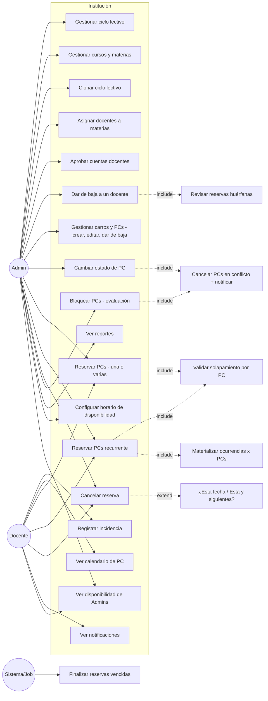

# Casos de Uso (UML) — SGRC

## Diagrama general

## Especificación de casos de uso críticos

### UC: Reservar PCs (una o varias)
- **Actores:** Docente (asignado a la materia), Admin
- **Precondición:** Usuario autenticado con JWT, cuenta en estado `APROBADA`.
- **Flujo:**
  1. Usuario selecciona materia, fecha, hora inicio y fin.
  2. Sistema muestra la lista de PCs disponibles en ese horario; el usuario tilda una o varias (como marcar casillas) hasta juntar la cantidad que necesita.
  3. Sistema verifica que el usuario tiene permiso para reservar en esa materia.
  4. Sistema verifica estado `DISPONIBLE` de cada PC elegida y ausencia de solapamiento (constraint `EXCLUDE` por PC).
  5. Crea un `ReservaGrupo` `CONFIRMADA` con snapshot del nombre del docente, y una `Reserva` por cada PC elegida.
- **Error solapamiento:** HTTP 409 con detalle por PC en conflicto (nombre, materia, horario) — el usuario puede destildar esas PCs puntuales y confirmar con el resto.

### UC: Reservar PCs recurrente
- **Flujo:**
  1. Usuario indica materia, conjunto de PCs, día de semana, horario, rango de fechas.
  2. Sistema calcula todas las ocurrencias (cada fecha × cada PC elegida).
  3. Valida **todas** contra solapamientos. Si alguna falla → devuelve lista de conflictos (fecha + PC), no crea ninguna.
  4. Si todas OK → crea `ReglaRecurrencia` + N `ReservaGrupo` materializados (uno por fecha), cada uno con su set de `Reserva` por PC.

### UC: Cancelar reserva
- **PC puntual dentro de un grupo:** marca esa `Reserva` como `CANCELADA`, libera el horario de esa PC. El `ReservaGrupo` pasa a `PARCIALMENTE_CANCELADA` si conserva otras PCs confirmadas, o a `CANCELADA` si esa era la última.
- **Grupo completo (todas sus PCs a la vez), a pedido del usuario:** cancela todas las `Reserva` del grupo de una vez → grupo `CANCELADA`.
- **Ocurrencia de recurrencia:** popup "¿Solo esta fecha? / ¿Esta y siguientes?" → aplica sobre el/los `ReservaGrupo` con `regla_recurrencia_id` y `fecha >= hoy` (cancela 1 fecha o todas las siguientes, con sus PCs).
- **Admin cancela una PC puntual ajena:** motivo obligatorio → marca esa `Reserva` `CANCELADA` + genera notificación interna al docente + recalcula estado del grupo.

### UC: Bloquear PCs para evaluación estatal
- **Actor:** Admin
- **Precondición:** rango de fecha/hora **definido** de antemano.
- **Flujo:**
  1. Admin selecciona carro (cualquiera, sin restricción), rango fecha/hora.
  2. Sistema identifica las `Reserva` `CONFIRMADA` en conflicto sobre las PCs de ese carro, dentro de ese rango exacto.
  3. Cancela cada `Reserva` puntual afectada y recalcula el estado de cada `ReservaGrupo` al que pertenecía.
  4. Genera notificación interna para cada docente afectado, detallando qué PCs puntuales se cancelaron.
  5. Crea filas `Reserva` tipo `EVALUACION_ESTATAL` (sin `materia_id` ni `reserva_grupo_id`) sobre todas las PCs del carro para ese rango.

### UC: Cambiar estado de PC individual (con cancelación en cascada)
- **Actor:** Admin
- **Precondición:** La PC tiene `Reserva` `CONFIRMADA` futuras.
- **Flujo:**
  1. Admin cambia el estado de la PC a `EN_MANTENIMIENTO` o `FUERA_DE_SERVICIO`, opcionalmente con un motivo. Esta condición es indefinida — no hay fecha de fin conocida.
  2. Sistema busca las `Reserva` `CONFIRMADA` de esa PC puntual con fecha/hora aún no transcurrida.
  3. Cancela cada una (`CANCELADA`, `motivo_cancelacion` = el ingresado o uno generado por defecto) y recalcula el estado de cada `ReservaGrupo` afectado.
  4. Genera notificación interna para cada docente afectado, detallando que fue esa PC puntual (no necesariamente toda su reserva).
- **Diferencia con el bloqueo de evaluación (RF-04.7):** acá el alcance es una sola PC, la duración es indefinida (no un rango horario acotado), y el motivo es opcional.
- **Al volver la PC a `DISPONIBLE`:** las reservas canceladas no se restauran automáticamente — quien las necesite debe volver a reservar.

### UC: Archivar y clonar ciclo lectivo
- **Actor:** Admin
- **Flujo:**
  1. Admin archiva ciclo actual: `curso` y `materia` de ese ciclo pasan a `archivado=true` (se preservan, para no recrearlos).
  2. Antes de tocar las reservas, el sistema calcula un snapshot agregado (uso por PC, uso por docente de ese año) y lo guarda en `historico_uso_pc` / `historico_uso_docente` (permanentes).
  3. El sistema **elimina físicamente** todos los `ReservaGrupo`, `Reserva`, `ReglaRecurrencia` y `ReglaRecurrenciaPc` de las materias de ese ciclo. `Incidencia` no se toca (es de la PC, no del ciclo).
  4. Sistema ofrece clonar estructura al nuevo ciclo (año+1): crea `curso` + `materia` nuevos (sin `archivado`). No clona: `DocenteMateria`.
  5. Admin puede ajustar la estructura clonada antes de activar el nuevo ciclo.
- **Por qué se conserva la estructura académica pero no las reservas:** recrear "1°A" + "Matemáticas" + "el titular es Fulano" cada año es el trabajo tedioso que la clonación evita. Las reservas puntuales de un año que ya terminó no tienen valor operativo — solo estadístico, y ese valor queda cubierto por el snapshot histórico.

### UC: Aprobar cuenta de docente
- **Actor:** Admin
- **Precondición:** Un docente se autorregistró y su cuenta está en estado `PENDIENTE`.
- **Flujo:**
  1. Docente se autorregistra, declarando —si quiere— qué curso y qué materia va a dictar → sistema notifica a todos los Admin (RF-05.6), sin necesidad de que revisen la lista manualmente.
  2. Admin ve la lista de cuentas pendientes, o llega directo desde el botón de la notificación.
  3. La tarjeta de cada pendiente muestra lo que esa persona declaró, así el Admin sabe a qué materia y curso corresponde asignarla — y si todavía no existen, que los tiene que crear primero (RF-02.6).
  4. Admin aprueba o rechaza.
  5. Si aprueba, el docente puede iniciar sesión; para poder reservar, además hay que asignarlo a la materia desde Académico.

### UC: Dar de baja a un docente
- **Actor:** Admin
- **Precondición:** El docente tiene estado `APROBADA`.
- **Flujo:**
  1. Admin da de baja al docente → `Usuario.estado = BAJA`.
  2. Sistema identifica todas las `Materia` donde el docente tenía `DocenteMateria`.
  3. Para cada una, verifica si queda al menos otro docente en estado `APROBADA` asignado:
     - **Sí queda otro docente** → no se toca ninguna reserva. Se genera una notificación informativa a todos los `ADMIN` listando los `ReservaGrupo` futuros creados por el docente dado de baja en esa materia, para revisión manual.
     - **No queda ningún docente** → se cancelan automáticamente todos los `ReservaGrupo` futuros de esa materia (con sus `Reserva`), y se notifica a todos los `ADMIN` (no hay un docente al cual avisar).
  4. **Recién después** de resolver el destino de las reservas de todas sus materias, el sistema elimina los vínculos `DocenteMateria` del docente dado de baja — el orden importa: si se borraran antes, el paso 3 no podría distinguir "quedan otros docentes" de "este era el único".
  5. El docente pierde acceso al login (estado `BAJA` no puede autenticarse).
- **La baja es permanente:** no existe "reactivar cuenta" — la API lo rechaza explícitamente. Si la persona vuelve, se autorregistra de nuevo como cuenta nueva.

### UC: Eliminar definitivamente una cuenta en BAJA
- **Actor:** Admin
- **Precondición:** La cuenta está en estado `BAJA` (no se puede hacer directamente sobre `PENDIENTE`/`APROBADA`/`RECHAZADA`).
- **Motivación típica:** el docente quiere volver y reusar el mismo email, que quedó ocupado por la cuenta anterior.
- **Flujo:**
  1. Admin confirma la eliminación definitiva de la cuenta.
  2. Sistema borra la fila `Usuario`. Sus `DocenteMateria` (ya deberían estar vacíos desde la baja) y sus notificaciones propias se eliminan en cascada; sus reservas, incidencias y aprobaciones que hizo a otros usuarios **no se eliminan** — solo pierden la referencia al usuario (`creado_por`, `reportado_por`, `aprobado_por` quedan en `NULL`), preservando `nombre_docente_snapshot` u otro texto ya guardado.
  3. El email queda libre para un registro nuevo.

### UC: Remover a un docente de una materia puntual (sin baja completa)
- **Actor:** Admin
- **Precondición:** El docente sigue con cuenta `APROBADA`, pero se lo desvincula de una materia específica (conserva sus demás materias y su cuenta).
- **Flujo:**
  1. Admin remueve el vínculo `DocenteMateria` de esa materia puntual.
  2. Sistema verifica si queda al menos otro docente `APROBADA` asignado a esa materia:
     - **Sí queda otro docente** → no se toca ninguna reserva. Aviso informativo al `ADMIN`.
     - **No queda ningún docente** → se cancelan los `ReservaGrupo` futuros de esa materia y se notifica al `ADMIN`.
- **Diferencia con la baja completa:** misma política de cascada (RF-02.10), pero acá el docente conserva su cuenta y el resto de sus materias — solo se ve afectado el vínculo puntual que se removió.

### UC: Gestionar inventario (carros y PCs)
- **Actor:** Admin
- **Flujo:**
  1. Admin crea un carro (nombre, descripción) y lo edita cuando lo necesite.
  2. Admin registra PCs dentro de un carro (identificador, `freezado`, CPU, RAM, SO, software instalado — incluyendo detalle como versión de AutoCAD).
  3. Admin edita los datos de una PC en cualquier momento.
  4. Admin cambia la disponibilidad de una PC (`DISPONIBLE`/`EN_MANTENIMIENTO`/`FUERA_DE_SERVICIO` — ver cascada de cancelación más arriba).
  5. Admin puede dar de baja una PC del inventario (soft delete: deja de listarse y de poder reservarse, pero su historial de incidencias y reservas pasadas se conserva).
- **Visibilidad:** el listado de carros/PCs (incluyendo `software_instalado` y `freezado`) es visible para **cualquier usuario autenticado**, no solo Admin — un docente lo necesita para elegir bien qué PCs reservar (ej: cuáles tienen la versión de AutoCAD que su clase requiere).

### UC: Resetear contraseña de un usuario
- **Actor:** Admin
- **Flujo:**
  1. Un usuario olvidó su contraseña y no hay flujo de email disponible.
  2. Admin busca su cuenta y dispara el reseteo.
  3. Sistema genera una contraseña temporal, la marca con `debeCambiarPassword = true`, y se la muestra al Admin una sola vez (para que se la comunique al usuario por el medio que prefieran).
  4. El usuario inicia sesión con la temporal — el login funciona, pero el frontend fuerza la pantalla de cambio de contraseña antes de dejarlo operar el resto del sistema.
  5. Al cambiarla, `debeCambiarPassword` vuelve a `false`.
- **Relacionado:** cualquier usuario puede cambiar su propia contraseña en cualquier momento, no solo cuando se lo exige un reseteo.

### UC: Editar o eliminar curso/materia con el ciclo activo
- **Actor:** Admin
- **Precondición:** El ciclo lectivo al que pertenece está activo (sin archivar).
- **Flujo:**
  1. Admin corrige el nombre de un curso o materia cargado por error.
  2. Si necesita eliminarlo, el sistema verifica que no tenga ninguna `ReservaGrupo` asociada.
     - **Sin reservas** → se elimina (hard delete).
     - **Con reservas** → rechaza la eliminación; la única forma de sacarlo de circulación es archivar el ciclo completo (ver UC de archivado).

### UC: Mover una PC de carro
- **Actor:** Admin
- **Flujo:**
  1. Admin reorganiza el inventario físico y actualiza el `carroId` de una PC.
  2. Sistema valida que el identificador siga siendo único dentro del carro destino.
  3. Las reservas existentes de esa PC no se ven afectadas — siguen apuntando a la misma PC, solo cambia su carro.

### UC: Configurar horario de disponibilidad (Admin)
- **Actor:** Admin
- **Flujo:**
  1. Admin carga uno o más bloques semanales (día + hora inicio + hora fin) indicando cuándo está presente en el laboratorio.
  2. Puede tener varios bloques por semana, en días y horarios distintos de otros Admins.
  3. Editar un bloque aplica desde ese momento en adelante para todas las semanas futuras — no hace falta ninguna acción extra para que el cambio "se propague".

### UC: Cargar excepción puntual o marcarse no disponible ahora (Admin)
- **Actor:** Admin
- **Flujo:**
  1. Para un día concreto distinto a lo habitual, el Admin carga una excepción con horario modificado o ausencia total — no toca el patrón semanal general.
  2. Alternativamente, con un solo clic puede marcarse "no disponible ahora" (equivalente a cargar una excepción de ausencia para la fecha de hoy), útil si llegó tarde o no puede estar presente ese día pese a que le tocaba.

### UC: Ver disponibilidad de Admins
- **Actor:** Cualquier usuario autenticado (docentes incluidos)
- **Flujo:**
  1. Usuario consulta la lista de Admins.
  2. Por cada uno, el sistema calcula "disponible ahora" comparando el día/hora actual contra: primero, si existe una excepción para hoy (la excepción manda); si no, contra el patrón semanal habitual.
  3. También se muestra el horario semanal completo de cada Admin, como referencia para saber cuándo volver.
- **Nota:** esto es puramente informativo (RF-07.6) — no habilita ni restringe ninguna acción del sistema.
