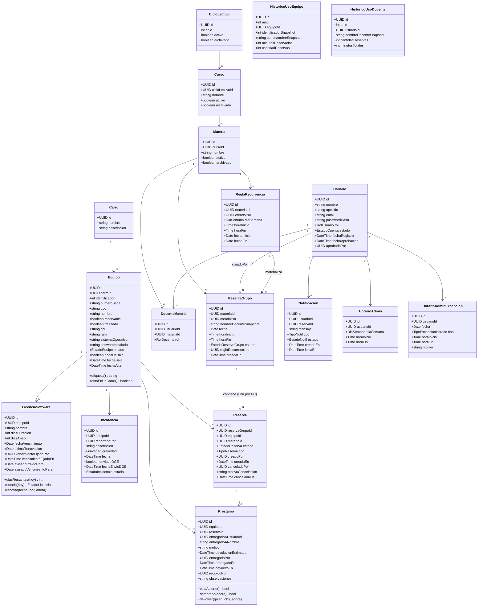

# Diagrama de Clases (Modelo de Dominio) — SGRC

## Enumeraciones

| Enum | Valores |
|---|---|
| `RolUsuario` | `ADMIN`, `DOCENTE` |
| `EstadoCuenta` | `PENDIENTE`, `APROBADA`, `RECHAZADA`, `BAJA` |
| `RolDocente` | `TITULAR`, `SUPLENTE` |
| `EstadoEquipo` | `DISPONIBLE`, `EN_MANTENIMIENTO`, `FUERA_DE_SERVICIO` |
| `EstadoReservaGrupo` | `CONFIRMADA`, `PARCIALMENTE_CANCELADA`, `CANCELADA`, `FINALIZADA`, `NO_RETIRADA` |
| `EstadoReserva` (por PC) | `CONFIRMADA`, `CANCELADA`, `FINALIZADA`, `NO_RETIRADA` |
| `TipoReserva` | `NORMAL`, `BLOQUEO` |
| `Gravedad` | `LEVE`, `MODERADA`, `GRAVE` |
| `EstadoIncidencia` | `ABIERTA`, `EN_REPARACION`, `ENVIADA_DGE`, `RESUELTA` |
| `EstadoNotif` | `NO_LEIDA`, `LEIDA` |
| `TipoNotif` | `GENERAL`, `DOCENTE_PENDIENTE`, `RESERVA_CANCELADA`, `LICENCIA_POR_VENCER`, `RESERVA_POR_COMENZAR`, `RESERVA_NO_RETIRADA`, `PC_SIN_DEVOLVER` |
| `EstadoLicencia` | `SIN_FECHA`, `VENCIDA`, `POR_VENCER`, `VIGENTE` — **derivado**, nunca una columna: se calcula contra la fecha de hoy |
| `DiaSemana` | `LUNES`…`VIERNES` (la semana lectiva es de lunes a viernes) |
| `TipoExcepcionHorario` | `NO_DISPONIBLE`, `HORARIO_MODIFICADO` |

## Notas de diseño

- **`ReservaGrupo` vs `Reserva`**: un docente selecciona varias PCs de una lista (tildando casillas) hasta juntar la cantidad que necesita para su clase, en una sola operación. `ReservaGrupo` es esa operación (una materia, fecha, horario); `Reserva` es cada PC dentro de ella. Las cancelaciones en cascada (bloqueo administrativo, PC fuera de servicio) actúan sobre filas `Reserva` puntuales — el `ReservaGrupo` solo pasa a `CANCELADA` si terminan canceladas **todas** sus PCs; si queda alguna en pie, pasa a `PARCIALMENTE_CANCELADA`.
- **`Reserva` de tipo `BLOQUEO` no pertenece a ningún `ReservaGrupo` ni `Materia`**: es un bloqueo administrativo sobre PCs puntuales, no la reserva de un docente para dar clase.
- **`Equipo.freezado`**: atributo informativo (Deep Freeze instalado), sin efecto funcional sobre reservas. Vive a nivel de PC, no de `Carro` — cada PC de un mismo carro puede tener o no Deep Freeze instalado.
- **`ReglaRecurrencia` no guarda sus PCs**: una recurrencia semanal reserva varias PCs a la vez, igual que una reserva puntual, pero eso vive en los `ReservaGrupo` que la regla materializa (uno por ocurrencia), cada uno con sus `Reserva`. Existió una tabla puente `regla_recurrencia_pc` que solo se escribía y nunca se leía: se eliminó en la migración `002` (ver `07-modelo-datos.md`). Cancelar "esta y las siguientes" (RF-04.6) resuelve por `reserva_grupo.regla_recurrencia_id`.
- **`Usuario.estado = BAJA`**: distingue una cuenta que estuvo activa y se dio de baja de una que nunca fue aprobada (`RECHAZADA`). Al dar de baja a un docente, sus reservas futuras **no se cancelan automáticamente** salvo que la materia quede sin ningún otro docente asignado (ver `01-requisitos.md` RF-02.8).
- **`nombreDocenteSnapshot`**: vive en `ReservaGrupo` (preserva el nombre del docente aunque el usuario sea dado de baja).
- **Archivado de cursos/materias**: `archivado = true` oculta del sistema activo, pero a diferencia de `ReservaGrupo`/`Reserva`/`ReglaRecurrencia` (que se **eliminan físicamente** al archivar el ciclo de su materia), `Curso`/`Materia`/`DocenteMateria` se preservan — es lo que evita recrearlos el año siguiente.
- **`HistoricoUsoEquipo` / `HistoricoUsoDocente`**: snapshot agregado permanente, calculado una sola vez al archivar un ciclo (no sincronizado continuamente). Es la única fuente de estadísticas para años ya cerrados, porque el detalle de sus reservas ya no existe.
- **`Equipo.dadaDeBaja` / `Equipo.fechaBaja`**: "eliminar" una PC desde la UI es en realidad un soft delete — se oculta de listados activos y no puede reservarse, pero conserva su historial de incidencias y reservas pasadas (mientras esas reservas no se hayan borrado por archivado de su materia).
- **`HorarioAdmin` es un patrón recurrente simple, sin versionar**: a diferencia de `ReglaRecurrencia` (que materializa una fila por ocurrencia porque cada una puede reservarse/cancelarse individualmente), acá no hace falta — es solo información para calcular "¿está disponible ahora?" en el momento de la consulta. Editar un bloque cambia el patrón para todas las semanas futuras de inmediato.
- **`Prestamo` no es `Reserva`**: la reserva es el derecho a usar una PC en una franja, el préstamo es quién tiene la máquina *ahora*. Existen por separado —reservas que nadie retiró, préstamos sin reserva, préstamos que sobreviven a su reserva—, y por eso tampoco hay un estado "prestada" en `Equipo`: se deriva de si hay un préstamo con `devueltoEn` en `null`. Lo que se guarda por duplicado se desincroniza, que es el defecto del papel que esto reemplaza.
- **`LicenciaSoftware` no guarda "los días que faltan"**: `diasRestantes()` los calcula contra la fecha de hoy cada vez (RF-03.12). Un contador guardado necesitaría que alguien lo decremente todos los días, y bastaría un día de servidor apagado para dejarlo mal para siempre. Por lo mismo, `fechaVencimiento` en `null` significa "todavía no se verificó contra la máquina" y **no** "no vence nunca": es un estado legítimo, no un dato faltante que haya que completar con una fecha inventada.
- **`avisadoPrevioPara` / `avisadoVencimientoPara` guardan una fecha, no un booleano**: la fecha de vencimiento para la que ya salió cada aviso. Es lo que hace idempotente al barrido sin resetear nada — al renovar cambia `fechaVencimiento`, las marcas dejan de coincidir solas, y el ciclo nuevo vuelve a avisar.
- **`HorarioAdminExcepcion`**: cubre tanto una excepción planificada (horario distinto un día puntual) como el botón rápido "marcarme no disponible ahora" (que es, puertas adentro, la misma fila con `tipo=NO_DISPONIBLE` y `fecha=hoy`). Si existe una excepción para la fecha consultada, siempre pisa al patrón semanal de `HorarioAdmin`.
