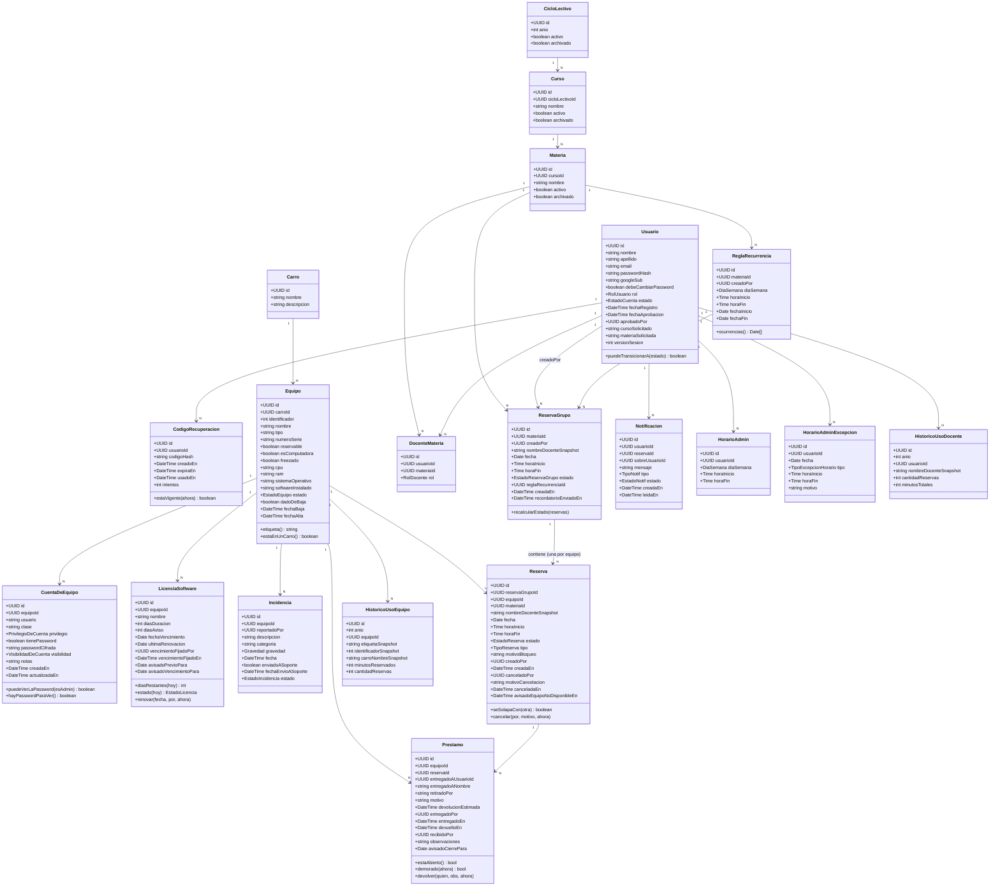

# Diagrama de Clases (Modelo de Dominio) — SGRC

Las entidades tal como viven en `internal/*/domain/`. La correspondencia con
las tablas está en `07-modelo-datos.md`; acá interesa el comportamiento —
qué sabe hacer cada entidad por sí sola.

## Enumeraciones

| Enum | Valores |
|---|---|
| `RolUsuario` | `ADMIN`, `DOCENTE` |
| `EstadoCuenta` | `PENDIENTE`, `APROBADA`, `RECHAZADA`, `BAJA` |
| `RolDocente` | `TITULAR`, `SUPLENTE` |
| `EstadoEquipo` | `DISPONIBLE`, `EN_MANTENIMIENTO`, `FUERA_DE_SERVICIO` |
| `EstadoReservaGrupo` | `CONFIRMADA`, `PARCIALMENTE_CANCELADA`, `CANCELADA`, `FINALIZADA`, `NO_RETIRADA` |
| `EstadoReserva` (por equipo) | `CONFIRMADA`, `CANCELADA`, `FINALIZADA`, `NO_RETIRADA` |
| `TipoReserva` | `NORMAL`, `BLOQUEO` |
| `Gravedad` | `LEVE`, `MODERADA`, `GRAVE` |
| `EstadoIncidencia` | `ABIERTA`, `EN_REPARACION`, `ENVIADA_A_SOPORTE`, `RESUELTA` |
| `EstadoNotif` | `NO_LEIDA`, `LEIDA` |
| `TipoNotif` | `GENERAL`, `DOCENTE_PENDIENTE`, `RESERVA_CANCELADA`, `LICENCIA_POR_VENCER`, `EQUIPO_SIN_DEVOLVER`, `PEDIDO_DE_LIBERACION`, `PEDIDO_DE_MATERIA`, `PEDIDO_DE_MATERIA_RESUELTO`, `SUGERENCIA`, `SUGERENCIA_RESPONDIDA` |
| `PrivilegioDeCuenta` | `COMUN`, `ADMINISTRADOR` — qué puede hacer esa cuenta en la máquina |
| `VisibilidadDeCuenta` | `PUBLICA`, `SOLO_ADMIN` — quién puede ver su **contraseña**; la cuenta y su privilegio se listan siempre |
| `EstadoLicencia` | `SIN_FECHA`, `VENCIDA`, `POR_VENCER`, `VIGENTE` — **derivado**, nunca una columna: se calcula contra la fecha de hoy |
| `DiaSemana` | `LUNES`…`DOMINGO` (los siete días; qué días opera la institución se declara, no se supone) |
| `TipoExcepcionHorario` | `NO_DISPONIBLE`, `HORARIO_MODIFICADO` |

Los cuatro campos que **no** son enums —`Equipo.tipo`,
`CuentaDeEquipo.clase`, `Incidencia.categoria` y `Reserva.motivoBloqueo`— son
los que escribe la institución. La regla es
simple: lo que el sistema interpreta es un enum, lo que describe una realidad
local es texto libre.

## Notas de diseño

- **`ReservaGrupo` vs `Reserva`**: un docente tilda varios equipos de una lista
  hasta juntar los que necesita, en una sola operación. `ReservaGrupo` es esa
  operación (una materia, fecha, horario); `Reserva` es cada equipo dentro de
  ella. Las cancelaciones en cascada actúan sobre filas `Reserva` puntuales — el
  grupo solo pasa a `CANCELADA` si terminan canceladas **todas**; si queda
  alguna en pie, pasa a `PARCIALMENTE_CANCELADA`.
- **`Reserva` de tipo `BLOQUEO` no pertenece a ningún `ReservaGrupo` ni
  `Materia`**: es un Admin tomando equipos puntuales, no la reserva de un
  docente para dar clase. En su lugar lleva `motivoBloqueo`, obligatorio.
- **`Equipo.etiqueta()` es el único lugar donde se decide cómo se nombra un
  equipo** (RF-03.17): "PC 3" si está en un carro, su nombre si no. Cualquier
  pantalla que arme el rótulo por su cuenta a partir del identificador y el
  carro muestra un proyector como "PC 0 · ".
- **`Equipo.freezado`** es informativo (Deep Freeze instalado), sin efecto sobre
  reservas. Vive a nivel de equipo y no de `Carro`: dentro de un mismo carro
  cada máquina puede tenerlo o no.
- **`ReglaRecurrencia` no guarda sus equipos**: una recurrencia semanal reserva
  varios equipos a la vez, pero eso vive en los `ReservaGrupo` que la regla
  materializa (uno por ocurrencia), cada uno con sus `Reserva`. Cancelar "esta y
  las siguientes" (RF-04.6) se resuelve por `reservaGrupo.reglaRecurrenciaId`.
- **`Usuario.estado = BAJA`** distingue una cuenta que estuvo activa de una que
  nunca fue aprobada (`RECHAZADA`). Al dar de baja a un docente, sus reservas
  futuras **no se cancelan** salvo que la materia quede sin ningún otro docente
  asignado (RF-02.8).
- **`nombreDocenteSnapshot`** vive en `ReservaGrupo` y se copia a cada
  `Reserva`: preserva el nombre aunque la cuenta se dé de baja o se elimine.
- **Archivado de cursos/materias**: `archivado = true` los oculta del sistema
  activo, pero a diferencia de `ReservaGrupo`/`Reserva`/`ReglaRecurrencia` —que
  se **eliminan físicamente** al archivar el ciclo— `Curso`/`Materia`/
  `DocenteMateria` se preservan. Es lo que evita recrearlos el año siguiente.
- **`HistoricoUsoEquipo` / `HistoricoUsoDocente`**: snapshot agregado
  permanente, calculado una sola vez al archivar un ciclo (no sincronizado
  continuamente). Es la única fuente de estadísticas para años cerrados, porque
  el detalle de sus reservas ya no existe.
- **`Equipo.dadoDeBaja` / `Equipo.fechaBaja`**: el "eliminar" de la interfaz es
  un soft delete — el equipo se oculta de los listados activos y no puede
  reservarse, pero conserva su historial de incidencias, préstamos y reservas.
- **`HorarioAdmin` es un patrón recurrente simple, sin versionar**: a diferencia
  de `ReglaRecurrencia` (que materializa una fila por ocurrencia porque cada una
  puede reservarse o cancelarse individualmente), acá no hace falta — se evalúa
  en el momento de la consulta. Editar un bloque cambia el patrón para todas las
  semanas futuras de inmediato.
- **`Prestamo` no es `Reserva`**: la reserva es el derecho a usar un equipo en
  una franja, el préstamo es quién tiene la máquina *ahora*. Existen por
  separado —reservas que nadie retiró, préstamos sin reserva, préstamos que
  sobreviven a su reserva—, y por eso tampoco hay un estado "prestado" en
  `Equipo`: se deriva de si hay un préstamo con `devueltoEn` en `null`.
- **`Prestamo.retiradoPor` no reemplaza a `entregadoANombre`** (RF-08.19): quien
  responde por el equipo es siempre quien reservó; quién vino a buscarlo se
  anota al lado y es opcional.
- **`LicenciaSoftware` no guarda "los días que faltan"**: `diasRestantes()` los
  calcula contra la fecha de hoy cada vez (RF-03.12). Un contador guardado
  necesitaría que alguien lo decremente todos los días, y bastaría un día de
  servidor apagado para dejarlo mal para siempre. Por lo mismo,
  `fechaVencimiento` en `null` significa "todavía no se verificó contra la
  máquina" y **no** "no vence nunca": es un estado legítimo, no un dato faltante
  que haya que completar con una fecha inventada.
- **`avisadoPrevioPara` / `avisadoVencimientoPara` guardan una fecha, no un
  booleano**: la fecha de vencimiento para la que ya salió cada aviso. Es lo que
  hace idempotente al barrido sin resetear nada — al renovar cambia
  `fechaVencimiento`, las marcas dejan de coincidir solas, y el ciclo nuevo
  vuelve a avisar.
- **`HorarioAdminExcepcion`** cubre tanto una excepción planificada como el
  botón rápido "marcarme no disponible ahora" (la misma fila, con
  `tipo = NO_DISPONIBLE` y `fecha = hoy`). Si existe una excepción para la fecha
  consultada, siempre pisa al patrón semanal de `HorarioAdmin`.
</content>
