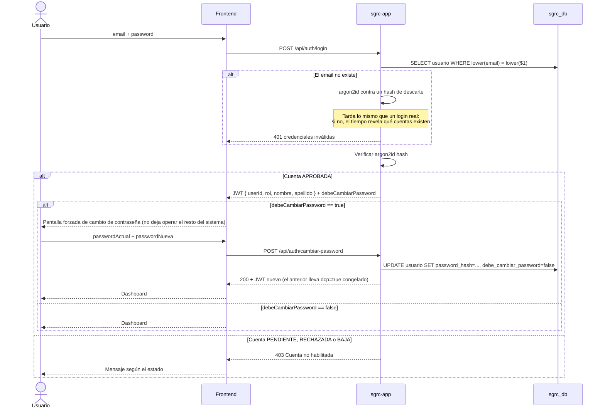
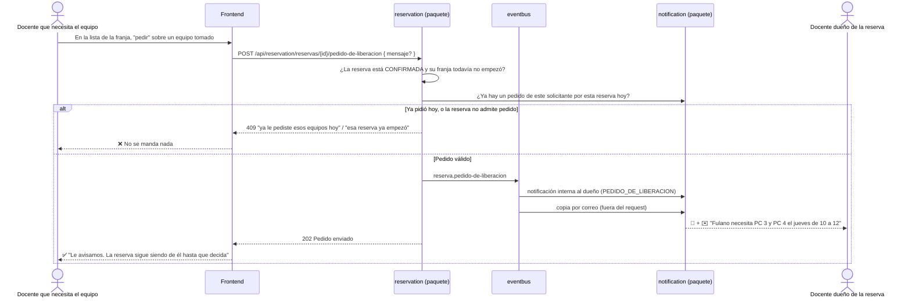
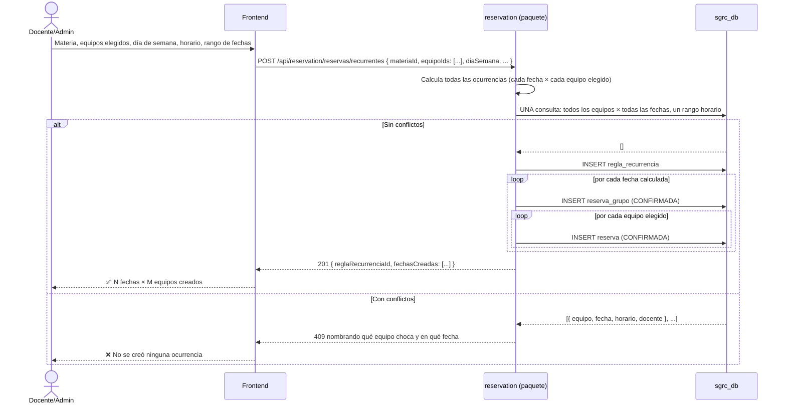
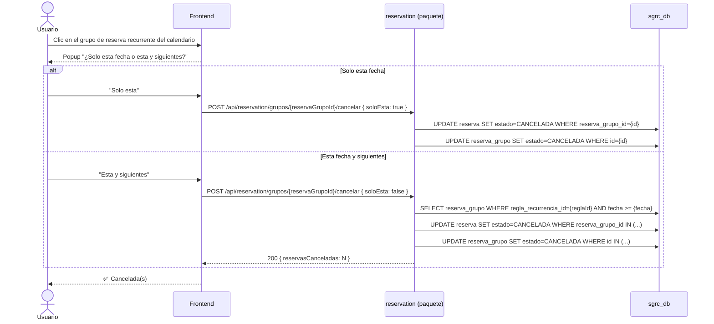
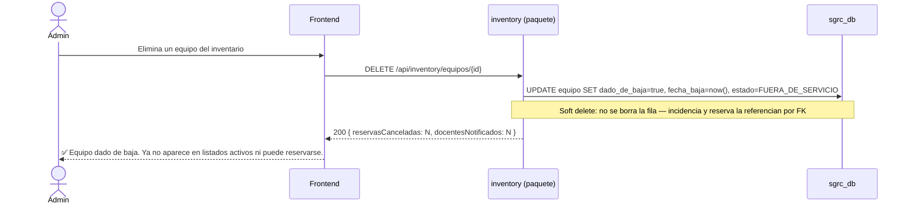
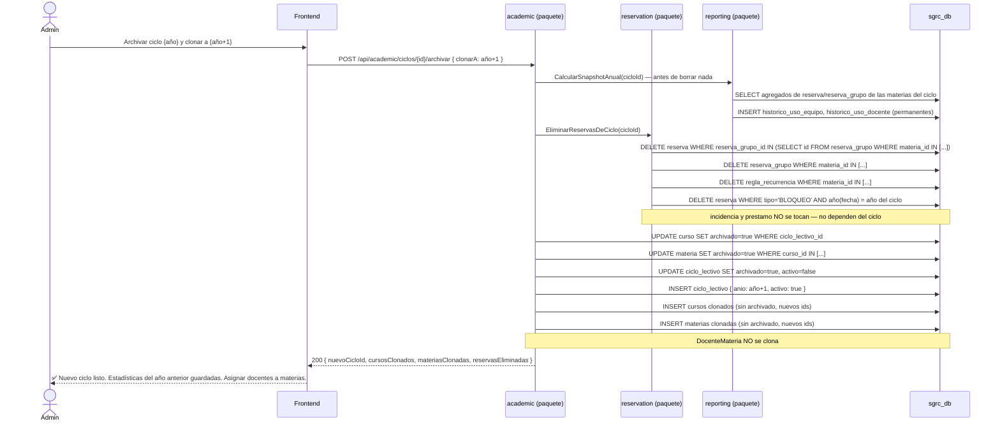
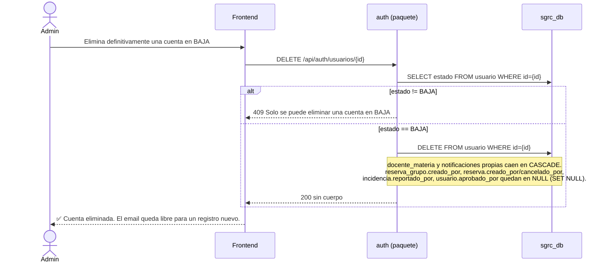
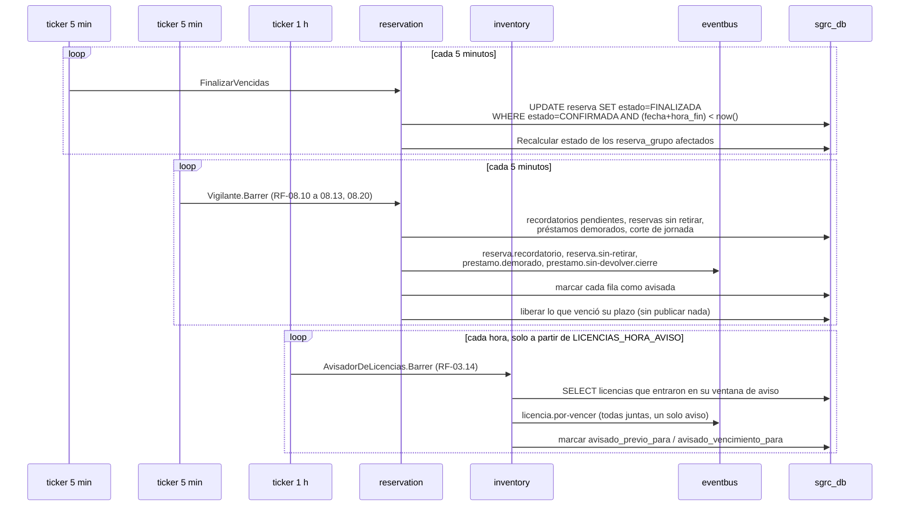
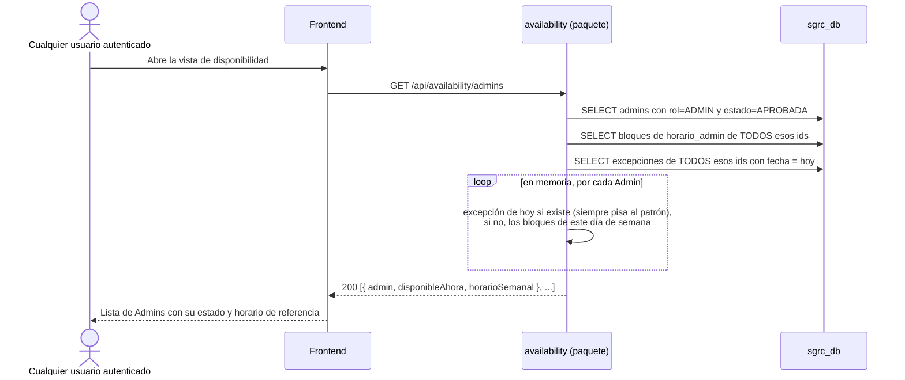

# Diagramas de Secuencia — SGRC

> Nota: los "participantes" de estos diagramas (auth, academic, inventory, reservation, notification) son paquetes internos de un mismo binario Go (ver `06-arquitectura.md`), no procesos ni contenedores separados. Se mantienen como carriles separados en los diagramas porque son límites de dominio reales — la comunicación entre ellos es una llamada de función/interfaz, no HTTP ni mensajería.

## 0. Autorregistro de docente (con notificación a Admins)

```mermaid
sequenceDiagram
    actor U as Docente nuevo
    participant FE as Frontend
    participant AUTH as auth (paquete)
    participant EB as eventbus (in-process)
    participant NOTIF as notification (paquete)
    participant DB as sgrc_db

    U->>FE: nombre, apellido, email, password<br/>+ cargo y titular/suplente (obligatorios)<br/>+ qué curso y materia va a dictar (opcional, solo docentes)
    FE->>AUTH: POST /api/auth/registro
    AUTH->>DB: SELECT usuario WHERE lower(email) = lower($1)
    alt Email libre
        AUTH->>DB: INSERT usuario (rol=DOCENTE, estado=PENDIENTE,<br/>cargo_solicitado, rol_solicitado,<br/>curso_solicitado, materia_solicitada)
        AUTH->>EB: Publish("docente.registro.pendiente", { usuarioId, nombre, apellido })
        EB->>NOTIF: Publish es sincrónico; el handler se va a su propia goroutine
        NOTIF->>DB: SELECT usuario WHERE rol=ADMIN AND estado=APROBADA
        NOTIF->>DB: INSERT notificación tipo=DOCENTE_PENDIENTE para cada Admin (RF-05.6)
        AUTH-->>FE: 201 Cuenta creada, pendiente de aprobación
    else Email pertenece a una cuenta en BAJA
        AUTH-->>FE: 409 "Este email pertenece a una cuenta dada de baja — pedile a un Admin que la elimine"
    else Email ya registrado (cuenta activa)
        AUTH-->>FE: 409 Email ya registrado
    end
    FE-->>U: Mensaje según corresponda
```

> **Lo que declara al registrarse no es una referencia.** `curso_solicitado`
> y `materia_solicitada` son texto libre: la persona todavía no está
> autenticada, así que no puede elegir de una lista, y lo que escribe puede
> no existir en el sistema — de hecho el Admin quizás lo tenga que crear al
> aprobarla. Es lo que la pantalla de aprobación muestra para que sepa a qué
> asignarla (RF-02.6).

> **La notificación lleva `tipo`**, no solo texto: es lo que le permite a la
> pantalla del Admin ofrecer "ir a aprobar" sin interpretar el mensaje. Si la
> acción dependiera de la redacción, cambiarle una palabra al aviso rompería
> el botón.

## 1. Login



> **Cada request posterior vuelve a mirar la cuenta.** El token prueba la
> identidad, pero el middleware consulta el estado y el rol en la base antes
> de dejar pasar: una cuenta dada de baja pierde el acceso en el momento, no
> cuando expira su token (ver `09-seguridad-rbac.md` §1). El rol que vale es
> el de la base, no el del token.

> El JWT se emite igual con la contraseña temporal — `debeCambiarPassword` es una bandera que el frontend usa para bloquear la navegación hasta que se cambie, no una restricción a nivel de token.

## 2. Reservar equipos (uno o varios, en un solo grupo)

```mermaid
sequenceDiagram
    actor U as Docente/Admin
    participant FE as Frontend
    participant RES as reservation (paquete)
    participant INV as inventory (paquete)
    participant DB as sgrc_db

    U->>FE: Selecciona materia, fecha, horario
    Note over FE: Antes de la franja no hay lista que mostrar
    FE->>RES: GET /api/reservation/equipos-disponibles?fecha&horaInicio&horaFin
    RES->>INV: Listar equipos DISPONIBLE y reservables
    RES->>DB: SELECT reservas y bloqueos que pisan esa franja
    RES-->>FE: { data: libres para tildar, ocupados: con docente/materia/franja o motivo }
    U->>FE: Tilda los equipos que necesita (uno o varios)
    FE->>RES: POST /api/reservation/reservas { materiaId, fecha, horaInicio, horaFin, equipoIds: [...] }
    RES->>RES: Verifica permiso sobre la materia (rol + docente_materia)
    RES->>DB: INSERT reserva_grupo (CONFIRMADA)
    loop por cada equipoId
        RES->>DB: INSERT reserva (EXCLUDE constraint valida solapamiento por equipo)
    end
    alt Todos los equipos sin solapamiento
        DB-->>RES: OK
        RES-->>FE: 201 { reservaGrupoId, equiposConfirmados: N }
        FE-->>U: ✅ Reserva confirmada (N equipos)
    else Algún equipo con solapamiento
        DB-->>RES: Constraint violation en ese equipo puntual
        RES->>DB: SELECT reserva en conflicto para ese equipo
        RES->>DB: ROLLBACK — no se confirma ningún equipo del grupo
        RES-->>FE: 409 "no se pudo reservar: PC 7 ya está reservado el 13/03 de 10:00 a 12:00 (Ada Lovelace)"
        FE-->>U: ❌ El mensaje dice cuál destildar; se recarga la lista de libres
    end
```

> La creación es transaccional: si un solo equipo del grupo tiene solapamiento, no se confirma ninguno. El cuerpo del 409 es texto plano —el backend usa el `ErrorHandler` por defecto de Fiber— pero ese texto **nombra el choque**: qué equipo, qué día, qué franja y con quién. El dato lo trae la misma consulta que lo detectó, así que no cuesta nada más.

> **La misma consulta responde las dos mitades.** Saber qué está libre en una franja exige leer las reservas y bloqueos que la pisan; devolver también quién tiene cada equipo tomado no agrega ninguna ida a la base, solo deja de descartar lo que ya se leyó (RF-04.11).

## 2b. Pedirle equipos a quien los tiene reservados (RF-04.12)



> **El pedido no escribe nada sobre las reservas.** No hay tabla propia, no hay estado que resolver y quien pidió no queda con prioridad sobre el equipo: si el dueño lo libera, vuelve a la lista de libres para todos. La única fila que se crea es la notificación, y de paso es la que sostiene la regla de "un pedido por reserva, por solicitante y por día".

> **El acuerdo ocurre afuera.** Lo que el sistema aporta es que el pedido llegue a alguien que quizá no se cruce con quien pide; lo que sigue —negociar, ceder, decir que no— no tiene por qué pasar por acá, y modelarlo costaría un flujo de aceptación con caducidad, carrera contra terceros y una pantalla de pendientes.

## 3. Reserva recurrente (uno o varios equipos)



## 4. Cancelar ocurrencia recurrente



## 5. Bloqueo administrativo de equipos

```mermaid
sequenceDiagram
    actor ADM as Admin
    participant FE as Frontend
    participant RES as reservation (paquete)
    participant EB as eventbus (in-process)
    participant NOTIF as notification (paquete)
    participant DB as sgrc_db

    ADM->>FE: Selecciona los equipos, el rango fecha/hora y escribe el motivo
    FE->>RES: POST /api/reservation/bloqueos (JWT)
    RES->>DB: SELECT reserva CONFIRMADA en conflicto (solo esos equipos, ese rango exacto)
    DB-->>RES: [reservas puntuales con reserva_grupo_id, docenteId]
    loop por cada reserva en conflicto
        RES->>DB: UPDATE reserva SET estado=CANCELADA, motivo_cancelacion='los equipos quedaron bloqueados: {motivo}'
        RES->>DB: Recalcular estado de reserva_grupo (PARCIALMENTE_CANCELADA o CANCELADA)
    end
    RES->>DB: INSERT reserva tipo BLOQUEO con motivo_bloqueo (sin materia_id ni reserva_grupo_id) por cada equipo
    RES->>EB: Publish("reserva.cancelada", { usuarioId, reservaId, motivo }) por reserva
    EB->>NOTIF: Publish es sincrónico; el handler se va a su propia goroutine
    NOTIF->>DB: INSERT notificación por docente, detallando qué equipos puntuales se cancelaron
    RES-->>FE: 201 { bloqueos: [...], reservasCanceladas: N, docentesNotificados: N }
    FE-->>ADM: ✅ Equipos bloqueados. N reservas puntuales canceladas.
```

> Solo se cancelan las `Reserva` (equipo + fecha) que caen dentro del rango exacto del bloqueo. El resto de una recurrencia, o del mismo `ReservaGrupo` en otro horario, sigue vigente.

> **Un solo tipo de evento para los tres orígenes.** RF-05.1, 05.2 y 05.3 son,
> de punta a punta, la misma notificación con distinto motivo: cancelación
> manual de un Admin, bloqueo administrativo, o equipo fuera de servicio. El
> motivo ya viene armado desde `reservation`, así que `notification` no
> necesita saber de dónde vino. Los eventos se publican **después del
> commit**: si la transacción se deshace, nadie recibe el aviso de una
> cancelación que no ocurrió.

## 6. Cambio de estado de un equipo individual → cascada de cancelación

```mermaid
sequenceDiagram
    actor ADM as Admin
    participant FE as Frontend
    participant INV as inventory (paquete)
    participant EB as eventbus (in-process)
    participant NOTIF as notification (paquete)
    participant DB as sgrc_db

    ADM->>FE: Cambia estado del equipo a EN_MANTENIMIENTO/FUERA_DE_SERVICIO (+ motivo opcional)
    FE->>INV: PATCH /api/inventory/equipos/{id}/estado
    INV->>DB: UPDATE equipo SET estado=...
    INV->>DB: SELECT reserva CONFIRMADA de ese equipo puntual con fecha/hora futura
    DB-->>INV: [reservas puntuales con reserva_grupo_id, docenteId]
    loop por cada reserva afectada
        INV->>DB: UPDATE reserva SET estado=CANCELADA, cancelado_por=admin, motivo_cancelacion=(ingresado o por defecto)
        INV->>DB: Recalcular estado de reserva_grupo (PARCIALMENTE_CANCELADA o CANCELADA)
    end
    INV->>EB: Publish("reserva.cancelada", { usuarioId, reservaId, motivo }) por reserva
    EB->>NOTIF: Publish es sincrónico; el handler se va a su propia goroutine
    NOTIF->>DB: INSERT notificación por docente, detallando que fue ese equipo puntual
    INV-->>FE: 200 { estado, reservasCanceladas: N, docentesNotificados: N }
    FE-->>ADM: ✅ Equipo actualizado. N reservas canceladas y docentes notificados.
```

> Duración **indefinida** (a diferencia del bloqueo administrativo, que tiene rango definido): se cancelan todas las reservas futuras de ese equipo puntual, sin fecha de corte. Cuando el equipo vuelve a `DISPONIBLE`, nada se restaura automáticamente.

## 6b. Dar de baja un equipo del inventario (soft delete)



> Un `DELETE` en la API es, puertas adentro, un soft delete: si se borrara la fila físicamente, se perdería la referencia de todo el historial de incidencias y reservas pasadas de ese equipo. Distinto del borrado de reservas al archivar un ciclo lectivo (§7), que sí es físico porque ahí se preserva un snapshot agregado aparte.

## 7. Archivar y clonar ciclo lectivo



> Las reservas de las materias del ciclo archivado **se eliminan físicamente**, no quedan como historial en detalle. El snapshot histórico se calcula primero para no perder las estadísticas — `curso`/`materia`/`docente_materia` sí se preservan (`archivado=true`), porque eso es lo que evita recrearlos.

## 8. Dar de baja a un docente (permanente)

```mermaid
sequenceDiagram
    actor ADM as Admin
    participant FE as Frontend
    participant AUTH as auth (paquete)
    participant ACAD as academic (paquete)
    participant RES as reservation (paquete)
    participant EB as eventbus (in-process)
    participant NOTIF as notification (paquete)
    participant DB as sgrc_db

    ADM->>FE: Da de baja a un docente
    FE->>AUTH: PATCH /api/auth/usuarios/{id}/estado { estado: BAJA }
    AUTH->>DB: UPDATE usuario SET estado=BAJA WHERE id={id}
    AUTH->>ACAD: ObtenerMateriasDeDocente(usuarioId) — llamada directa vía interfaz
    ACAD-->>AUTH: [materiaId, ...]
    loop por cada materia
        AUTH->>ACAD: ¿Queda otro DocenteMateria con usuario APROBADA en esta materia?
        alt Queda otro docente activo
            ACAD-->>AUTH: Sí
            AUTH->>EB: Publish("docente.baja.notificar_admin", { usuarioId, materiaId })
        else No queda ningún docente
            ACAD-->>AUTH: No
            AUTH->>RES: CancelarReservasFuturasDeMateria(materiaId)
            RES->>DB: UPDATE reserva SET estado=CANCELADA<br/>WHERE materia_id={materiaId} AND (fecha + hora_fin) > ahora
            AUTH->>EB: Publish("docente.baja.materia-huerfana", { usuarioId, materiaId, reservasCanceladas })
        end
    end
    AUTH->>ACAD: EliminarDocenteMateria(usuarioId) — recién ahora, después de resolver el destino de las reservas
    ACAD->>DB: DELETE FROM docente_materia WHERE usuario_id={usuarioId}
    EB->>NOTIF: Publish es sincrónico; los handlers se van a su propia goroutine
    NOTIF->>DB: INSERT notificación(es) a todos los ADMIN (aviso informativo o cancelación aplicada)
    AUTH-->>FE: 200
    FE-->>ADM: ✅ Docente dado de baja. Revisar notificaciones si hay materias afectadas.
```

> El orden importa por dos razones. `EliminarDocenteMateria` corre **después**
> del loop que revisa cada materia: si se borrara primero, la pregunta "¿queda
> otro docente activo?" ya no tendría con qué compararse. Y las cancelaciones
> van antes de borrar los vínculos, porque la cascada cruza a `reservation`
> con su propia transacción y el conjunto no puede ser atómico: si algo falla,
> los vínculos se conservan y el error dice qué materias quedaron pendientes,
> en vez de dejar reservas vivas en materias que ya nadie sabe cuáles eran.

> **RF-02.10 hace lo mismo por el otro camino.** Quitar a un docente de **una
> sola** materia (`DELETE /materias/{id}/docentes/{dmId}`) llega al mismo
> estado —materia sin nadie a cargo, con reservas futuras vivas— así que
> dispara la misma cascada, con el mismo orden (cancelar y después borrar el
> vínculo) y su propio evento, `docente.desasignado.materia-huerfana`. La
> respuesta devuelve `reservasCanceladas` para que el Admin sepa qué se llevó
> puesto.

## 8b. Eliminar definitivamente una cuenta en BAJA



## 9. Los barridos periódicos (sin proceso externo)

Hay **tres barridos**, cada uno en su propia goroutine arrancada por
`cmd/main.go` con un `time.Ticker` y registrada en un `sync.WaitGroup` para que
el apagado ordenado los espere. Ninguno necesita cron ni un proceso aparte.



> **`FinalizarVencidas` va por lotes**, cada uno en su propia transacción, con
> corte por falta de progreso y un tope de lotes por ciclo del ticker: el
> primer barrido de una base con años de reservas no puede quedarse tomando un
> lock encima de la tabla que usa el resto del sistema.

> **Ningún aviso depende de que el barrido corra a una hora exacta.** Cada uno
> deja su marca en la fila, así que reiniciar el proceso o estar caído dos
> horas cambia *cuándo* sale el aviso, nunca *cuántas veces* (RF-08).

> **El aviso y la liberación son dos momentos distintos** (RF-08.20 y RF-08.10).
> A los 15 minutos del inicio, si no salió ninguna máquina de esa reserva, el
> barrido publica `reserva.sin-retirar` y marca `aviso_sin_retirar_en`: ese es el
> único aviso, y llega cuando el docente todavía puede ir, cambiar la máquina o
> cancelar. **Liberar no publica nada** — ni a los 40 sin retiro, ni a los 15 de
> una entrega parcial. Es el único punto del barrido donde una reserva cambia de
> estado sin que salga un aviso, y es a propósito: el correo ya salió antes, y
> repetirlo al liberar sería un segundo mensaje por la misma clase para contar
> algo que ya no se puede cambiar.

## 10. Ver disponibilidad de Admins



> **Dos consultas en total, no dos por Admin.** Resolverlo dentro del bucle
> serían 2N viajes a la base para armar una pantalla que mira cualquier
> docente; el cálculo en sí no toca la base, así que se traen los dos conjuntos
> de una vez y se cruzan en memoria.

> Puramente informativo (RF-07.6): este cálculo no habilita ni bloquea ninguna otra acción del sistema — es solo para que el docente sepa cuándo pasar por el laboratorio.
