# Diagramas de Secuencia — SGRC

> Nota: los "participantes" de estos diagramas (auth, academic, inventory, reservation, notification) son paquetes internos de un mismo binario Go (ver `06-arquitectura.md`), no procesos ni contenedores separados. Se mantienen como carriles separados en los diagramas porque son límites de dominio reales — la comunicación entre ellos es una llamada de función/interfaz, no HTTP ni mensajería.

## 0. Autorregistro de docente (con notificación a Admins)

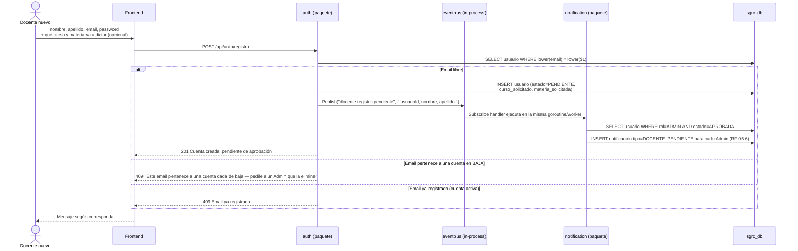

> **Lo que declara al registrarse no es una referencia.** `curso_solicitado`
> y `materia_solicitada` son texto libre: la persona todavía no está
> autenticada, así que no puede elegir de una lista, y lo que escribe puede
> no existir en el sistema — de hecho el Admin quizás lo tenga que crear al
> aprobarla. Es lo que la pantalla de aprobación muestra para que sepa a qué
> asignarla (RF-02.6).

> **La notificación lleva `tipo`**, no solo texto: es lo que le permite a la
> pantalla del Admin ofrecer "ir a aprobar" sin interpretar el mensaje. Si la
> acción dependiera de la redacción, cambiarle una palabra al aviso rompería
> el botón.

## 1. Login

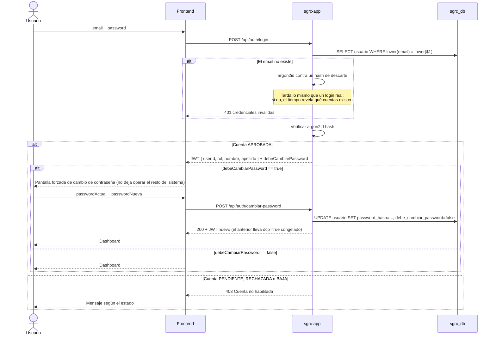

> **Cada request posterior vuelve a mirar la cuenta.** El token prueba la
> identidad, pero el middleware consulta el estado y el rol en la base antes
> de dejar pasar: una cuenta dada de baja pierde el acceso en el momento, no
> cuando expira su token (ver `09-seguridad-rbac.md` §1). El rol que vale es
> el de la base, no el del token.

> El JWT se emite igual con la contraseña temporal — `debeCambiarPassword` es una bandera que el frontend usa para bloquear la navegación hasta que se cambie, no una restricción a nivel de token.

## 2. Reservar PCs (una o varias, en un solo grupo)

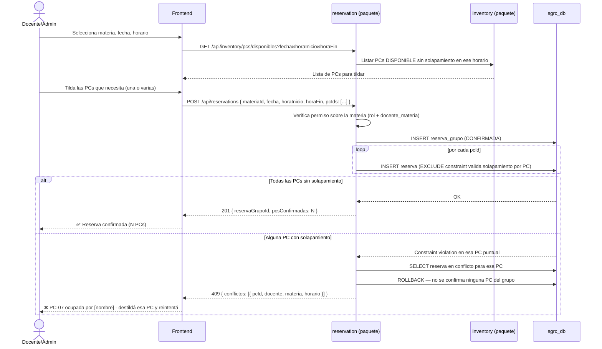

> La creación es transaccional: si una sola PC del grupo tiene solapamiento, no se confirma ninguna — el usuario ve exactamente cuál PC falló y puede destildarla sin perder el resto de la selección.

## 3. Reserva recurrente (una o varias PCs)

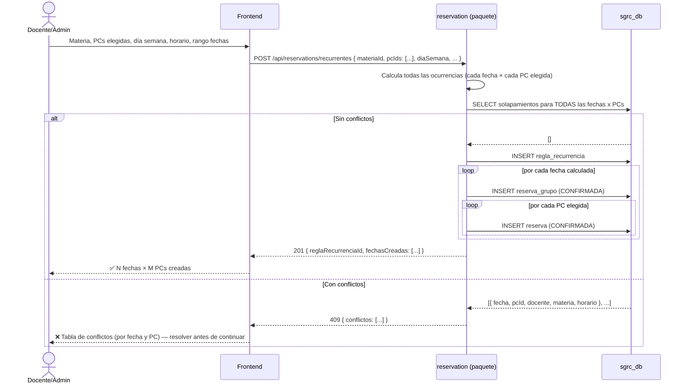

## 4. Cancelar ocurrencia recurrente

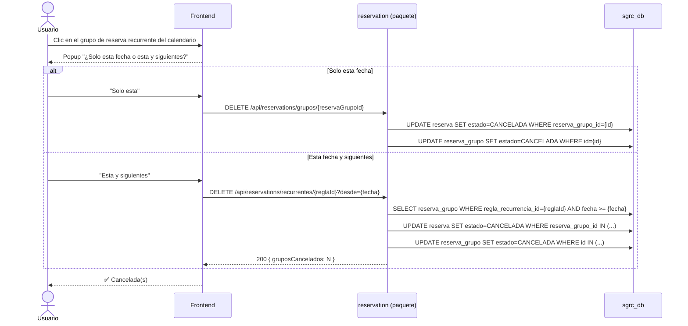

## 5. Bloqueo de PCs para evaluación estatal

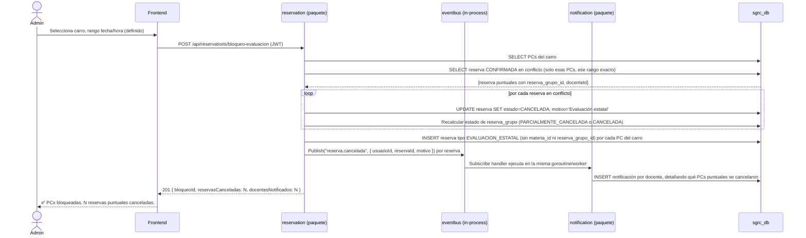

> Solo se cancelan las `Reserva` (PC + fecha) que caen dentro del rango exacto del bloqueo. El resto de una recurrencia, o del mismo `ReservaGrupo` en otro horario, sigue vigente.

> **Un solo tipo de evento para los tres orígenes.** RF-05.1, 05.2 y 05.3 son,
> de punta a punta, la misma notificación con distinto motivo: cancelación
> manual de un Admin, bloqueo por evaluación, o PC fuera de servicio. El
> motivo ya viene armado desde `reservation`, así que `notification` no
> necesita saber de dónde vino. Los eventos se publican **después del
> commit**: si la transacción se deshace, nadie recibe el aviso de una
> cancelación que no ocurrió.

## 6. Cambio de estado de PC individual → cascada de cancelación

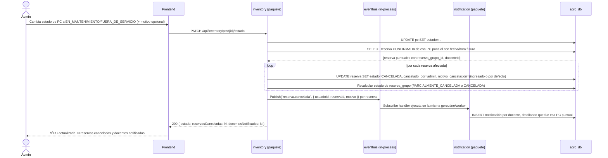

> Duración **indefinida** (a diferencia del bloqueo de evaluación, que tiene rango definido): se cancelan todas las reservas futuras de esa PC puntual, sin fecha de corte. Cuando la PC vuelve a `DISPONIBLE`, nada se restaura automáticamente.

## 6b. Dar de baja una PC del inventario (soft delete)

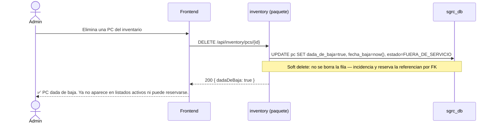

> Un `DELETE` en la API es, puertas adentro, un soft delete: si se borrara la fila físicamente, se perdería la referencia de todo el historial de incidencias y reservas pasadas de esa PC. Distinto del borrado de reservas al archivar un ciclo lectivo (§7), que sí es físico porque ahí se preserva un snapshot agregado aparte.

## 7. Archivar y clonar ciclo lectivo

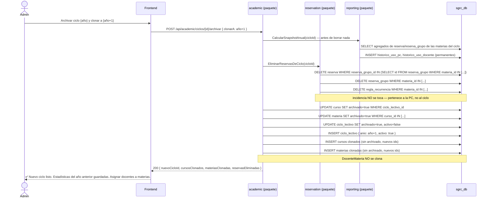

> Las reservas de las materias del ciclo archivado **se eliminan físicamente**, no quedan como historial en detalle. El snapshot histórico se calcula primero para no perder las estadísticas — `curso`/`materia`/`docente_materia` sí se preservan (`archivado=true`), porque eso es lo que evita recrearlos.

## 8. Dar de baja a un docente (permanente)

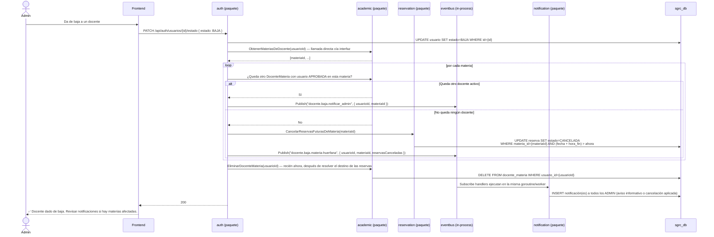

> El orden importa por dos razones. `EliminarDocenteMateria` corre **después**
> del loop que revisa cada materia: si se borrara primero, la pregunta "¿queda
> otro docente activo?" ya no tendría con qué compararse. Y las cancelaciones
> van antes de borrar los vínculos, porque la cascada cruza a `reservation`
> con su propia transacción y el conjunto no puede ser atómico: si algo falla,
> los vínculos se conservan y el error dice qué materias quedaron pendientes,
> en vez de dejar reservas vivas en materias que ya nadie sabe cuáles eran.

> **RF-02.10 hace lo mismo por el otro camino.** Quitar a un docente de **una
> sola** materia (`DELETE /materias/{id}/docentes/{dmId}`) llega al mismo
> estado —materia sin nadie a cargo, con reservas futuras vivas— así que
> dispara la misma cascada, con el mismo orden (cancelar y después borrar el
> vínculo) y su propio evento, `docente.desasignado.materia-huerfana`. La
> respuesta devuelve `reservasCanceladas` para que el Admin sepa qué se llevó
> puesto.

## 8b. Eliminar definitivamente una cuenta en BAJA

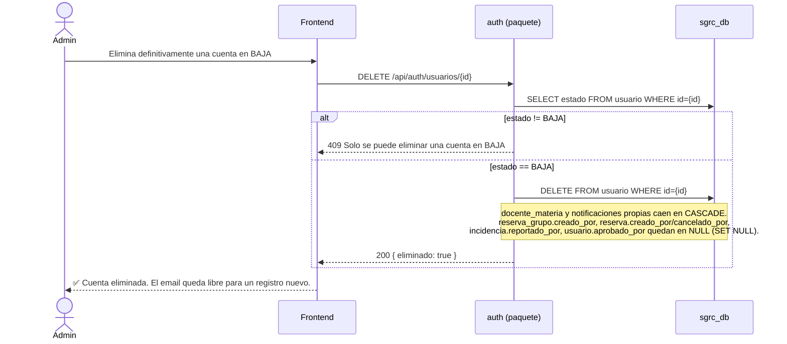

## 9. Liberar reservas vencidas (job interno)

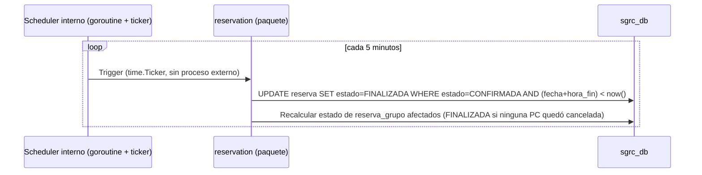

> El job corre como una goroutine que arranca junto con `main.go` (`time.NewTicker(5 * time.Minute)`), sin pieza de infraestructura adicional ni proceso externo.

## 10. Ver disponibilidad de Admins

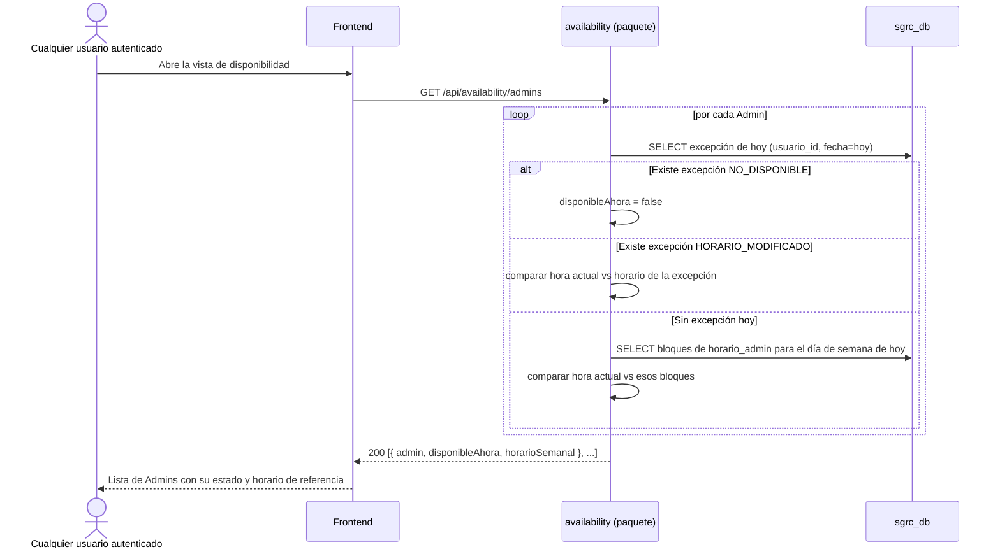

> Puramente informativo (RF-07.6): este cálculo no habilita ni bloquea ninguna otra acción del sistema — es solo para que el docente sepa cuándo pasar por el laboratorio.
