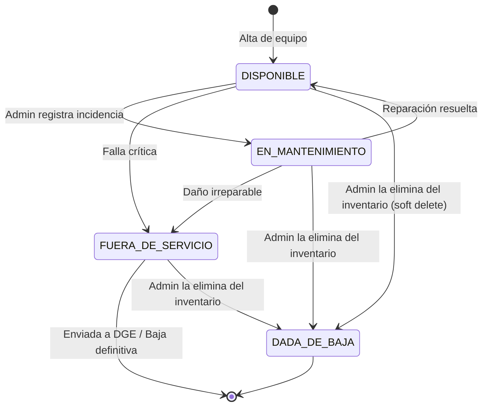
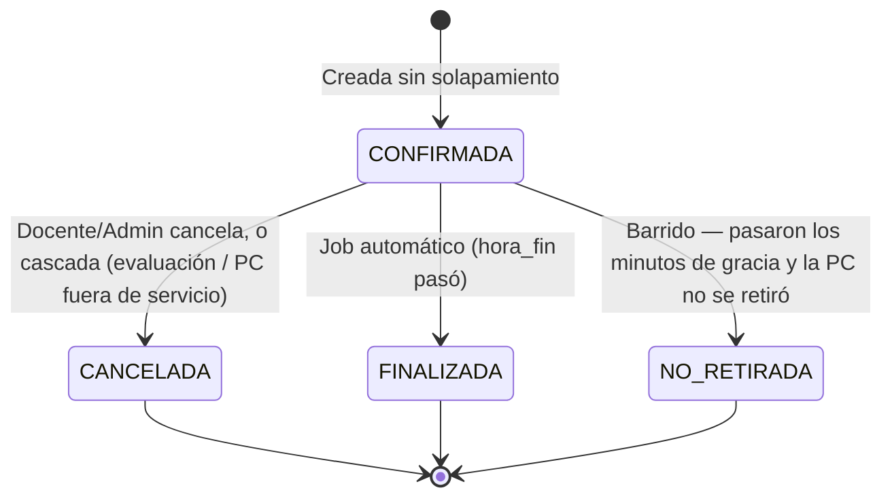
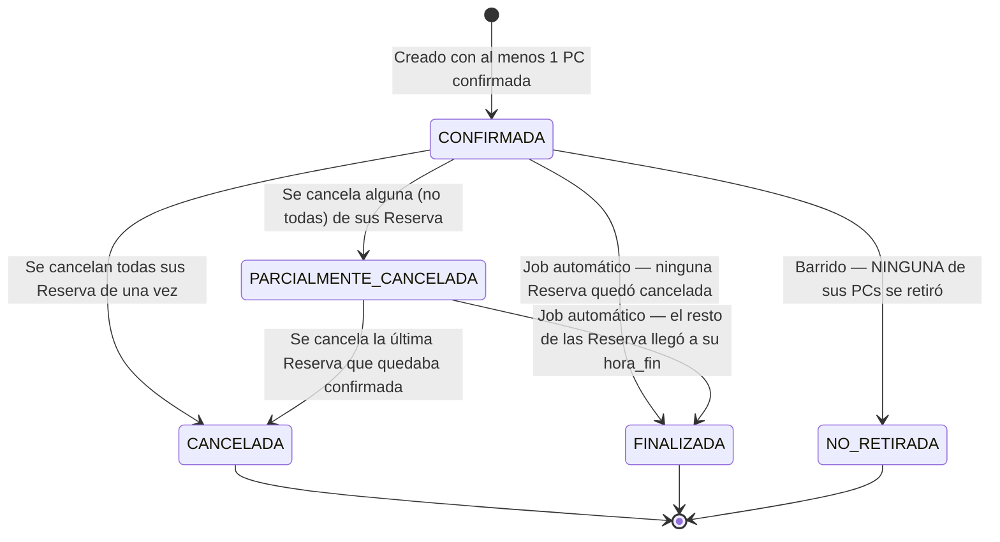
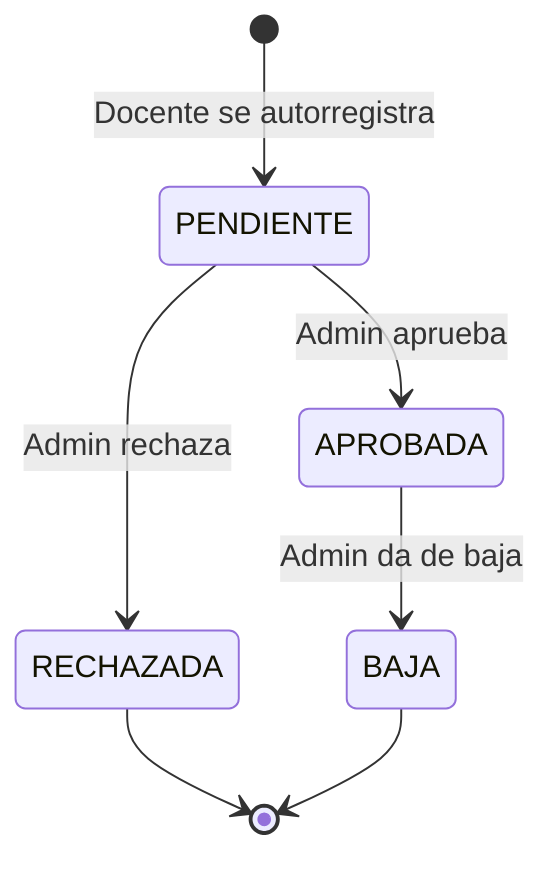
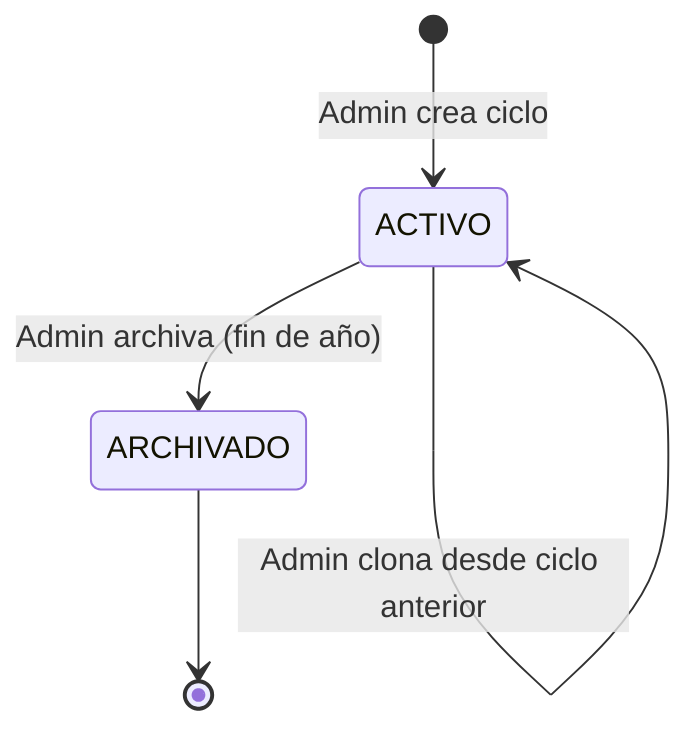

# Diagramas de Estado — SGRC

## Estado de una PC

> `DADA_DE_BAJA` es independiente del campo `estado` (`DISPONIBLE`/`EN_MANTENIMIENTO`/`FUERA_DE_SERVICIO`) — es el flag `pc.dada_de_baja`, no un cuarto valor de ese enum. Se muestra acá junto al resto porque es, en la práctica, un estado terminal más del ciclo de vida de la PC.

> Los tránsitos hacia `EN_MANTENIMIENTO`/`FUERA_DE_SERVICIO` son de duración **indefinida** y disparan cancelación en cascada de las reservas futuras de esa PC puntual (RF-03.6). El regreso a `DISPONIBLE` no restaura nada automáticamente.

## Estado de una Reserva (PC puntual)

## Estado de un ReservaGrupo (la reserva tal como la ve el docente)

> `PARCIALMENTE_CANCELADA` es clave: un grupo de reserva con varias PCs no pasa a `CANCELADA` solo porque una de ellas se vio afectada por una evaluación o una avería — pasa a `CANCELADA` únicamente cuando **todas** sus PCs quedaron sin confirmar.

## Estado de cuenta de Usuario

> `RECHAZADA` y `BAJA` son estados distintos: `RECHAZADA` es para una solicitud que nunca llegó a aprobarse; `BAJA` es para una cuenta que **estuvo** activa y luego se dio de baja (dispara la revisión de reservas huérfanas de RF-02.8).

## Estado de un Ciclo Lectivo

## Préstamo de una PC

No lleva diagrama porque tiene dos estados y uno solo de salida: está
**abierto** mientras `devuelto_en` sea `NULL`, y se cierra al recibirlo. Lo
que importa de un préstamo no es su estado sino su relación con la reserva —
son cosas distintas, ver RF-08 y `07-modelo-datos.md`.

## Reglas asociadas

> **`NO_RETIRADA` no es `CANCELADA`, y la diferencia importa.** Una
> cancelación la decidió alguien y pide saber quién y por qué; una reserva no
> retirada se explica sola. Además, el reporte de uso (RF-06.1) puede dejar de
> contarla como una clase dada, que es lo que hacía cuando todo lo no
> cancelado terminaba en `FINALIZADA`.
>
> **`NO_RETIRADA` es terminal y no vuelve a `CONFIRMADA`**, aunque el docente
> aparezca a los cincuenta minutos: liberar no es prohibir. Si las máquinas
> siguen ahí se le entregan igual, y eso queda registrado como un *préstamo*,
> que es otra cosa que la reserva.
>
> **A nivel `ReservaGrupo` solo se marca si NINGUNA de sus PCs se retiró.** Si
> el docente vino y se llevó tres de cinco, el grupo sigue `CONFIRMADA`: vino
> a dar la clase, y lo que pasó con las otras dos se ve fila por fila.
- PC en `EN_MANTENIMIENTO`, `FUERA_DE_SERVICIO` o `dada_de_baja=true` rechaza nuevas reservas.
- `Reserva` `CANCELADA` o `FINALIZADA` es inmutable; lo mismo aplica a `ReservaGrupo`. Ambas se eliminan físicamente al archivar el ciclo lectivo de su materia (no antes).
- Cursos y materias con `archivado=true` no aparecen en vistas activas; a diferencia de las reservas, ellos **sí** se preservan (nunca se eliminan) para no recrearlos el año siguiente.
- Un usuario con `estado=PENDIENTE`, `RECHAZADA` o `BAJA` no puede operar en el sistema aunque intente autenticarse. `BAJA` es terminal — no hay reactivación.
- Dar de baja a un docente (`APROBADA → BAJA`) solo cancela reservas si la materia queda sin ningún otro docente activo (ver RF-02.8).
- Dar de baja a una PC (`dada_de_baja=true`) es un soft delete: la fila se conserva para no perder el historial de incidencias y reservas ya asociadas.
