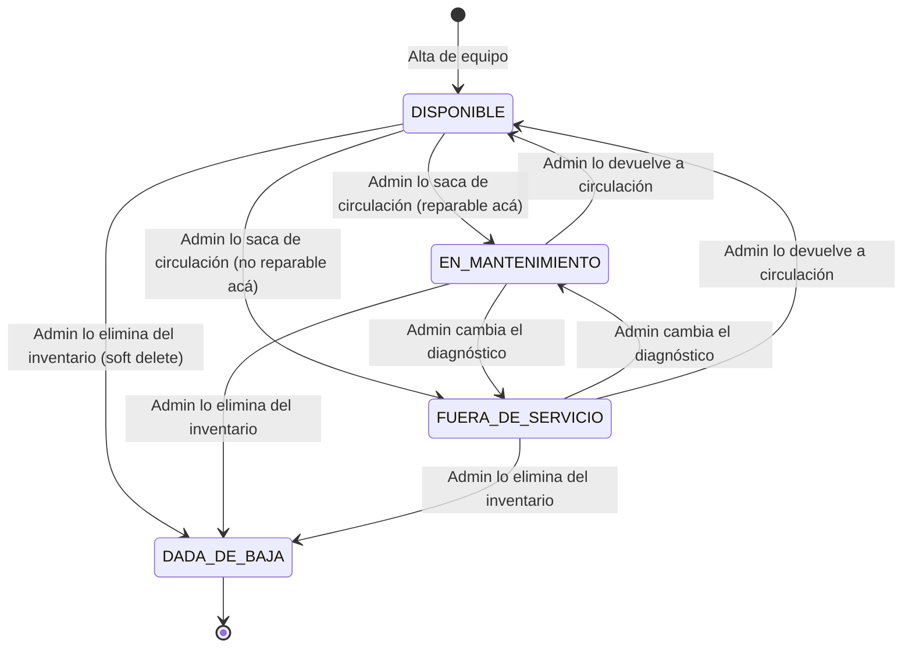
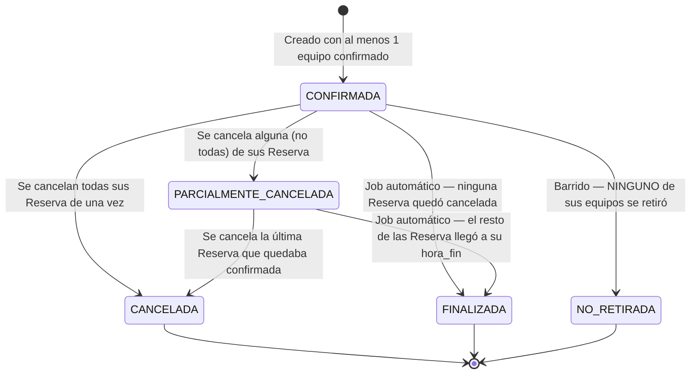
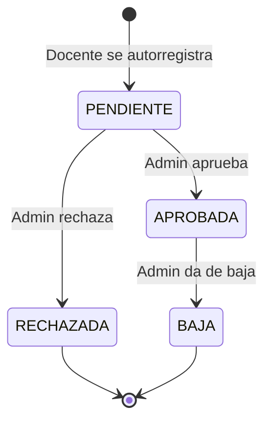
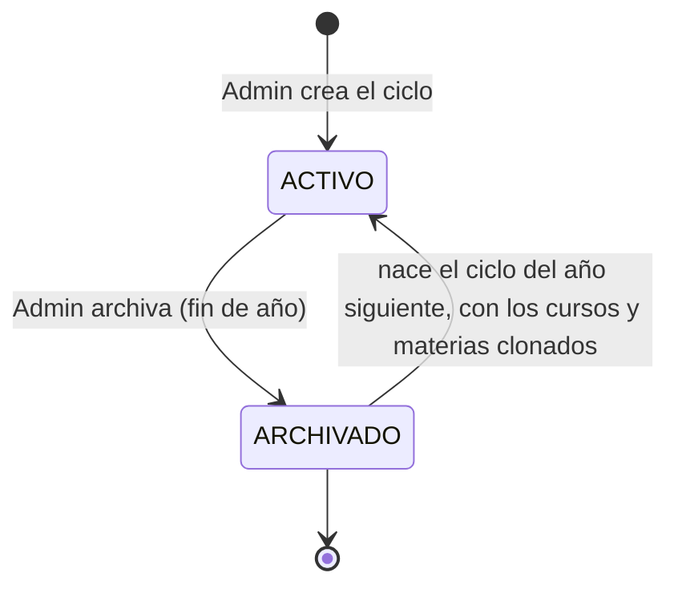

# Diagramas de Estado — SGRC

## Estado de un Equipo

> **El estado lo decide una persona, no el sistema.** Registrar una incidencia
> no cambia el estado del equipo, y la categoría de la falla tampoco: la
> diferencia entre `EN_MANTENIMIENTO` y `FUERA_DE_SERVICIO` no es qué se rompió
> sino **si la institución puede repararlo** —si tiene el repuesto, el
> conocimiento o la autorización—, y eso no se deduce de un diagnóstico
> (RF-03.5).

> `DADA_DE_BAJA` es independiente del campo `estado` (`DISPONIBLE`/`EN_MANTENIMIENTO`/`FUERA_DE_SERVICIO`) — es el flag `equipo.dado_de_baja`, no un cuarto valor de ese enum. Se muestra acá junto al resto porque es, en la práctica, el estado terminal del ciclo de vida del equipo. Dar de baja fija además `estado = FUERA_DE_SERVICIO`, y **no se permite sobre un equipo prestado** (RF-03.20): primero hay que registrar que volvió.

> Los tránsitos hacia `EN_MANTENIMIENTO`/`FUERA_DE_SERVICIO` son de duración **indefinida** y disparan cancelación en cascada de las reservas futuras de ese equipo puntual (RF-03.8). El regreso a `DISPONIBLE` no restaura nada automáticamente.

> **`FUERA_DE_SERVICIO` no es terminal**, y este diagrama siempre lo dijo. El código lo trataba como si lo fuera —citando a este archivo para justificarlo— y por eso un equipo que se arreglaba no tenía forma de volver: la pantalla ofrecía el botón y el servidor respondía 409. Corregido el 2026-08-27. Lo terminal es `dado_de_baja`, que es otra columna.

## Estado de una Reserva (un equipo puntual)

```mermaid
stateDiagram-v2
    [*] --> CONFIRMADA: Creada sin solapamiento
    CONFIRMADA --> CANCELADA: Docente/Admin cancela, o cascada (bloqueo administrativo / equipo fuera de servicio)
    CONFIRMADA --> FINALIZADA: Job automático (hora_fin pasó)
    CONFIRMADA --> NO_RETIRADA: Barrido — el equipo no se retiró (40 min desde el inicio si no salió ninguno; 15 desde la entrega si el docente se llevó otros)
    CANCELADA --> [*]
    FINALIZADA --> [*]
    NO_RETIRADA --> [*]
```

## Estado de un ReservaGrupo (la reserva tal como la ve el docente)

> `PARCIALMENTE_CANCELADA` es clave: un grupo con varios equipos no pasa a `CANCELADA` solo porque uno de ellos se vio afectado por un bloqueo administrativo o una avería — pasa a `CANCELADA` únicamente cuando **todos** sus equipos quedaron sin confirmar.

## Estado de cuenta de Usuario

> `RECHAZADA` y `BAJA` son estados distintos: `RECHAZADA` es para una solicitud que nunca llegó a aprobarse; `BAJA` es para una cuenta que **estuvo** activa y luego se dio de baja (dispara la revisión de reservas huérfanas de RF-02.8).

## Estado de un Ciclo Lectivo

> **Solo puede haber un ciclo `ACTIVO` a la vez**, y lo garantiza un índice
> único parcial en la base (RF-02.1). Archivar y clonar son un solo paso: el
> ciclo que se cierra deja de ser activo y el del año siguiente nace en la
> misma operación, con sus cursos y materias copiados y sin asignaciones de
> docentes.

## Préstamo de un Equipo

No lleva diagrama porque tiene dos estados y uno solo de salida: está
**abierto** mientras `devuelto_en` sea `NULL`, y se cierra al recibirlo. Lo
que importa de un préstamo no es su estado sino su relación con la reserva —
son cosas distintas, ver RF-08 y `07-modelo-datos.md`.

## Reglas asociadas

> **`NO_RETIRADA` no es `CANCELADA`, y la diferencia importa.** Una
> cancelación la decidió alguien y pide saber quién y por qué; una reserva no
> retirada se explica sola. Y sobre todo, la franja **deja de bloquear**: el
> `EXCLUDE` de anti-solapamiento solo mira las `CONFIRMADA`, así que liberar
> una reserva es un cambio de estado y nada más.
>
> **`NO_RETIRADA` es terminal y no vuelve a `CONFIRMADA`**, aunque el docente
> aparezca pasado el plazo de gracia: liberar no es prohibir. Si las máquinas
> siguen ahí se le entregan igual, y eso queda registrado como un *préstamo*,
> que es otra cosa que la reserva.
>
> **A nivel `ReservaGrupo` solo se marca si NINGUNO de sus equipos se retiró.** Si
> el docente vino y se llevó tres de cinco, el grupo sigue `CONFIRMADA`: vino
> a dar la clase, y lo que pasó con los otros dos se ve fila por fila.
>
> **La misma transición sale de dos plazos, y ninguno avisa** (RF-08.10). Si no se
> retiró nada, se espera desde el inicio de la clase (40 min por defecto); si el
> docente se llevó una parte, lo que dejó cae a los 15 minutos de esa entrega. En
> los dos casos la liberación es **silenciosa**: el aviso al docente ya salió a
> los 15 minutos del inicio (RF-08.20), cuando todavía podía ir a buscarlas,
> cambiar la máquina o cancelar. Es la única transición del sistema que no genera
> ninguna notificación, y la razón es esa.

- Equipo en `EN_MANTENIMIENTO`, `FUERA_DE_SERVICIO` o `dado_de_baja=true` rechaza nuevas reservas, **y también rechaza entregas**: está físicamente en el laboratorio y no se le da a nadie (RF-08.17). Llevarle una máquina rota al técnico sigue registrándose, pero como *salida a reparación* (RF-08.21), que exige decir a dónde va y vive en un panel aparte del mostrador. Lo dado de baja no sale por ningún camino.
- `Reserva` `CANCELADA` o `FINALIZADA` es inmutable; lo mismo aplica a `ReservaGrupo`. Ambas se eliminan físicamente al archivar el ciclo lectivo de su materia (no antes).
- Cursos y materias con `archivado=true` no aparecen en vistas activas; a diferencia de las reservas, ellos **sí** se preservan (nunca se eliminan) para no recrearlos el año siguiente.
- Un usuario con `estado=PENDIENTE`, `RECHAZADA` o `BAJA` no puede operar en el sistema aunque intente autenticarse. `BAJA` es terminal — no hay reactivación.
- Dar de baja a un docente (`APROBADA → BAJA`) solo cancela reservas si la materia queda sin ningún otro docente activo (ver RF-02.8).
- Dar de baja un equipo (`dado_de_baja=true`) es un soft delete: la fila se conserva para no perder el historial de incidencias y reservas ya asociadas.
