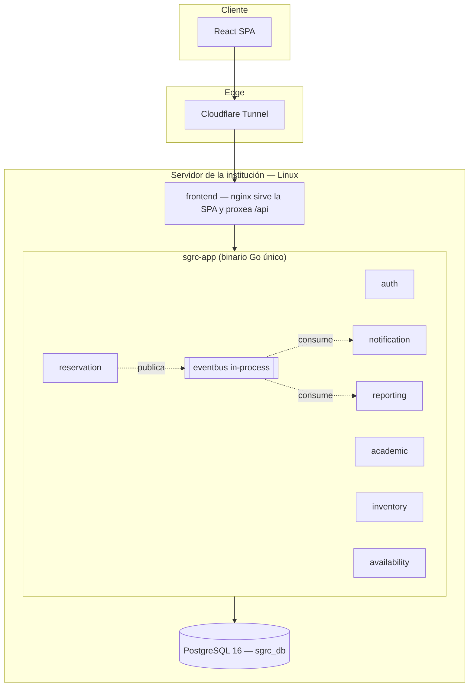
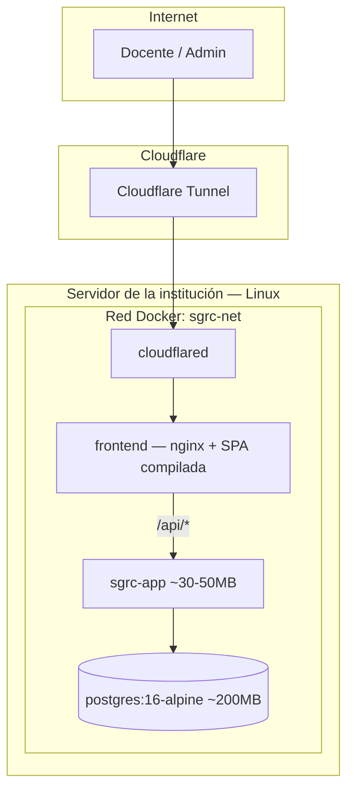

# Arquitectura del Sistema — SGRC

## 1. Criterio de diseño

**Monolito modular con límites de dominio explícitos.** Un solo binario Go y un solo Postgres, organizados en paquetes internos que se comunican solo a través de interfaces — ningún paquete importa `domain/` de otro directamente. Para el volumen de uso real (una sola institución, decenas de usuarios, un servidor con recursos acotados) no se justifica la complejidad operativa de microservicios (mensajería entre procesos, bases de datos separadas, orquestación). Los límites de paquete se mantienen igual de estrictos que si fueran servicios separados, de forma que el sistema quede preparado para dividirse en microservicios el día que el volumen de uso lo justifique (por ejemplo, si el proyecto crece a más de una institución), sin tener que reescribir la lógica de dominio.

## 2. Estructura del binario

| Paquete | Responsabilidad |
|---|---|
| `internal/auth` | Usuarios, JWT, aprobación de cuentas docentes |
| `internal/academic` | Ciclos lectivos, cursos, materias, DocenteMateria, clonado |
| `internal/inventory` | Carros, equipos, incidencias, licencias |
| `internal/reservation` | Reservas, solapamiento, recurrencias, bloqueo, job de vencimiento |
| `internal/notification` | Notificaciones internas y las copias por email de algunas de ellas (RF-05.8) |
| `internal/reporting` | Estadísticas y reportes: queries agregadas directas para el ciclo activo + snapshot histórico permanente calculado al archivar |
| `internal/availability` | Horario de disponibilidad de Admins (puramente informativo) — cálculo de "disponible ahora" |
| `internal/shared/middleware` | JWT + verificación de cuenta, RBAC, rate limiting, headers de seguridad |
| `internal/shared/eventbus` | Pub/sub in-process (ver §4) |
| `internal/shared/security` | Hash y verificación de contraseñas (`argon2id`), en un solo lugar |
| `internal/shared/email` | Envío por SMTP (`net/smtp`, texto plano). Está en `shared/` porque lo usan dos: `notification` para los avisos y `auth` —indirectamente, vía evento— para el código de recuperación. Arma el mensaje a mano, y esa lista de cabeceras es deliberada: `From` igual a la cuenta que autentica (lo exige Gmail y es lo que alinea DMARC), `Auto-Submitted` para que ningún autorespondedor conteste, `Message-ID` propio —Gmail lo agrega si falta, pero cualquier otro SMTP deja salir el mensaje sin él y para varios filtros eso solo ya es señal de correo automático mal armado— y texto plano, sin HTML ni imágenes, que no tiene ratio que penalizar |
| `internal/shared/audit` | Escritura del `audit_log` (ver `09-seguridad-rbac.md` §5) |
| `internal/shared/paginacion` | Ventana de resultados y `meta` de los listados paginados |
| `internal/shared/adminseed` | Decisión de "sembrar el primer Admin si hace falta", sin dependencias externas |
| `internal/shared/archtest`, `authtest`, `testdb` | Solo para tests: el que verifica los límites de paquete, el armado de autenticación y el Postgres efímero |

```
sgrc/
├── cmd/
│   └── main.go
├── internal/
│   ├── auth/{domain,application,infrastructure,interfaces/http}
│   ├── academic/{...}
│   ├── inventory/{...}
│   ├── reservation/{...}
│   ├── notification/{...}
│   ├── reporting/{...}
│   ├── availability/{...}
│   └── shared/{middleware, eventbus, security, email, audit, paginacion, adminseed, …}
├── migrations/
├── frontend/                 ← SPA React servida por nginx (ver README)
├── scripts/
├── Dockerfile
├── docker-compose.yml
├── docker-compose.dev.yml
└── Makefile
```

## 3. Comunicación entre paquetes

Cada paquete expone una interfaz pequeña en su capa `application/`; los demás paquetes dependen de esa interfaz, nunca del paquete `domain/` ajeno:

```go
// internal/reservation/application/ports.go — el puerto lo declara quien lo
// necesita, no quien lo implementa.
type ValidadorEquipo interface {
    EquipoDisponibleParaReservar(ctx context.Context, equipoID string) (bool, error)
}

// internal/reservation/application/service.go
type Service struct {
    validadorEquipo ValidadorEquipo // inyectado; nunca se importa inventory/domain
}
```

Hay dos formas de implementar esos puertos, y la diferencia importa:

- **Lecturas simples** (¿este equipo está disponible?, ¿este usuario está
  aprobado?): las resuelve el propio `infrastructure/` del paquete que
  pregunta, con un SQL directo sobre la tabla ajena. No hay reglas de negocio
  que duplicar.
- **Acciones con reglas propias** (cancelar las reservas de una materia,
  borrar las de un ciclo): las implementa `cmd/wiring_adapters.go`,
  envolviendo el `Service` del paquete dueño. Cancelar una reserva tiene una
  máquina de estados y un recálculo del grupo padre; reimplementar eso con
  SQL crudo en otro paquete es cómo dos caminos al mismo estado terminan
  comportándose distinto.

Un test de arquitectura (`internal/shared/archtest`) verifica que ningún
paquete importe el `domain/` de otro, así que el límite no depende de que
alguien se acuerde.

Este es el mismo contrato que tendría una llamada REST entre servicios separados — solo que resuelto en compile-time y sin latencia de red. Si algún paquete necesitara convertirse en un servicio aparte más adelante, se reemplaza la implementación en memoria por un cliente HTTP que cumpla la misma interfaz, sin tocar el resto del código.

## 4. Event bus in-process

```go
// internal/shared/eventbus/eventbus.go
type Evento struct {
    Tipo    string
    Payload any
}

type EventBus interface {
    Publish(evento Evento)
    Subscribe(tipo string, handler func(Evento))
}
```

`reservation` publica eventos como `reserva.cancelada`; `notification` y `reporting` se suscriben en el arranque (`cmd/main.go`). La entrega es en memoria — sin persistencia de mensajes ni garantías at-least-once, que no hacen falta con un solo proceso: si muere, publicadores y suscriptores se reinician juntos.

**Los filtros van en la query, no en el path.** Fiber resuelve las rutas por orden de registro, así que un segmento literal (`/equipos/sueltos`) tendría que registrarse **antes** que el parámetro que lo puede tragar (`/equipos/:id`). Invertido, la ruta literal deja de existir y el handler del `:id` responde 404 buscando un equipo con ese ID: compila, arranca y falla recién en tiempo de ejecución. Un comentario pidiendo que nadie reordene las líneas no es una garantía.

La convención evita el problema en vez de documentarlo: **una condición sobre una colección es un query param** (`/equipos?enCarro=false`), y **un concepto distinto es una colección hermana** (`/categorias-de-falla`, que no son incidencias sino el vocabulario con el que se las clasifica). Lo que sí puede ir en el path es una relación real de pertenencia: `/carros/{id}/equipos` son los equipos DE ese carro.

**`Publish` corre en la goroutine de quien publica.** Eso no es un detalle: significa que un suscriptor lento se traduce directamente en un request HTTP lento. Por eso los handlers de `notification` no hacen su trabajo adentro del handler, sino que lo lanzan en su propia goroutine con un contexto y un timeout propios (el del request se cancela apenas se responde). Es lo que hace que registrar un docente no espere a que se abra una conexión SMTP, y lo que permite que cancelar una recurrencia de 40 fechas × 5 PCs no haga 200 `INSERT` en serie dentro del request. Un `sync.WaitGroup` en `main.go` registra las entregas en curso para que el apagado ordenado no se las lleve puestas.

**Un mismo evento puede tener varios suscriptores, y se usa.** `docente.registro.pendiente` tiene dos: el que escribe el aviso interno y el que manda el mail (RF-05.8). `reserva.pedido-de-liberacion` (RF-04.12) sigue el mismo patrón, y es el caso donde más importa: el pedido de un docente a otro no puede quedarse sin llegar porque el SMTP esté caído, y al revés, la campana sola no alcanza cuando la clase es mañana. Están registrados por separado a propósito — el aviso interno es la fuente de verdad y el correo una copia, así que un fallo de SMTP no puede impedir que el aviso se escriba. `Publish` además recupera el panic de cada handler por separado, así que uno roto no se lleva a los demás.

**`prestamo` vive en `reservation` y no en `inventory`, aunque hable de un equipo.** El criterio no es de qué entidad cuelga sino de qué reglas depende: contra qué reserva salió la máquina, si volvió antes de que empiece la siguiente, quién es el próximo que la tiene reservada. Ponerlo en `inventory` obligaría a ese paquete a leer reservas, que es exactamente el límite que §3 no deja cruzar. Lo único que necesita de `inventory` —que el equipo exista y no esté dado de baja— entra por el puerto `ValidadorEquipo` que ya existía.

**Hay eventos que no los dispara ningún request.** Además de `licencia.por-vencer`, los cinco del barrido de reservas y entregas (`reserva.recordatorio`, `reserva.equipo-no-disponible`, `reserva.sin-retirar`, `prestamo.demorado`, `prestamo.sin-devolver.cierre`). Liberar una reserva (RF-08.10) **no publica ninguno**: el aviso salió antes, con `reserva.sin-retirar`. `licencia.por-vencer` lo publica un barrido periódico de `inventory` (RF-03.14), no una acción de una persona. Eso cambia una cosa importante: como nadie está esperando el resultado, nadie se da cuenta si sale dos veces — así que la idempotencia no puede depender de que el job corra "una vez por día". La garantiza el estado de cada licencia (dos columnas que apuntan a la fecha de vencimiento para la que ya se avisó), lo que permite correr el barrido cada hora, reiniciar el contenedor y seguir mandando un solo mail. El barrido **publica primero y marca después**: si el proceso se cae en el medio, un aviso repetido molesta, pero un vencimiento que pasa en silencio es exactamente lo que la funcionalidad existe para evitar.

**El payload lleva el dato, no solo el ID.** Los eventos de correo (`cuenta.aprobada`, `password.recuperacion.solicitada`) viajan con nombre y email adentro y no con un `usuarioId` a resolver: el suscriptor vive en `notification`, que no puede importar el `domain` de `auth` (§3), así que resolverlo del otro lado significaría o violar el límite o agregar otro puerto de lectura para algo que quien publica ya tenía en la mano.

Se modela como pub/sub (en vez de que `reservation` llame directo a `notification.Notificar()`) porque preserva un patrón de event-driven design real y deja la puerta abierta a que la implementación pase a un message broker (NATS, Kafka) sin tocar quién publica o se suscribe, si en el futuro hace falta desacoplar procesos.

## 5. Diagrama de arquitectura



## 6. Diagrama de despliegue



El túnel expone **solo `frontend`**: el deploy es same-origin y nginx decide
qué hacer con cada request (ver README, "Cómo entra el tráfico"). `sgrc-app`
no publica ningún puerto al host en producción — ese atajo desde la LAN de la
institución permitiría falsificar el header con la IP real del cliente
(`09-seguridad-rbac.md` §4).

**Presupuesto de RAM estimado: ~150–200 MB total**, cómodo dentro de los 8 GB compartidos del servidor.

## 7. Decisiones de diseño

| Decisión | Justificación |
|---|---|
| **Monolito modular, no monolito plano** | Los límites de paquete vía interfaces se mantienen aunque corran en el mismo proceso — permite extraer a servicios separados sin reescribir lógica el día que haga falta, y documenta criterio de diseño real. |
| **Event bus in-process en vez de un message broker** | Mismo patrón pub/sub, sin contenedor ni complejidad operativa adicional para un servidor sin equipo de DevOps dedicado. |
| **JWT HS256** | Un solo proceso firma y verifica el token — un secreto simétrico cumple esa función sin la gestión de un par de claves asimétricas. Si en el futuro varios procesos necesitaran verificar sin llamar a `auth` por red, se puede pasar a RS256 sin tocar el resto del sistema. |
| **Reporting con queries agregadas directas para el ciclo activo, sin CQRS continuo** | A esta escala (una institución, decenas de usuarios) no hay volumen que justifique un read-model sincronizado por eventos. La única excepción es un snapshot agregado (`historico_uso_equipo`/`historico_uso_docente`) calculado **una sola vez, al archivar un ciclo lectivo** — porque el detalle de reservas de ese ciclo se borra físicamente en el mismo paso (ver `01-requisitos.md` RF-02.4 y `07-modelo-datos.md` §3). |
| **PostgreSQL único, FKs reales** | Toda referencia entre tablas es una foreign key real — integridad referencial completa, sin el costo de mantener bases de datos separadas. |
| **Imágenes Docker desde `scratch`** | Binario Go estático + imagen `scratch` = ~10–15 MB, sin shell, sin librerías extra, superficie de ataque mínima. El proceso corre como `USER 65532` (no root) y el `HEALTHCHECK` lo hace el propio binario contra su `/health`, porque en `scratch` no hay `curl` con el que armarlo desde afuera. El costo de `scratch` es que **el binario no puede dar por sentado nada del sistema de archivos**: la zona horaria se embebe importando `time/tzdata` en `cmd/main.go`, y los certificados raíz se copian a `/etc/ssl/certs/ca-certificates.crt` desde la etapa de build. Sin esos dos, el proceso arranca igual y falla más tarde y lejos — sin CAs, el ingreso con Google devuelve 500 y los correos no salen (ver `Dockerfile`). |
| **Preparado para escalar a más de una institución** | Docker Compose hoy → Kubernetes si hiciera falta escalar. Los límites de paquete de §3 y la interfaz de `EventBus` de §4 permiten esa extracción sin reescribir el dominio. |
